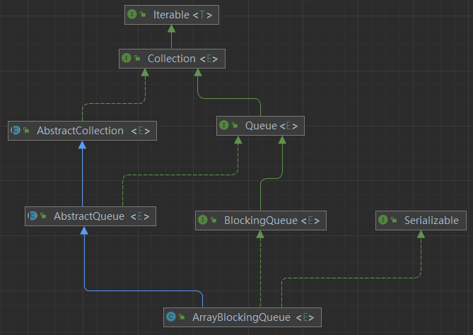

## 一、BlockingQueue 接口

### 1.1 BlockingQueue 接口概述

阻塞队列与普通队列（ `ArrayDeque` 等）之间的最大不同点在于阻塞队列提供了阻塞式的添加 和删除方法。

- **阻塞添加**： 指当阻塞队列元素已满时，队列会阻塞添加元素的线程，直队列元素不满时，才重新唤醒线程执行元素添加操作。
- **阻塞删除**：在队列元素为空时，删除队列元素的线程将被阻塞，直到队列不为空时，才重新唤醒删除线程再执行删除操作。

实际上，<font color="red">**阻塞队列就是典型的生产者-消费者模型**</font>，基于非空和非满两个条件实现生产者和消费者之间的交互。

- **生产者阻塞**： 当队列已满时，生产者线程会被阻塞，直到有足够的空间可以插入新的元素。这可以防止生产者继续生产数据，导致内存耗尽。
- **消费者阻塞**：当队列为空时，消费者线程会被阻塞，直到队列中有新的数据可供消费。这可以防止消费者在没有数据可处理时进行空轮询。


`BlockingQueue` 接口常见的操作如下：

| 操作类型     | 抛出异常操作 | 特殊值操作 | 阻塞操作 | 限时阻塞操作           |
| ------------ | ------------ | ---------- | -------- | ---------------------- |
| **添加**     | `add(e)`     | `offer(e)` | `put(e)` | `offer(e, time, unit)` |
| **删除**     | `remove()`   | `poll()`   | `take()` | `poll(time, unit)`     |
| **获取元素** | `element()`  | `peek()`   | 不可用   | 不可用                 |


### 1.2 阻塞队列实现类

`BlockingQueue` 的 实 现 类 有 `ArrayBlockingQueue` 、 `DelayQueue` 、 `LinkedBlockingDeque` 、 `LinkedBlockingQueue` 、 `PriorityBlockingQueue`、`SynchronousQueue`等，

不同的BlockingQueue子类之间的区别主要体现在元素存储结构和元素操作上。另外，除了`LinkedBlockingDeque`类，其他类<font color="red">**添加和删除操作都是共用同一个锁对象**</font>，由此意味着**添加和删除无法并行运行**。

| **实现类**              | **存储结构**           | **是否有界**     | **主要特点**                                                 | **应用场景**                          |
| ----------------------- | ---------------------- | ---------------- | ------------------------------------------------------------ | ------------------------------------- |
| `ArrayBlockingQueue`    | 数组                   | 有界             | 固定大小的数组结构，先进先出（FIFO）。在容量已满时阻塞生产者，在队列为空时阻塞消费者。 | 生产者-消费者模型，任务调度           |
| `DelayQueue`            | 优先级队列（堆）       | 无界             | 存储实现了 `Delayed` 接口的元素，元素只有当延迟时间到期时才能被取出。 | 定时任务调度，延时消息队列            |
| `LinkedBlockingDeque`   | 链表                   | 可选择有界或无界 | 双向阻塞队列，允许在两端插入和移除元素。可以设定容量限制以避免无限增长。 | 双向任务队列，线程间双向通信          |
| `PriorityBlockingQueue` | 优先级队列（堆）       | 无界             | 元素按优先级顺序排序，默认自然顺序（或自定义 `Comparator`），不保证 FIFO。 | 任务优先级处理，任务调度              |
| `SynchronousQueue`      | 无存储空间（无缓冲区） | 无界             | 不存储元素，插入操作必须等待相应的移除操作，反之亦然。适用于只有在有消费者时才生产元素的场景。 | 线程间直接传递数据，生产者-消费者模型 |

注意：无界阻塞队列并不会阻塞数据生产者，而只会在没有可消费的数据时，阻塞数据的消费者。但是，生产者生产数据的速度绝对不能快于消费者消费数据的速度，否则时间一长，会最终耗尽所有的可用堆内存空间。


## 二、ArrayBlockingQueue 源码分析

### 2.1 ArrayBlockingQueue 类简介

ArrayBlockingQueue是一个常用的阻塞队列，是基于数组实现的。

```java
public class ArrayBlockingQueue<E> extends AbstractQueue<E>
        implements BlockingQueue<E>, java.io.Serializable {
        
}
```




### 2.2 底层数据结构

ArrayBlockingQueue是一个常用的阻塞队列，是基于数组实现的，其内部使用一个**定长数组存储元素**。除了一个定长数组外，ArrayBlockingQueue内部还保存着**两个整型变量，分别标识队列的头部和尾部在数组中的位置**。

```java
public class ArrayBlockingQueue<E> extends AbstractQueue<E>
        implements BlockingQueue<E>, java.io.Serializable {
        
        // 存储队列的元素
        final Object[] items;
        
        
        /** items index for next take, poll, peek or remove */
    	int takeIndex;

    	/** items index for next put, offer, or add */
    	int putIndex;
}
```


### 2.3 线程安全的实现

ArrayBlockingQueue的<font color="red">**添加和删除操作都是共用同一个锁对象**</font>，由此意味着**添加和删除无法并行运行**。

ArrayBlockingQueue 完全可以将添加和删除的锁分离， 从而添加和删除操作完全并行。Doug Lea之所以没有这样去做，是**因为 ArrayBlockingQueue 的数据写入和获取操作已经足够轻巧**。

```java
public class ArrayBlockingQueue<E> extends AbstractQueue<E>
        implements BlockingQueue<E>, java.io.Serializable {
        
        /** Main lock guarding all access */
    	final ReentrantLock lock;
        
        
        public void put(E e) throws InterruptedException {
            Objects.requireNonNull(e);
            final ReentrantLock lock = this.lock;
            lock.lockInterruptibly();
            try {
                while (count == items.length)
                    notFull.await();
                enqueue(e);
            } finally {
                lock.unlock();
            }
    	}

    	public E take() throws InterruptedException {
            final ReentrantLock lock = this.lock;
            lock.lockInterruptibly();
            try {
                while (count == 0)
                    notEmpty.await();
                return dequeue();
            } finally {
                lock.unlock();
            }
    	}
}
```


## 三、LinkedBlockingQueue 源码分析

### 3.1 LinkedBlockingQueue 类简介

`LinkedBlockingQueue` 是基于链表的无界阻塞队列，继承自 `AbstractQueue` 并实现了 `BlockingQueue` 和 `Serializable` 接口。其内部也维持着一个数据缓冲队列（该队列由一个链表构成）。

```java
public class LinkedBlockingQueue<E> extends AbstractQueue<E>
        implements BlockingQueue<E>, java.io.Serializable {
}
```


### 3.2 底层数据结构

`LinkedBlockingQueue` 采用链表作为底层存储结构，使用 `head` 和 `last` 作为链表的头和尾来维护队列。

`capacity` 表示链表的容量上限，如果在调用构造函数时没有指定上限， 默认为 `Integer.MAX_VALUE`（无界队列）。我们指定 `LinkedBlockingQueue` 为无界队列或者有界队列。

```java
public class LinkedBlockingQueue<E> extends AbstractQueue<E>
        implements BlockingQueue<E>, java.io.Serializable {
    
    /** The capacity bound, or Integer.MAX_VALUE if none */
    private final int capacity;
    
    // 链表的头节点
	transient Node<E> head;
    
    // 链表的尾节点
    private transient Node<E> last;
    
    // 节点类型
    static class Node<E> {
        E item;
        Node<E> next;

        Node(E x) { item = x; }
	}

}
```


### 3.3 线程安全的实现

`LinkedBlockingQueue` **对于添加和删除元素分别采用了独立的锁来控制数据同步**， 这也意味着在高并发的情况下生产者和消费者可以并行地操作队列中的数据，以此来提高整个队列的并发性能。

```java
    /** Lock held by take, poll, etc */
    private final ReentrantLock takeLock = new ReentrantLock();
    
    /** Lock held by put, offer, etc */
    private final ReentrantLock putLock = new ReentrantLock();
```


## 四、DealyQueue 源码分析

### 4.1 DealyQueue 简介

`DelayQueue` 是一个无界队列，`DelayQueue` 中的元素只有当其指定的延迟时间到了，才能从队列中获取到该元素。

因此，往队列中添加数据的操作（生产者）永远不会被阻塞，而只有获取数据的操作（消费者）才会被阻塞。

```java
public class DelayQueue<E extends Delayed> extends AbstractQueue<E>
    implements BlockingQueue<E> {

}
```


### 4.2 底层数据结构

`DelayQueue`  实际上使用 `PriorityQueue` 类型的队列来存储元素， 元素的类型都继承自 `Delayed` 接口。

```java
public class DelayQueue<E extends Delayed> extends AbstractQueue<E>
    implements BlockingQueue<E> {
	private final PriorityQueue<E> q = new PriorityQueue<E>();
}

```

`Delayed` 接口定义了如何获取元素的剩余延迟时间( `getDelay()` )和元素之间的比较规则( 继承 `Comparable` )

```java
public interface Delayed extends Comparable<Delayed> {

    /**
     * Returns the remaining delay associated with this object, in the
     * given time unit.
     *
     * @param unit the time unit
     * @return the remaining delay; zero or negative values indicate
     * that the delay has already elapsed
     */
    long getDelay(TimeUnit unit);
}
```


### 4.3 线程安全实现

`DelayQueue` 的<font color="red">**添加和删除操作都是共用同一个锁对象**</font>，由此意味着**添加和删除无法并行运行**。

为了实现多线程之间等待和唤醒的交互效率，`DelayQueue` 还用到了 `Condition`，通过 `Condition` 的 `await` 和 `signal` 方法完成多线程之间的等待唤醒。

另外，队列的添加和删除实际上调用的是 `PriorityQueue` 的方法。

```java
private final transient ReentrantLock lock = new ReentrantLock();

private final Condition available = lock.newCondition();

public E take() throws InterruptedException {
    final ReentrantLock lock = this.lock;
    lock.lockInterruptibly();
    try {
        for (;;) {
            E first = q.peek();
            if (first == null)
                available.await();
            else {
                long delay = first.getDelay(NANOSECONDS);
                if (delay <= 0L)
                    return q.poll();
                first = null; // don't retain ref while waiting
                if (leader != null)
                    available.await();
                else {
                    Thread thisThread = Thread.currentThread();
                    leader = thisThread;
                    try {
                        available.awaitNanos(delay);
                    } finally {
                        if (leader == thisThread)
                            leader = null;
                    }
                }
            }
        }
    } finally {
        if (leader == null && q.peek() != null)
            available.signal();
        lock.unlock();
    }
}
```


## 五、PriorityBlockingQueue 源码分析

### 5.1 PriorityBlockingQueue 类简介

`DelayQueue` 是一个无界队列，结合了优先队列的特性和阻塞队列的行为，适用于需要按优先级处理任务且能容忍等待的场景。

`PriorityBlockingQueue` 并不会阻塞数据生产者，而只会在没有可消费的数据时，阻塞数据的消费者。在使用的时候要特别注意，生产者生产数据的速度绝对 不能快于消费者消费数据的速度，否则时间一长，会最终耗尽所有的可用堆内存空间。

```java
public class PriorityBlockingQueue<E> extends AbstractQueue<E>
    implements BlockingQueue<E>, java.io.Serializable {
}
```


### 5.2 底层数据结构

这段代码定义了一个优先队列（Priority Queue），它使用平衡二叉堆（Balanced Binary Heap）来实现。具体解释如下：

1. 数组表示堆：数组 `queue` 用于存储堆中的元素，没有像 `DealyQueue` 那样直接定义 `PriorityQueue` 变量。
2. 子节点索引：
   - 节点 `queue[n]` 的左子节点是 `queue[2*n+1]`。
   - 节点 `queue[n]` 的右子节点是 `queue[2*(n+1)]`。
3. 排序规则：
     - 如果提供了 `comparator`，则按照 `comparator` 排序。
     - 如果没有提供 `comparator`，则按照元素的自然顺序排序。
4. 堆性质：对于堆中的每个节点 n 和其所有后代节点 d，都有 n <= d。
5. 最小值位置：假设队列非空，最小值始终位于 queue[0]。

```java
private transient Object[] queue;
```


### 5.3 线程安全实现

`DelayQueue` 的<font color="red">**添加和删除操作都是共用同一个锁对象**</font>，由此意味着**添加和删除无法并行运行**。

```java
	public boolean offer(E e) {
        if (e == null)
            throw new NullPointerException();
        final ReentrantLock lock = this.lock;
        lock.lock();
        int n, cap;
        Object[] es;
        while ((n = size) >= (cap = (es = queue).length))
            tryGrow(es, cap);
        try {
            final Comparator<? super E> cmp;
            if ((cmp = comparator) == null)
                siftUpComparable(n, e, es);
            else
                siftUpUsingComparator(n, e, es, cmp);
            size = n + 1;
            notEmpty.signal();
        } finally {
            lock.unlock();
        }
        return true;
    }
    
	public E poll() {
        final ReentrantLock lock = this.lock;
        lock.lock();
        try {
            return dequeue();
        } finally {
            lock.unlock();
        }
    }
```

