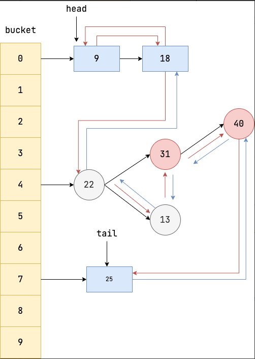

### 什么是 LinkedHashMap


### 底层数据结构

在 `HashMap` 基础上在各个节点之间维护一条双向链表，使得原本散列在不同 bucket 上的节点、链表、红黑树有序关联起来。




### 应用案例

[146. LRU 缓存 - 力扣（LeetCode）](https://leetcode.cn/problems/lru-cache/solutions/259678/lruhuan-cun-ji-zhi-by-leetcode-solution/?envType=study-plan-v2&envId=top-100-liked)

LinkedHashMap 可以用于实现 LRU 缓存。

```java
class LRUCache extends LinkedHashMap<Integer, Integer>{
    private int capacity;
    
    public LRUCache(int capacity) {
        super(capacity, 0.75F, true);
        this.capacity = capacity;
    }

    public int get(int key) {
        return super.getOrDefault(key, -1);
    }

    public void put(int key, int value) {
        super.put(key, value);
    }

    @Override
    protected boolean removeEldestEntry(Map.Entry<Integer, Integer> eldest) {
        return size() > capacity; 
    }
}
```


### 参考资料

[146. LRU 缓存 - 力扣（LeetCode）](https://leetcode.cn/problems/lru-cache/solutions/259678/lruhuan-cun-ji-zhi-by-leetcode-solution/?envType=study-plan-v2&envId=top-100-liked)