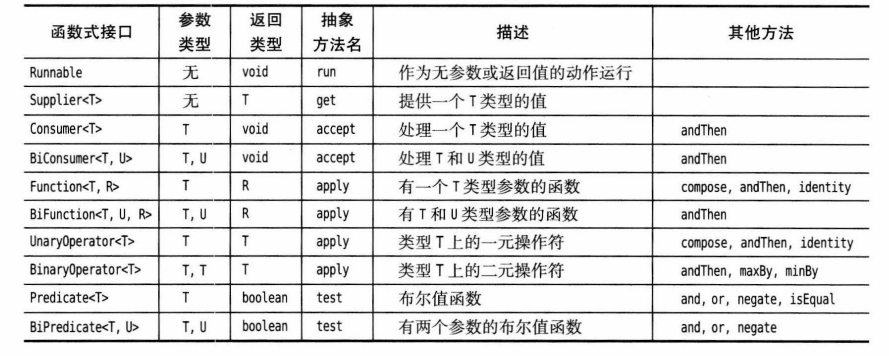

[TOC]

# 二、函数式接口

在Java中，函数式接口的引入是为了支持Lambda表达式。一个函数式接口可以有多个默认方法，但只能有一个抽象方法。Lambda表达式可以用来实现这个唯一的抽象方法，使得可以以更简洁的语法实现接口的实例。


## 2.1 什么是函数式接口

函数式接口是**一个具有且仅有一个抽象方法（Abstract Method）的接口**。

函数式接口是函数式编程的核心概念之一，它允许将函数作为一等公民来传递和使用，使得在接口层面上可以更方便地实现函数式编程的思想。


## 2.2  函数式接口语法

在 Java 中，函数式接口通常使用 **`@FunctionalInterface`** 注解进行标记，这样编译器可以检查该接口是否符合函数式接口的定义。如果一个接口声明了多个抽象方法，或者没有声明任何抽象方法，都不能被标记为函数式接口，否则会产生编译错误。

函数式接口的定义示例：

```java
@FunctionalInterface
interface MyFunctionalInterface {
    void myMethod(); // 抽象方法

    // 允许存在默认方法和静态方法
    default void defaultMethod() {
        // 实现代码
    }

    static void staticMethod() {
        // 实现代码
    }
}
```

在函数式接口中，可以包含静态方法和默认方法，而这些方法与接口中的抽象方法不同。

- **抽象方法：** 函数式接口必须包含且仅包含一个抽象方法。Lambda 表达式通过实现这个抽象方法来创建接口的实例。
- **默认方法：** 默认方法是在接口中提供了一个默认的实现，可以在实现类中选择性地重写。Lambda 表达式可以忽略默认方法，因为它们不会影响接口的单一抽象方法的约束。
- **静态方法：** 静态方法在接口中提供了一个静态的实用工具方法。与默认方法一样，Lambda 表达式不需要显式地实现接口中的静态方法，因为静态方法与实例方法无关。


## 2.3 常用函数式接口




# 三、Lambda表达式(Java版本)

## 3.1 为什么引入 Lambda 表达式

到目前为止，在Java中传递一个代码段并不容易，你不能直接传递代码段。Java是一种面向对象语言，所以必须构造一个对象，这个对象的类需要有一个方法包含所需的代码。

```java
// 接口定义
interface Greeting {
    void greet(String message);
}

public class WithoutLambdaExample {
    public static void main(String[] args) {
    
        // 例子1： 使用匿名内部类实现接口
        Greeting greeting = new Greeting() {
            @Override
            public void greet(String message) {
                System.out.println("Hello, " + message + "!");
            }
        };
        
         // 例子2： 使用 Lambda 表达式实现接口
        Greeting greeting = message -> System.out.println("Hello, " + message + "!");

        // 调用接口方法
        greeting.greet("World");
    }
}
```

在这两个例子中，接口 `Greeting` 包含一个抽象方法 `greet`，它接受一个字符串参数并输出一条问候语。在第一个例子中，我们使用传统的匿名内部类来实现这个接口。在第二个例子中，我们使用 Lambda 表达式来实现相同的接口。

使用 Lambda 表达式的主要优势在于它能够**简化代码**，特别是在需要实现的接口只包含一个抽象方法(即函数式接口)的情况下。Lambda 表达式的语法更为紧凑，更易读，使得代码更为简洁。


## 3.2 什么是 Lambda 表达式

Lambda 表达式(也称为闭包)是一种匿名函数，它允许在代码中直接定义简短的函数。它可以被赋值给函数式接口类型的变量。

Lambda 表达式是一种轻量级的语法，用于简化函数式接口的实现。

> Lambda 表达式，也可称为闭包，它是推动 Java 8 发布的最重要新特性。


## 3.3 Lambda表达式语法

lambda 表达式的语法格式如下：

```
(parameters) -> expression        // 简单形式，表达式值作为Lambda表达式的返回值
(parameters) ->{ statements; }    // 复杂形式，代码块可以包含任意数量的语句，并且可以有return语句
```

在使用Lambda表达式时，编译器可以根据上下文推断出参数的类型，所以在大多数情况下，你无需显式指定参数的类型。

Lambda表达式通常用于函数式接口，即只包含一个抽象方法的接口。


## 3.4 变量作用域

Lambda表达式的变量作用域主要涉及两个方面: **作用域**和**变量捕获**：

- Lambda 表达式的作用域与匿名内部类类似，可以访问外部作用域的变量。但存在一些限制，这就引入了变量捕获的概念

- lambda 表达式可以捕获外围作用域中变量的值。这里有一条规则: lambda表达式中捕获的变量必须实际上是**事实最终变量**( effectively final)。事实最终变量是指，这个变量初始化之后就不会再为它赋新值。


## 3.5 处理lambda表达式

现在，我们需要了解 如何编写方法处理lambda表达式。

使用lambda表达式的重点是 **延迟执行**（ deferred execution)。