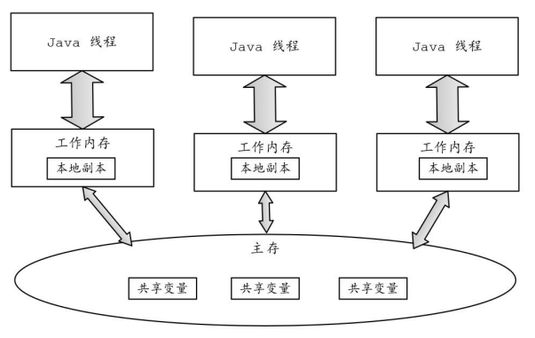

### 什么是 Java 内存模型

JMM（Java Memory Model，即Java内存模型）由JSR-133（Java Memory Model and Thread Specification）文档描述， 定义了一组**规则**或规范。

该规范定义了一个线程对共享变量的写入时，如何确保对另一个线程是可见的。实际上， JMM提供了合理的禁用缓存以及禁止重排序的方法，所以**其核心的价值在于解决可见性和有序性**。

### Java 内存模型概念

Java内存模型定义的两个概念：

- **主存（Main Memory）**：JVM 的共享内存区域，主要用于存储所有 Java 实例对象（无论该实例对象是成员变量还是方法中的本地变量）和类信息、包含成员变量、静态变量和常量等共享数据。

  - **共享性**：主存中的数据是多个线程共享的，因此对同一变量的并发访问可能导致线程安全问题。
  - **线程安全问题**：由于是共享数据区域，因此多个线程对同一个变量进行访问可能会发现线程安全问题。

- **工作内存（Working Memory）**：每个线程的私有内存区域，主要用于存储线程当前执行方法的所有本地变量信息。**工作内存中存储的是主存中变量的副本**。

  - **私有性**：每个线程都有自己的工作内存，线程之间无法直接访问彼此的工作内存。这意味着线程中的本地变量对其他线程是不可见的，从而避免了线程安全问题。
  - **效率**：由于每个线程可以在自己的工作内存中快速访问和操作本地变量，降低了竞争和冲突的发生，因此提高了程序的执行效率。

  

### Java 内存模型规定

Java内存模型的规定如下： 

- 所有变量存储在主存中。 
- 每个线程都有自己的工作内存，将主存中的变量复制到自己的工作内存中，且对变量的操作都是在工作内存中进行的。
- 不同线程之间无法直接访问彼此工作内存中的变量，要想访问只能通过主存来传递。

## Happens-Before 原则的定义

在 Java 内存模型中，**Happens-Before** 原则用于描述两个操作之间的先后顺序，保证有序性。一个操作 `A` **happens-before** 另一个操作 `B`，意味着 `A` 的结果对 `B` 是可见的，即 `A` 必须在 `B` 之前完成。

Happens-Before 原则主要有：

- 顺序性规则：一个线程内，按照代码顺序书写在前面的操作 **happens-before**  发生于书写在后面的操作。
- `volatile` 规则：对一个 `volatile` 变量的写操作 `A` **happens-before** 对该 `volatile` 变量的后续读操作 `B`。
- 传递性规则：如果  A 操作 **happens-before**  B 操作，且 B 操作 **happens-before**  C 操作，那么 A 操作 **happens-before**   C 操作。
- 监视锁规则：对一个锁的unlock操作先行发生于后面对同一个锁的lock操作
- `start()` 规则：如果线程 A 执行 `ThreadB.start()` 操作启动线程 B，那么线程 A 的 `ThreadB.start()` 操作 **happens-before**  线程 B 中的任意操作。
- `join()` 规则:  如果线程 A 执行 `threadB.join()` 操作并成功返回，那么线程 B 中的任意操作先行发生于线程 A 的 `ThreadB.join()` 操作。

  

#### 为什么需要 happens-before 原则

Happens-Before 原则主要是为了平衡程序员的需求、编译器和处理器的需求。

| 目标                    | 程序员的需求                       | 编译器和处理器的需求               |
| ----------------------- | ---------------------------------- | ---------------------------------- |
| **主要诉求**            | 可理解的、符合预期的执行顺序       | 最大化性能，减少执行时间和内存访问 |
| **约束**                | 程序行为应按预期顺序执行，避免错误 | 尽量减少约束，进行重排序和优化     |
| **Happens-Before 原则** |                                    |                                    |

### 参考资料

[JMM 是如何抽象线程和主内存之间的关系？](https://javaguide.cn/java/concurrent/jmm.html#jmm-是如何抽象线程和主内存之间的关系)

《 极致经典（卷2）：Java高并发核心编程(卷2 加强版) -特供v21-release》