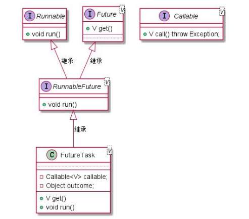

[TOC]


## 一、继承 Thread 类创建创建线程类

### 1.1 Thread 类解析

在 `Thread` 类里面，成员变量  `target` 用于保存一个实现了  `Runnable`  接口的对象，该对象包含了要在新线程中执行的代码。`run`  方法定义线程里面被执行的用户业务逻辑 。`start`  方法会启动一个新的线程，并调用  `run`  方法。`Thread` 类的部分代码如下：

```java
package java.lang;
public class Thread implements Runnable {
	/* What will be run. */
    private Runnable target;
    
     @Override
    public void run() {
        if (target != null) {
            target.run();
        }
    }
    
    // 
    public synchronized void start() {
    	...
    }
}
```

另外，`target` 目标是 `Runnable` 示例，我们可以这样任务：<font color="red">**线程的本质依旧是通过实现 `Runnable` 接口来定义任务。线程的运行行为依赖于 `Runnable` 接口中的 `run` 方法。**</font>


### 1.2 使用方法

我们可以通过继承 `Thread` 类并重写其 `run` 方法来创建线程。 示例如下：

```
public class MyThread extends Thread {
	@Override
    public void run(){
        System.out.println("MyThread is running");
    }

    public static void main(String[] args) {
        MyThread myThread = new MyThread();
        myThread.start();
    }
}
```

在这个例子中，我们定义了一个 `MyThread` 类继承自 `Thread`，并重写了 `run` 方法。在 `main` 方法中，我们创建了一个 `MyThread` 对象，并调用 `start` 方法启动线程。


### 1.3 优缺点

优点有：

- 简单直观

缺点有：

- **单继承限制**
- **不符合面向对象设计**：将任务逻辑和线程管理合并在一个类中不符合面向对象的设计原则，任务逻辑和线程管理应该分开，以提高代码的复用性和可维护性。


## 二、实现 Runable 接口创建线程类

### 2.1 Runable 接口解析

`Runnable` 接口只有一个抽象方法 `run()`，用于**定义被执行的用户业务逻辑**。当我们将 `Runnable` 实例作为参数传递给 `Thread` 类的构造函数，并将其赋值给 `Thread` 实例的 `target` 属性后，`Runnable` 接口的 `run()` 方法将会在新的线程中被异步调用。

`Runnable` 接口的完整代码如下：

```java
package java.lang;
@FunctionalInterface
public interface Runnable {
    public abstract void run();
}
```

### 2.2 使用方法

我们可以实现 `Runable` 接口创建线程类， 示例如下：

```java
public class MyRunnable implements Runnable{
    @Override
    public void run() {
        System.out.println("MyRunnable is running");
    }

    public static void main(String[] args) {
        // 1. 普通的创建方式
        MyRunnable myRunnable = new MyRunnable();
        Thread thread = new Thread(myRunnable);
        thread.start();  // 启动线程
        
        // 2. 使用匿名内部类实现Runnable接口
        new Thread(new Runnable() {
            @Override
            public void run() {
                // 这里是线程执行的代码
                System.out.println("Hello from anonymous class!");
            }
        }).start();

        // 3. 使用Lambda表达式实现Runnable接口
        new Thread(() -> {
            // 这里是线程执行的代码
            System.out.println("Hello from Lambda!");
        }).start();
    }
}
```


### 2.3 优缺点

优点有：

- **避免单继承的限制**：Java 不支持多继承，通过实现 `Runnable` 接口，可以使类继承其他类

- **逻辑和数据分离**：通过实现 Runnable 接口的方法创建多线程更加适合同一个资源被多段业务逻辑并行处理的场景。

缺点有：

- **无法直接获取线程状态**：由于 `Runnable` 实现类本身不是线程对象，因此无法直接获取和控制线程的状态。必须通过 `Thread.currentThread()` 获取当前线程实例，才能访问和控制当前线程。
- **任务执行结果的处理**： `Runnable` 接口中的 `run` 方法不返回结果，如果需要任务执行的结果，必须额外设计一种机制来获取结果。相比之下，`Callable` 接口更适合这种场景。


## 三、使用 Callable 和 FutureTask 创建线程

### 3.1 Callable 接口解析

`Callable` 接口是一个支持泛型的函数式接口，源代码如下：

```java
package java.util.concurrent;
@FunctionalInterface
public interface Callable<V> {
    /**
     * Computes a result, or throws an exception if unable to do so.
     *
     * @return computed result
     * @throws Exception if unable to compute a result
     */
    V call() throws Exception;
}
```

`Callable` 接口类似于 `Runnable`。比较而言，`Callable` 接口的 call() 有返回值，并且声明了受检异常，其功能更强大一些。

注意：`Callable` 实例和 `Runable` 实例不一样，**不能作为 `Thread` 线程实例的 `target` 来使用**（`target` 是 `Runable` 类型的变量 ）


### 3.2 RunnableFuture 接口解析

`RunnableFuture` 接口是为了在 `Callable` 与 `Thread` 之间实现搭桥功能。`RunnableFuture` 接口实现了两个目标：

- 可以作为 `Thread` 线程实例的 `targe`t 实例。`RunnableFuture` 继承了 `Runnable` 接口，从而保证了其实例可以作为 `Thread` 线程实例的 `target` 目标；
- 可以获取异步执行的结果。`RunnableFuture` 通过继承 `Future` 接口，保证了通过它可以获取未来的异步执行结果

源代码如下：

```java
package java.util.concurrent;
public interface RunnableFuture<V> extends Runnable, Future<V> {
    /**
     * Sets this Future to the result of its computation
     * unless it has been cancelled.
     */
    void run();
}
```


### 3.3 Future 接口解析

Future 接口通常**用于实现异步编程和回调机制**， 至少提供了三大功能：

- 能够取消异步执行中的任务。
- 判断异步任务是否执行完成。 
- 获取异步任务完成后的执行结果

源代码如下：

```java
package java.util.concurrent;
public interface Future<V> {
    // 判断计算是否已经完成。
    boolean isDone();

    // 取消异步执行
    boolean cancel(boolean mayInterruptIfRunning);
    
    // 判断异步执行是否被取消。
    boolean isCancelled();
 
    // 获取异步任务完成后的执行结果
    V get() throws InterruptedException, ExecutionException;

    //  获取异步任务完成后的执行结果， 等待时间不超过指定的超时时间。
    V get(long timeout, TimeUnit unit) throws InterruptedException, ExecutionException, TimeoutException;
}

```

注意：`Future` 接口提供了 `get()` 方法来获取任务的结果。**这个方法的行为是同步的**，具体表现为：

- **阻塞行为**：当你调用 `future.get()` 时，如果任务尚未完成，当前线程将被阻塞，直到任务完成并返回结果。
- **获取结果**：在任务完成后，`get()` 方法将返回任务的结果，或者抛出异常（如果任务执行过程中发生了异常）。

虽然任务的执行是异步的，但通过 `Future` 的 `get()` 方法获取结果的过程是同步的，因为调用 `get()` 方法的线程必须等待任务完成。


### 3.4 Futuretask 类解析

`FutureTask` 类是 `RunnableFuture` 接口的实现类，提供了对异步任务的操作的具体实现，实现了两个目标：

- 可以作为 `Thread` 线程实例的 `targe`t 实例。
- 可以获取异步执行的结果。



`FutureTask` 的部分代码如下：

```java
public class FutureTask<V> implements RunnableFuture<V> {
	/** The underlying callable; nulled out after running */
    private Callable<V> callable;
    
     /** The result to return or exception to throw from get() */
    private Object outcome; // non-volatile, protected by state reads/writes
    
    ...
}
```

其中，`callable` 实例属性保存异步执行的任务，`outcome` 实例属性用于保存 `callable`成员`call()` 方法的异步执行结果。


### 3.5 使用方法

通过 `FutureTask` 类和 `Callable` 接口的联合使用可以创建能**获取异步执行结果**的线程。具体步骤如下：

1. **创建 `Callable` 实现类**：定义异步执行的逻辑并返回结果。
2. **创建 `FutureTask` 实例**：将 `Callable` 实例传入 `FutureTask`。
3. **创建并启动 `Thread` 实例**：将 `FutureTask` 实例作为 `Thread` 的 target 属性，启动新线程。
4. **获取结果**：通过 `FutureTask` 的 `get()` 方法阻塞性地获取执行结果。

> **异步执行**：指任务可以并行或在后台执行，主线程不必等待任务完成，可以继续处理其他操作。当异步任务完成时，可以通过回调、通知或其他机制获取结果。

示例如下：

```java
public class MyCallable implements Callable<String> {
    @Override
    public String call() throws Exception {
        // 异步执行的具体逻辑
        return "Task executed";
    }

    public static void main(String[] args) throws Exception {
        MyCallable myCallable = new MyCallable();
        FutureTask<String> futureTask = new FutureTask<>(myCallable);

        // 使用 `FutureTask` 实例作为 `Thread` 构造器的 target 入参，构造新的 `Thread` 线程实例
        Thread thread = new Thread(futureTask, "returnableThread");

        // 启动新线程
        thread.start();

        try {
            // 阻塞性地获得并发线程的执行结果
            String result = futureTask.get();
            System.out.println("Result from callable: " + result);
        } catch (Exception e) {
            e.printStackTrace();
        }
    }
}
```

在这个例子中有两个线程：

- **main 线程**：执行 `main()` 方法的主线程。
- **returnableThread 线程**：由 main 线程通过 `thread.start()` 方法启动的业务线程。该线程包含了 `FutureTask` 任务作为其 `target`。

当 main 线程通过 `thread.start()` 启动 `returnableThread` 线程后，main 线程会继续执行自己的任务，而 `returnableThread` 线程开始并发执行。其中，**returnableThread 线程的执行逻辑**为：

①`returnableThread` 线程首先执行 `thread.run()` 方法。在 `thread.run()` 方法中，会调用其 `target`（即 `FutureTask` 实例）的 `run()` 方法。

②在 `FutureTask.run()` 方法中，会调用内部 `callable` 成员的 `call()` 方法。这个 `callable` 成员是在 `FutureTask` 构造器初始化时传递进来的，是一个自定义的 `Callable` 实现类实例（如 `ReturnableTask`）。

③`FutureTask` 内部的 `callable` 成员（`ReturnableTask` 实例）执行其 `call()` 方法。结果保存在`FutureTask` 内部的  `outcome`  实例属性。


### 3.6 优缺点

**优点**：

- 实现异步编程和回调机制

- 支持任务结果的返回和异常处理。
- 可以与线程池结合使用，任务管理更加灵活。
- 提供了对任务执行状态的控制和结果的同步等待。

**缺点**：

- 引入了额外的复杂性和性能开销。
- 任务取消可能会受到实际实现的影响。


## 四、通过线程池创建线程

由于线程实例的创建于销毁的代价过高，我们要使用线程池的技术。线程池是多线程编程中的一种重要机制，可以有效地管理和复用线程资源，从而提高应用程序的性能和响应能力。

### 4.1 Excutor 接口

`Executor` 是 Java 并发包 (`java.util.concurrent`) 中的一个核心接口，**提供了一个基本的任务执行框架**。

`Executor` 接口定义了一个执行任务的方法，<font color="red">**使任务的提交与任务的执行机制解耦**</font>。这种解耦允许开发者专注于任务的逻辑，而不需要关心任务是如何、何时以及在哪个线程中执行的。

```java
package java.util.concurrent;
public interface Executor {

    /**
     * Executes the given command at some time in the future.  The command
     * may execute in a new thread, in a pooled thread, or in the calling
     * thread, at the discretion of the {@code Executor} implementation.
     *
     * @param command the runnable task
     * @throws RejectedExecutionException if this task cannot be
     * accepted for execution
     * @throws NullPointerException if command is null
     */
    void execute(Runnable command);
}
```


### 4.1 静态工厂类 Executors 

`Executors` 是一个工具类，包含了静态工厂方法，<font color="red">**用于创建 `ExecutorService` 实例**</font>。它**简化了线程池的创建过程**，使得创建线程池变得更加方便和直观。

| 线程池类型     | 方法                                                 | 说明                                                      |
| -------------- | ---------------------------------------------------- | --------------------------------------------------------- |
| 固定大小线程池 | `Executors.newFixedThreadPool(int nThreads)`         | 创建一个固定大小的线程池，线程池中的线程数量为 `nThreads` |
| 缓存线程池     | `Executors.newCachedThreadPool()`                    | 创建一个缓存线程池，根据需要创建新线程，但会复用空闲线程  |
| 单线程池       | `Executors.newSingleThreadExecutor()`                | 创建一个单线程池，所有任务按顺序执行                      |
| 调度线程池     | `Executors.newScheduledThreadPool(int corePoolSize)` | 创建一个调度线程池，可以执行定时或周期性任务              |


### 4.2 ExecutorService 接口

`ExecutorService` 是一个接口，继承自 `Executor`，它**定义了管理和控制任务执行的方法**。`ExecutorService` 实现类可以通过 `Executors` 工具类来创建。 

`ExecutorService` 提供了一些扩展功能，比如任务提交、任务调度、关闭线程池等。主要功能有：

- **任务提交**: 可以提交 `Runnable` 或 `Callable` 任务。
- **任务调度**: 提供方法来调度任务的执行时间和频率（如果是 `ScheduledExecutorService`）。
- **线程池管理**: 提供方法来管理线程池的生命周期，包括关闭线程池、等待线程池完成任务等。

`ExecutorService` 线程池**提交异步执行 target 目标任务的常用方法**有：

| 任务类型               | 方法                                                         | 说明                                                         |
| ---------------------- | ------------------------------------------------------------ | ------------------------------------------------------------ |
| `Runnable` 任务        | `execute(Runnable command)`                                  | 提交一个不返回结果的任务                                     |
| `Callable` 任务        | `submit(Callable<T> task)`                                   | 提交一个有返回结果的任务，返回一个 `Future` 对象             |
| 定时 `Runnable` 任务   | `schedule(Runnable command, long delay, TimeUnit unit)`      | 提交一个在指定延迟后执行的任务                               |
| 定时 `Callable` 任务   | `schedule(Callable<V> callable, long delay, TimeUnit unit)`  | 提交一个在指定延迟后执行的任务，并返回一个 `Future` 对象     |
| 周期性 `Runnable` 任务 | `scheduleAtFixedRate(Runnable command, long initialDelay, long period, TimeUnit unit)` | 提交一个在初始延迟后开始执行，并以固定频率重复执行的任务     |
| 周期性 `Runnable` 任务 | `scheduleWithFixedDelay(Runnable command, long initialDelay, long delay, TimeUnit unit)` | 提交一个在初始延迟后开始执行，并在每次执行完后等待指定时间再执行 |


### 4.3 使用方法

```java
public class ThreadPoolExample {

    public static void main(String[] args) {
        // 创建一个包含3个线程的固定大小线程池 ThreadPoolExecutor
        ExecutorService executor = Executors.newFixedThreadPool(3);

        // 提交10个任务给线程池
        for (int i = 0; i < 10; i++) {
            final int taskId = i;
            executor.submit(new Runnable() {
                @Override
                public void run() {
                    System.out.println("Task ID: " + taskId + " is running by " + Thread.currentThread().getName());
                    try {
                        // 假设每个任务需要1秒的时间来完成
                        TimeUnit.SECONDS.sleep(1);
                    } catch (InterruptedException e) {
                        Thread.currentThread().interrupt();
                        System.out.println("Task interrupted");
                    }
                }
            });
        }

        // 关闭线程池，等待所有任务完成
        executor.shutdown();
        try {
            // 等待所有任务结束，或超时后退出
            executor.awaitTermination(1, TimeUnit.MINUTES);
        } catch (InterruptedException e) {
            System.err.println("Tasks interrupted");
        }

        System.out.println("All tasks completed.");
    }
}
```

在这个例子中，我们创建了一个包含三个线程的线程池。然后，我们提交了十个任务给这个线程池，每个任务都会打印它的 ID 以及执行它的线程名称，并模拟了一个 1 秒的延迟。最后，我们调用了  `shutdown`  方法来关闭线程池，并调用  `awaitTermination`  方法等待所有任务完成。
请注意，`shutdown`  方法并不会立即停止正在运行的任务，而是不允许提交新的任务。`awaitTermination`  方法则会阻塞主线程直到所有已提交的任务完成或达到指定的超时时间。


### 4.5 优缺点

优点：

- 提供了线程管理和任务调度的机制，避免了频繁创建和销毁线程的开销。

缺点：

- **资源耗尽风险**：如果线程池的配置不当，可能会导致资源耗尽。例如，如果线程池的核心线程数设置过低，可能会导致任务队列中的任务排队等待，影响响应时间。
- **复杂性增加**：线程池的使用增加了程序的复杂性。需要合理配置线程池的参数（如核心线程数、最大线程数、任务队列长度等），并处理任务的提交、监控和管理。


## 参考资料

[Overview (Java SE 17 & JDK 17) (oracle.com)](https://docs.oracle.com/en/java/javase/17/docs/api/index.html)

《 极致经典（卷2）：Java高并发核心编程(卷2 加强版) -特供v21-release》