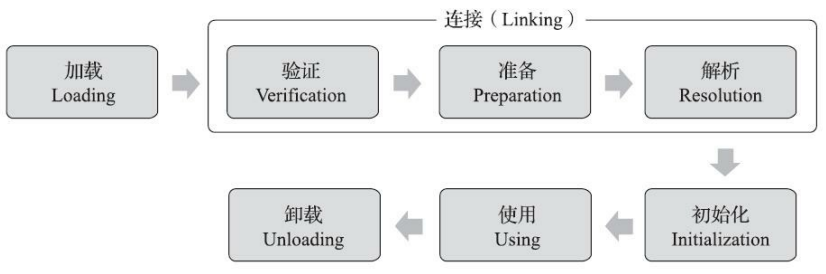

### 类的生命周期

一个类型从被加载到虚拟机内存中开始，到卸载出内存为止，它的整个生命周期将会经历加载 （Loading）、验证（Verification）、准备（Preparation）、解析（Resolution）、初始化 （Initialization）、使用（Using）和卸载（Unloading）七个阶段，其中验证、准备、解析三个部分统称 为连接（Linking）。

其中，加载、验证、准备、初始化和卸载这五个阶段的顺序是确定的，但是解析的阶段并不确定。

### 类加载的全过程

类加载的全过程主要包括加载、验证、准备、解析和初始化这五个阶段所执行的具体动作。

#### 加载

在加载阶段，Java 虚拟机需要完成以下事情：

1. 通过一个类的全限定名来获取定义此类的二进制字节流
2. 将这个字节流所代表的静态存储结构转化为方法区的运行时数据结构。
3. 在内存中生成一个代表这个类的 `java.lang.Class` 对象，作为方法区这个类的各种数据的访问入口。

**加载主要是通过双亲委托模型所决定使用的类加载器来实现**。值得注意的是，加载阶段与连接阶段的部分动作（如一部分字节码文件格式验证动作）是交叉进行的。

另外，类加载器并不会一次性加载所有的类，而是根据需要**动态加载**。

#### 验证

验证的目的是确保 Class 文件的字节流中包含的信息符合《Java虚拟机规范》的全部约束要求，保**证这些信息被当作代码运行后不会危害虚拟机自身的安全**。

验证阶段大致上会完成下面四个阶段的检验动作：

- **文件格式验证**：验证字节流是否符合 Class 文件格式的规范，并且能被当前版本的虚拟机处理
- **元数据验证**：是对字节码描述的信息进行语义分析。例如，这个类的父类是否继承了不允许被继承的类（被 final 修饰的类）
- **字节码验证**：是通过数据流分析和控制流分析，确定 程序语义是合法的、符合逻辑的。
- **符号引用验证**：确保解析行为能正常发生。对类自身以外（常量池中的各种符号引用）的各类信息进行匹配性校验，通俗来说就是，该类是否缺少或者被禁止访问它依赖的某些外部类、方法、字段等资源。

#### 准备

准备阶段是正式为类中定义的变量（即静态变量，被static修饰的变量）分配内存并设置类变量初始值的阶段。

从概念上来讲，这些变量存放在方法区中的运行时常量池。

#### 解析

解析阶段是Java虚拟机将常量池内的符号引用替换为直接引用的过程。

#### 初始化

在初始化阶段，Java虚拟机才真正开始执行类中编写的Java程序代码。会根据程序员通过程序编码制定的主观计划去初始化类变量和其他资源。更加具体点，执行静态字段赋值动作，执行类定义中的静态初始化块内的逻辑。

执行编译器自动生成的构造器方法， 而不是开发者编写的构造器方法。也能理解，毕竟这里只是创建 `java.lang.Class` 对象，而不是创建 `java.lang.Class` 对象所对应的 `Object` 对象

### 类的卸载

在 JVM 生命周期内，由 jvm 自带的类加载器加载的类是不会被卸载的。但是由我们自定义的类加载器加载的类是可能被卸载的。