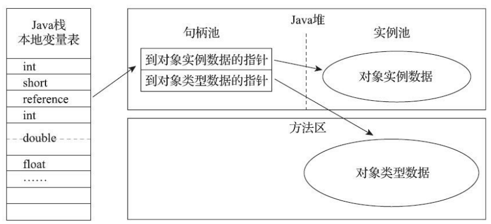
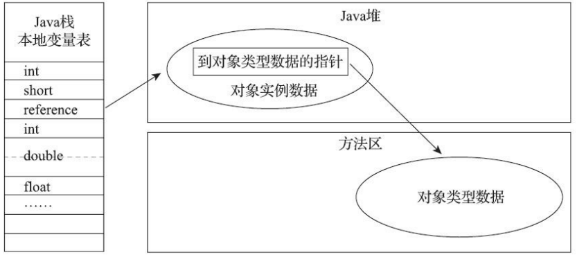

### 对象的创建过程

在 Java 虚拟机（ JVM ）中，创建一个对象的过程涉及多个步骤，从类加载到内存分配，再到对象初始化。

```plaintext
1. 类加载检查 --> 2. 内存分配 --> 3. 内存初始化 --> 4. 对象头设置 --> 5. 构造函数调用 --> 6. 返回引用
```

详细创建过程如下：

1. **类加载检查**

   当 Java 虚拟机遇到一条字节码new指令时，首先将去检查这个指令的参数是否能在常量池中定位到 一个类的符号引用，并且检查这个符号引用代表的类是否已被加载、解析和初始化过。如果没有，那 必须先执行相应的类加载过程。

2. **内存分配**

   在类加载检查通过后，**虚拟机根据新生对象的大小在堆中分配一块连续的内存空间**。将为新生对象分配内存。对象所需内存的大小在类加载完成后便可完全确定。

   内存分配方式有：

   - **指针碰撞（Bump-the-pointer）**：如果堆内存是规整的，所有已使用内存位于一边，空闲内存在另一边，中间有一个指针指示内存边界，分配时只需移动指针。
   - **空闲列表（Free List）**：如果堆中已使用和未使用的内存交错存在，JVM 会使用一个空闲列表来找到合适的内存块。

   选择哪种分配方式由 Java 堆是否规整决定，而 Java 堆是否规整又由所采用 的垃圾收集器是否带有空间压缩整理（Compact）的能力决定。实际上来说，**内存分配的方式依赖于垃圾收集器的实现**。

   另外，对象创建的线程安全问题由CAS配上失败重试和本地线程分配缓冲（Thread Local Allocation Buffer，TLAB）来解决

3. **内存初始化**

   内存分配完成之后，**虚拟机必须将分配到的内存空间（但不包括对象头）都初始化为零值**。这步操作保证了对象的实例字段 在Java代码中可以不赋初始值就直接使用，使程序能访问到这些字段的数据类型所对应的零值。

4. **对象头设置**

   Java虚拟机还要对对象进行必要的设置，通常包括以下内容：

   - **Mark Word**：包含对象的哈希码、GC 标志、锁状态、对象的GC分代年龄等。

   - **类元数据指针**：指向对象对应的类元数据，标识该对象是哪个类的实例。

   - **数组长度（如果是数组）**：如果对象是数组，还需要记录数组的长度。

   根据虚拟机当前运行状态的不同，如是否启用偏向锁等，对象头会有不同的设置方式。

5. **构造函数调用**

   new 指令之后会接着执行 Class 文件中的 `<init>()` 方法，按照程序员的意愿对对象进行初始化.

6. **返回对象的引用**

   对象创建完毕后，JVM 将该对象的引用返回给调用者。引用是指向堆中对象的内存地址。


### 对象的内存布局

在HotSpot虚拟机里，对象在堆内存中的存储布局可以划分为三个部分：对象头（Header）、实例 数据（Instance Data）和对齐填充（Padding）。

1. **对象头**

   对象头是 JVM 用来<font color="blue">**存储对象的元数据信息的部分**</font>，通常包括两部分内容：

   - **标记字段（Mark Word）**：用于存储对象自身的运行时数据，如哈希码（HashCode）、GC分代年龄、锁状态标志、线程持有的锁、偏向线程ID、偏向时间戳等，这部 分数据的长度在32位和64位的虚拟机（未开启压缩指针）中分别为32个比特和64个比特。

   - **类型指针（Type Pointer）**：即对象指向它的类型元数据的指针，Java虚拟机通过这个指针来确定该对象是哪个类的实例。

   对于数组类型的对象，对象头还会存储数组的长度信息。

2. **实例数据**

   实例数据部分是<font color="blue">**对象真正存储的有效信息**</font>，即对象的实例变量。实例数据部分存储了对象的所有非静态字段（静态字段属于类，不属于对象，因此存储在方法区中）。

   这部分的存储顺序会受到虚拟机分配策略参数（-XX：FieldsAllocationStyle参数）和字段在Java源码中定义顺序的影响。

3. **对齐填充**

   为了确保对象的内存地址能够按照机器的字节对齐要求进行排列，JVM 可能会在对象的内存布局中加入一些填充字节。

   - 对齐的目的是为了提高内存访问效率。**JVM 通常要求对象的大小是 8 字节的倍数**，因此如果对象的大小不是 8 的倍数，JVM 会填充一些字节使其对齐。

   - 这些填充字节通常位于对象的末尾，并不包含有意义的数据。


### 对象的访问定位

Java 对象的访问定位是指<font color="blue">**JVM 如何通过 Java 虚拟机栈上的 reference 数据在堆中找到对象的实际存储位置**</font> 。《Java虚拟机规范》里面只规定了reference 数据它是一个指向对象的引用，并没有定义 这个引用应该通过什么方式去定位、访问到堆中对象的具体位置，所以对象访问方式也是由虚拟机实现而定的。

主流的访问方式主要由句柄和直接指针两种。

**(1) 句柄访问方式（Handle Access）**

在句柄访问方式下,  Java 堆中将可能会划分出一块内存来作为句柄池，reference 中存储的就是对象的句柄地址，而句柄中包含了对象实例数据与类型数据各自具体的地址信息。

> 句柄（**Handle**）是一种间接的引用方式，它提供了对资源（如对象、文件、内存块、设备等）的间接访问。



使用句柄来访问的最大好处就是 reference 中存储的是稳定句柄地址，在对象被移动（垃圾收集时移动对象是非常普遍的行为）时只会改变句柄中的实例数据指针，而 <font color="red">**reference本身不需要被修改**</font>。

但是，由于增加了句柄的间接访问，需要多一次内存的访问操作，性能上稍逊于直接指针访问方式。


**(2) 直接指针访问方式（Direct Pointer Access）**

在直接指针访问方式下，reference 数据直接指向对象的实例数据内存地址。另外，Java堆中对象的内存布局必须考虑如何放置访问类型数据的相关信息。



使用直接指针来访问最大的好处就是**速度更快**，它节省了一次指针定位的时间开销。

但是，当对象在内存中移动（如垃圾回收期间），所有指向该对象的引用都需要更新，以确保它们仍然指向正确的内存地址。这对内存管理和维护程序的正确性提出了很大的挑战。