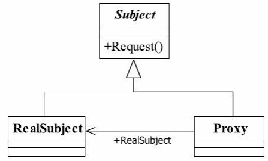
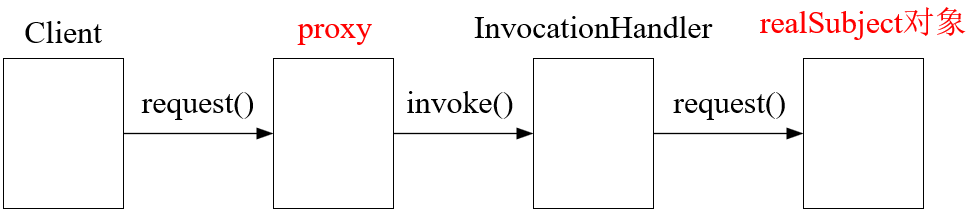

## 一、代理模式

### 1.1 代理模式的定义

代理模式（Proxy Pattern）是一个使用率非常高的模式，其定义如下： 

<font color="blue">**Provide a surrogate or placeholder for another object to control access to it**</font>.（为其他对象提供一种代理以控制对这个对象的访问。）

代理模式也叫做委托模式，它是一项基本设计技巧。许多其他的模式，如状态模式、策略模式、访问者模式本质上是在更特殊的场合采用了委托模式。实际上，代理模式就是**增加额外的一些功能**。


### 1.2 代理模式的参与者

在代理模式中，参与者主要有：

- **抽象主题（Subject）**：定义代理和真实对象的共同接口或抽象类，声明真实对象和代理对象所共有的方法。
- **真实主题（RealSubject）**：实现抽象主题接口，定义具体的业务逻辑。
- **代理（Proxy）**：实现抽象主题接口，<font color="red">**持有真实主题对象的引用，把所有抽象主题类定义的方法委托给真实主题角色实现，并且在真实主题角色执行方法前后做附加操作**</font>（如控制访问、记录日志等）。





### 1.3 代理模式的优点

- **职责清晰**。真实的角色就是实现实际的业务逻辑，不用关心其他非本职责的事务，通过后期的代理 完成一件事务，附带的结果就是编程简洁清晰。
- **高扩展性**。具体主题角色是随时都会发生变化的，只要它实现了接口，代理类完全就可以在不做任何修改的情况下使用。


### 1.4 代理模式的扩展

根据客户端是否能访问代理角色，代理模式可以扩展为：

- **普通代理**：客户端只能访问代理角色，不能访问真实角色。（在日常生活中，我们将任务委托给律师完成后，就什么都不用管）
- **强制代理**：客户端直接调用真实角色，而不用关心代理是否存在，其代理的产生是通过真实角色决定的。

根据代理类生成的阶段，代理模式分为：

- **静态代理**：在编译时创建代理类，代理类和真实对象类在编译时就已经确定。静态代理需要为每个代理类写一个具体的实现。
- **动态代理**：在运行时动态生成代理类，不需要在编译时创建具体的代理实现。**动态代理可以在运行时根据不同的需要生成不同的代理对象**。


### 1.5 代理模式的使用场景

代理模式本质上是在执行方法的前后做一些额外的动作，经典实现主要有 Spring AOP。使用场景有：

- **访问控制**：代理对象可以控制对真实对象的访问，执行权限检查等操作。

- **日志记录**：代理对象可以记录对真实对象的操作日志，例如方法调用的时间、参数等。


## 二、代理模式实现

### 2.1 静态代理

```java
// 抽象主题
public interface Subject {
    void request();
}

// 真实主题
public class RealSubject implements Subject {
    @Override
    public void request() {
        System.out.println("RealSubject request");
    }
}

// 代理
public class ProxySubject implements Subject {
    private RealSubject realSubject;

    public ProxySubject() {
        this.realSubject = new RealSubject();
    }

    @Override
    public void request() {
        System.out.println("ProxySubject request");
        realSubject.request();
    }
}

// 客户端代码
public class StaticProxyDemo {
    public static void main(String[] args) {
        Subject subject = new ProxySubject();
        subject.request();
    }
}
```


### 2.2 动态代理

在动态代理中，代理类在运行时生成。在 Java 提供的动态代理机制中， 动态代理主要分为两种类型：

- 基于类的代理( CGLIB 动态代理)： CGLIB 在运行时动态生成一个目标类的子类。CGLIB 代理不需要目标类实现接口，而是通过继承的方式来创建类。

- 基于接口的代理( JDK 动态代理):  这种代理的核心是 `java.lang.reflect.Proxy` 类和 `java.lang.reflect.InvocationHandler` 接口。调用过程为：




本文利用 JDK 动态代理来实现代理模式。

```java
import java.lang.reflect.InvocationHandler;
import java.lang.reflect.Method;
import java.lang.reflect.Proxy;

// 抽象主题
public interface Subject {
    void request();
}

// 真实主题
public class RealSubject implements Subject {
    @Override
    public void request() {
        System.out.println("RealSubject request");
    }
}

// 动态代理处理器
public class DynamicProxyHandler implements InvocationHandler {
    private Subject subject;

    public DynamicProxyHandler(Subject subject) {
        this.subject = subject;
    }

    /**
     * 处理代理实例上的方法调用并返回结果。
     *
     * @param proxy 被调用方法的代理实例
     * @param method 与代理实例上被调用接口方法对应的 {@code Method} 实例。该方法声明的类是最初声明此方法的接口，
     *             可能是代理接口通过继承获得该方法的父接口。
     * @param args 包含方法调用时传递的参数值的对象数组，若接口方法无参数，则为 {@code null}。
     *            基本类型的参数会被包装成对应的包装类类型，如 {@code java.lang.Integer} 或 {@code java.lang.Boolean}。
     *
     * @return 处理结果
     * @throws Throwable 可能抛出的异常
     */
    @Override
    public Object invoke(Object proxy, java.lang.reflect.Method method, Object[] args) throws Throwable {
        System.out.println("before invoke");
        Object result = method.invoke(subject, args);
        System.out.println("after invoke");
        return result;
    }
}

// 客户端代码
public class DynamicProxyDemo {

    public static void main(String[] args) throws Exception {
        // 创建真实主题对象
        RealSubject realSubject = new RealSubject();

        // 创建动态代理对象 proxy
        Subject proxy = (Subject) Proxy.newProxyInstance(
                RealSubject.class.getClassLoader(),     // 指定类加载器，用于定义代理类
                new Class[]{Subject.class},             // 代理类需实现的接口列表
                new DynamicProxyHandler(realSubject)    // 处理代理方法调用的调用处理器（此处为realSubject的实际调用）
        );

        // 调用代理对象 proxy 的方法 request()
        // 当代理对象的一个方法被调用时，JVM 会捕获这个方法调用，并将其转发给 InvocationHandler 的 invoke 方法
        proxy.request();
    }
}
```


## 参考资料

《设计模式之禅 (第2版)》