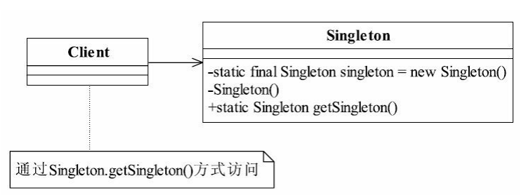

[TOC]

> 本文源代码地址为 [java-demos/singeleton-pattern at main · idealzouhu/java-demos (github.com)](https://github.com/idealzouhu/java-demos/tree/main/singeleton-pattern)

## 一、单例模式

### 1.1 单例模式定义

单例模式（Singleton Pattern）是一个比较简单的模式，其定义如下： 

<font color="blue">**Ensure a class has only one instance, and provide a global point of access to it**</font>.（**确保某一个类只有一个实例，而且自行实例化并向整个系统提供这个实例**。）





### 1.2 单例模式的优点

- **全局访问**：单例对象可以在应用程序的任何地方被访问，而不需要传递对象的引用。这样可以方便地共享对象的状态和功能，简化了对象之间的通信和协作。
- **节省资源**：由于只有一个对象实例存在，可以减少重复创建对象的开销。在需要频繁创建和销毁对象的情况下，单例对象可以显著节省系统资源，提高性能。


### 1.3 单例模式的缺点

- 单例模式没有接口，**扩展困难**
- 单例模式与单一职责原则有冲突。一个类应该只实现一个逻辑，而不关心它是否是单例的，是不是要单例取决于环境，单例模式把“要单例”和业务逻辑融合在一个类中。


### 1.4 单例模式的使用场景

在一个系统中，要求一个类有且仅有一个对象，**如果出现多个对象就会出现“不良反应”**，可以采用单例模式，具体的场景如下： 

- 要求生成唯一序列号的环境； 
- 在整个项目中需要一个共享访问点或共享数据，例如一个Web页面上的计数器，可以 不用把每次刷新都记录到数据库中，使用单例模式保持计数器的值，并确保是线程安全的； 
- 创建一个对象需要消耗的资源过多，如要访问IO和数据库等资源；
- 需要定义大量的静态常量和静态方法（如工具类）的环境，可以采用单例模式（当 然，也可以直接声明为static的方式）。


## 二、单例模式实现

实现单例模式的注意事项主要有：

- **构造函数私有化**:限制产生多个对象。
- **提供静态的访问方法**: 用于外部访问唯一的实例
- **线程安全性**：在懒汉式单例模式中，如果多个线程同时访问 `getInstance()` 方法并且尝试创建实例，可能会导致创建多个实例。


### 2.1 饿汉式单例模式(Eager Initialization Singleton)

在饿汉式单例模式中，单例对象**在类加载时就已经被初始化**，因此不需要担心线程安全问题。

```java
public class EagerSingleton {
    // 静态成员变量，保存单例对象（final 使对象具备不可变性，从而保证线程安全）
    private static EagerSingleton instance = new EagerSingleton();

    // 私有构造方法，防止外部实例化
    private EagerSingleton() {}

    // 公共静态方法，返回单例对象
    public static EagerSingleton getInstance() {
        return instance;
    }

    // 示例方法，用于演示单例的行为
    public void doSomething() {
        System.out.println("do something");
    }

    public static void main(String[] args) {
        // 获取单例对象并调用方法
        EagerSingleton eagerSingleton = EagerSingleton.getInstance();
        eagerSingleton.doSomething();
    }
}
```

 `getInstance` 是一个公共静态方法，用于返回单例对象。由于 INSTANCE 已经在类加载时初始化，因此这种方法被称为“饿汉式”实现。


### 2.2 懒汉式单例模式(Lazy Initialization Singleton)

懒汉式单例模式的特点是**在需要的时候才创建实例**，将实例的初始化延迟到第一次调用的时候。

```java
public class LazySingleton {
    // 静态成员变量，保存单例对象
    private static LazySingleton instance;

    // 私有构造方法，防止外部实例化
    private LazySingleton() {}

    // 公共静态方法，返回单例对象
    public static LazySingleton getInstance() {
        // 双重检查加锁，线程安全
        if (instance == null) {
            synchronized (LazySingleton.class) {
                if (instance == null) {
                    instance = new LazySingleton();
                }
            }
        }
        return instance;
    }

    // 示例方法，用于演示单例的行为
    public void doSomething() {
        System.out.println("Doing something...");
    }

    public static void main(String[] args) {
        // 获取单例对象并调用方法
        LazySingleton singleton = LazySingleton.getInstance();
        singleton.doSomething();
    }
}
```

 `getInstance()` 是一个公共静态方法，用于返回单例对象。该方法利用双重检查锁保证线程安全：

1. 首先检查 instance 是否为 `null`，如果是，则进入同步块。大多数情况下，instance 已经被初始化，因此大多数调用都不会进入同步块，从而避免了不必要的同步开销。
2. 在同步块内再次检查 instance 是否为 `null`，以确保线程安全地创建单例对象。


## 参考资料

《设计模式之禅 (第2版)》

[Java基础面试题 | 小林coding (xiaolincoding.com)](https://xiaolincoding.com/interview/java.html#volatile和sychronized如何实现单例模式)

[手摸手实现基础组件模块 (yuque.com)](https://www.yuque.com/magestack/12306/gmk40bad5dickgul#Ie0WN)