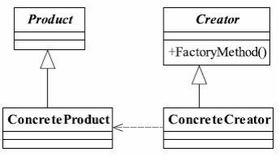

## 一、工厂方法模式

### 1.1 工厂方法模式定义

工厂方法( Factory Method)模式定义为：

<font color="blue">**Define an interface for creating an object,but let subclasses decide which class to instantiate. Factory Method lets a class defer instantiation to subclasses.**</font>（定义一个用于创建对象的接口，让子类决定实例化哪一个类。工厂方法使一个类的实例化延迟到其子类。）


### 1.2 工厂方法模式的参与者

在工厂方法模式中，不同参与者的作用如下：

- **抽象产品（Product）**：定义了工厂方法所创建的对象的接口，实现对事物最抽象的定义。
- **具体产品（Concrete Product）**：实现了抽象产品接口。工厂方法创建的实际对象，每一个具体产品对应于某一个具体工厂。
- **抽象工厂（Creator / Factory）**：声明工厂方法 `FactoryMethod()` ，用来返回一个抽象产品。工厂方法通常是抽象的，具体子类会覆盖这个方法以返回不同的具体产品。
- **具体工厂（Concrete Creator）**:  实现工厂方法，负责创建一种具体产品的实例。




### 工厂方法模式的优点

- **解耦合**：工厂方法模式**将对象的创建逻辑与使用逻辑分离**。虽然客户端依赖工厂类，但它并不需要知道产品的实际构造细节，只需要知道如何调用工厂方法。产品对象的具体类型隐藏在工厂实现的背后，降低了客户端与具体产品的耦合度。


### 二、工厂方法模式实现

工厂方法模式的核心在于**将对象的创建推迟到子类中**，使得客户端代码只与抽象产品和抽象工厂进行交互，而无需关心具体产品类的生成。

```java
// 抽象产品
interface Product {
    void use();
}

// 具体产品A
class ConcreteProductA implements Product {
    public void use() {
        System.out.println("Using Product A");
    }
}

// 具体产品B
class ConcreteProductB implements Product {
    public void use() {
        System.out.println("Using Product B");
    }
}

// 抽象工厂
abstract class Creator {
    // 工厂方法
    public abstract Product factoryMethod();

    // 一般方法，调用工厂方法
    public void doSomething() {
        Product product = factoryMethod();
        product.use();
    }
}

// 具体工厂A
class ConcreteCreatorA extends Creator {
    public Product factoryMethod() {
        return new ConcreteProductA();
    }
}

// 具体工厂B
class ConcreteCreatorB extends Creator {
    public Product factoryMethod() {
        return new ConcreteProductB();
    }
}

// 客户端
public class FactoryMethodExample {
    public static void main(String[] args) {
        Creator creatorA = new ConcreteCreatorA();
        creatorA.doSomething();  // 输出：Using Product A

        Creator creatorB = new ConcreteCreatorB();
        creatorB.doSomething();  // 输出：Using Product B
    }
}
```

