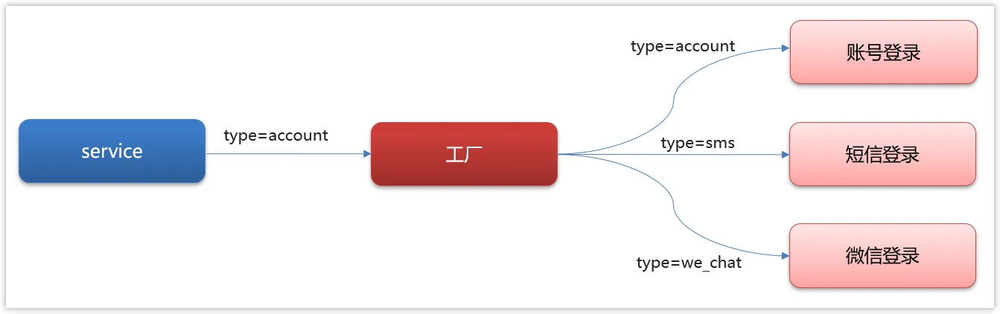

[设计模式 (yuque.com)](https://www.yuque.com/xiaobaicaio/gh8rmw/vlvoeqfvc6779lky?singleDoc#NaoiR)

[java中常见的设计模式以及常见的面试题-CSDN博客](https://blog.csdn.net/weixin_43784341/article/details/136682931?spm=1000.2115.3001.6382&utm_medium=distribute.pc_feed_v2.none-task-blog-personrec_tag-5-136682931-null-null.329^v9^个推pc首页推荐—桶10&depth_1-utm_source=distribute.pc_feed_v2.none-task-blog-personrec_tag-5-136682931-null-null.329^v9^个推pc首页推荐—桶10)

最常用的设计模式三板斧： 构建者模式、 责任链模式、 策略模式

## 责任链模式

责任链模式可以实现请求的发送者和接收者之间的解耦。 发送者只需要将请求发送给第一个处理者，无需关心具体是哪个处理者来处理。

在使用模式的时候**，`applicationContext.getBeansOfType()` 是 Spring Framework 提供的一个方法，用于获取容器中所有指定类型的 bean 实例。**这样的话，我们就不需要将其保存到指定位置

## 策略模式

案例 [设计模式 (yuque.com)](https://www.yuque.com/xiaobaicaio/gh8rmw/vlvoeqfvc6779lky?singleDoc#jzz3h)

下图是gitee的登录的入口，其中有多种方式可以进行登录

- 用户名密码登录
- 短信验证码登录
- 微信登录
- QQ登录

## 观察者模式

在⽀付场景下，⽤户购买⼀件商品，当⽀付成功之后，系统可能会有很多需要执⾏的逻辑（如：更新订单状态，发送邮件通知，赠送礼品…），这些逻辑之间并没有强耦合，因此天然适合使⽤观察者模式去实现这些功能，当有更多的操作时，只需要添加新的观察者就能实现，完美实现了对修改关闭，对扩展开放的开闭原则。

在这里，第三方系统可以看作是观察者，因为它需要观察支付成功这一事件的发生，并且在事件发生后执行一些与该事件相关的操作。支付系统视为被观察者，因为它会通知观察者支付成功这一事件的发生。

