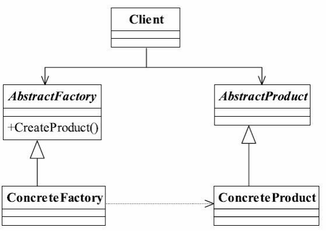

## 一、抽象工厂模式

### 1.1 抽象工厂模式定义

抽象工厂模式（Abstract Factory Pattern）是一种比较常用的模式，其定义如下： 

<font color="blue">**Provide an interface for creating families of related or dependent objects without specifying their concrete classes.**</font>（为创建一组相关或相互依赖的对象提供一个接口，而且无须指定它们的具体类。）


### 1.2 抽象工厂模式的参与者

**抽象工厂（Abstract Factory）**: 提供一个接口，负责创建一系列产品。

**具体工厂（Concrete Factory）**: 实现创建一系列具体产品。

**抽象产品（Abstract Product）**: 声明一系列产品的接口。

**具体产品（Concrete Product）**: 具体实现不同产品的类。




### 1.3 抽象工厂模式的优点

- 封装性
- 产品族内的约束为非公开状态。


### 1.4 抽象工厂模式的缺点

- 产品族**扩展非常困难**。以下文普通案例中的通用代码为例，如果要增加一个产品C，也就是说产品家族由原来的 2 个增加到 3 个，抽象类 AbstractCreator 要增加一个方法 createProductC()， 抽象类的两个实现类也要修改。


### 1.5 抽象工厂模式和工厂方法模式的区别

**抽象层次**: 工厂方法是针对一个产品的创建，抽象工厂是针对多个产品族的创建。

**结构**: 工厂方法模式只有一个抽象产品，而抽象工厂模式会有**多个抽象产品**对应多个具体工厂。

**使用场景**: 工厂方法适用于只有一种产品的场景，抽象工厂适用于<font color="red">**创建多个相关产品**</font>的场景。


## 二、抽象工厂模式实现

对于一个产品来说，我们只要知道它的工厂方法就可以直接产生一个产品对象，无须关心它的实现类。

```java
// 抽象产品接口
interface Chair {
    void create();
}

interface Table {
    void create();
}

// 具体产品 - 现代风格
class ModernChair implements Chair {
    public void create() {
        System.out.println("Create modern chair");
    }
}

class ModernTable implements Table {
    public void create() {
        System.out.println("Create modern table");
    }
}

// 具体产品 - 维多利亚风格
class VictorianChair implements Chair {
    public void create() {
        System.out.println("Create Victorian chair");
    }
}

class VictorianTable implements Table {
    public void create() {
        System.out.println("Create Victorian table");
    }
}

// 抽象工厂接口
interface FurnitureFactory {
    Chair createChair();
    Table createTable();
}

// 具体工厂 - 现代风格家具工厂
class ModernFurnitureFactory implements FurnitureFactory {
    public Chair createChair() {
        return new ModernChair();
    }

    public Table createTable() {
        return new ModernTable();
    }
}

// 具体工厂 - 维多利亚风格家具工厂
class VictorianFurnitureFactory implements FurnitureFactory {
    public Chair createChair() {
        return new VictorianChair();
    }

    public Table createTable() {
        return new VictorianTable();
    }
}

// 客户端代码
public class Client {
    public static void main(String[] args) {
        FurnitureFactory factory = new ModernFurnitureFactory();
        Chair chair = factory.createChair();
        Table table = factory.createTable();
        chair.create();
        table.create();

        // 也可以创建维多利亚风格的家具
        factory = new VictorianFurnitureFactory();
        chair = factory.createChair();
        table = factory.createTable();
        chair.create();
        table.create();
    }
}
```

