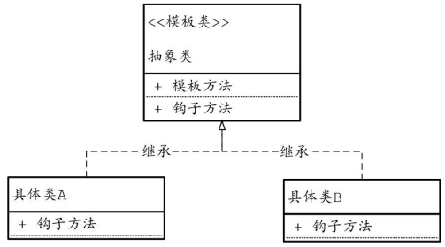

## 一、模板方法模式

### 模板方法模式的定义

模板方法模式（Template Method Pattern）定义如下：

<font color="blue">**Define the skeleton of an algorithm in an operation,deferring some steps to subclasses.Template Method lets subclasses redefine certain steps of an algorithm without changing the algorithm's structure**</font>.（定义一个操作中的算法的框架，而将一些步骤延迟到子类中。使得子类可以不改变一个算法的结构即可重定义该算法的某些特定步骤。）


### 模板方法模式的参与者

在模板模式中，父类提供框架性的公共逻辑，子类提供个性化的定制逻辑。

- 抽象类定义模板方法和钩子方法，模板方法定义一套业务算法框架，**算法框架中的某些步骤由钩子方法负责完成**。
- 具体的子类可以按需要重写钩子方法。模板方法的调用将通过抽象类的实例来完成




### 模板方法模式的优点

- **分离变与不变**： 模板模式将不变的部分封装在基类的骨架方法中， 而将变化的部分通过钩子方法进行封装，交给子类去提供具体的实现。

- 行为由父类控制，子类实现。

  


### 模板方法模式的缺点

- 增大代码阅读难度：一般而言， 抽象类声明方法，实现类负责实现方法。但是，模板方法模式却颠倒了，抽象类定义了部分抽象方法，由子类实现，子类执行的结果影响了父类的结果，也就是**子类对父类产生了影响**。


### 模板方法模式的使用场景

- **重要的复杂算法**：把核心算法设计为模板方法，周边的相关细节功能则由各个子类实现


### 模板方法模式的实际使用案例

在 Java 集合里面， BlockingQueue 就是使用了这个。


### 模板方法模式的扩展

在模板方法模式中，将普通抽象方法替换成钩子方法。

**钩子方法**：在父类中提供一个默认的实现，子类可以根据需要覆盖它来提供自己的实现。<font color="red">**钩子方法可以让子类在模板方法执行过程中决定插入或跳过某些步骤**</font>。

“钩子”这个名字的含义源于其功能：它像一个挂钩（hook）一样，可以在执行主流程（模板方法）时**挂入**或**插入**额外的行为。换句话说，钩子方法让子类有机会在算法执行过程中“钩住”某些点，插入或跳过某些操作，而不需要完全改变算法的结构。


## 二、模板方法模式实现

使用的注意事项：

- 为了防止恶意的操作，一般模板方法都加上 `final` 关键字，不允许被覆写。
- 钩子方法尽量设计为 `protected` 类型，符合迪米特法则，不需要暴露 的属性或方法尽量不要设置为 `protected` 类型


```java
// 抽象类：定义制作饮料的模板
abstract class Beverage {
    
    // 模板方法，定义制作饮料的步骤
    public final void prepareRecipe() {
        boilWater();
        brew();
        pourInCup();
        if (customerWantsCondiments()) {
            addCondiments();
        }
    }
    
    // 具体方法：煮水
    void boilWater() {
        System.out.println("Boiling water");
    }
    
    // 具体方法：倒入杯子
    void pourInCup() {
        System.out.println("Pouring into cup");
    }
    
    // 抽象方法：冲泡或浸泡，具体由子类实现
    abstract void brew();
    
    // 抽象方法：添加调料，具体由子类实现
    abstract void addCondiments();
    
    // 钩子方法：子类可以覆盖这个方法以添加调料的条件
    boolean customerWantsCondiments() {
        return true;
    }
}

// 具体类：制作茶
class Tea extends Beverage {
    @Override
    void brew() {
        System.out.println("Steeping the tea");
    }
    
    @Override
    void addCondiments() {
        System.out.println("Adding lemon");
    }
}

// 具体类：制作咖啡
class Coffee extends Beverage {
    @Override
    void brew() {
        System.out.println("Dripping coffee through filter");
    }
    
    @Override
    void addCondiments() {
        System.out.println("Adding sugar and milk");
    }
}

// 测试
public class TemplateMethodPatternExample {
    public static void main(String[] args) {
        Beverage tea = new Tea();
        tea.prepareRecipe();  // 制作茶
        
        Beverage coffee = new Coffee();
        coffee.prepareRecipe();  // 制作咖啡
    }
}

```


