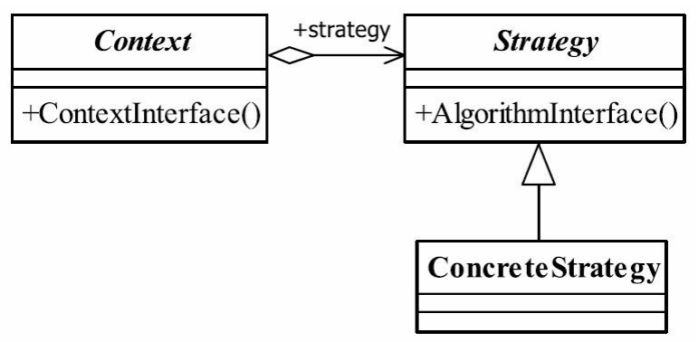

## 一、策略模式

### 1.1 策略模式的定义

策略模式（Strategy Pattern）定义如下：

<font color="blue">**Define a family of algorithms,encapsulate each one,and make them interchangeable**</font>.（定义一组算法，将每个算法都封装起来，并且使它们之间可以互换。）


### 1.2 策略模式的参与者

策略模式的参与者主要有：

- **Context（上下文类）**：它持有一个 `Strategy` 对象，用于调用具体策略的方法。客户端通常只需要与 `Context` 交互，而不直接接触具体的策略实现。
- **Strategy（策略接口）**：定义了算法的通用接口，所有具体策略都实现这个接口。
- **ConcreteStrategy（具体策略类）**：实现 `Strategy` 接口的具体算法类，不同的策略类提供不同的算法实现。




### 1.3 策略模式的优点

- **避免使用多重条件判断**：策略模式可以取代`if-else`或`switch-case`的条件分支。


### 1.4 策略模式的缺点

- **策略数量可能会增多**：如果策略太多，会增加类的数量，维护成本上升。


### 1.5 策略模式的使用场景

- **算法/行为自由切换**： 比如支付系统中，可以通过策略模式动态选择不同的支付方式（微信支付、支付宝支付、信用卡支付等）。
- **屏蔽算法底层细节**：只用知道算法名字即可


### 二、策略模式实现

假设我们有一个系统，它可以根据不同的需求选择不同的排序算法，比如快速排序、冒泡排序、归并排序等。通过策略模式，我们可以将这些不同的算法作为策略类进行实现。

```java
// 策略接口
interface SortStrategy {
    void sort(int[] array);
}

// 具体策略类：快速排序
class QuickSortStrategy implements SortStrategy {
    @Override
    public void sort(int[] array) {
        // 快速排序算法实现
        System.out.println("Using Quick Sort");
        // 排序逻辑
    }
}

// 具体策略类：冒泡排序
class BubbleSortStrategy implements SortStrategy {
    @Override
    public void sort(int[] array) {
        // 冒泡排序算法实现
        System.out.println("Using Bubble Sort");
        // 排序逻辑
    }
}

// 上下文类：负责使用策略
class SortingContext {
    private SortStrategy strategy;
    
    // 设置策略
    public void setStrategy(SortStrategy strategy) {
        this.strategy = strategy;
    }
    
    // 执行排序
    public void executeSort(int[] array) {
        strategy.sort(array);
    }
}

// 测试
public class StrategyPatternExample {
    public static void main(String[] args) {
        SortingContext context = new SortingContext();
        
        // 使用快速排序策略
        context.setStrategy(new QuickSortStrategy());
        context.executeSort(new int[]{3, 1, 2});
        
        // 使用冒泡排序策略
        context.setStrategy(new BubbleSortStrategy());
        context.executeSort(new int[]{3, 1, 2});
    }
}

```


## 参考资料

[(16条消息) Java设计模式之策略模式(UML类图分析+代码详解)_策略模式类图_bobcoding的博客-CSDN博客](https://blog.csdn.net/m0_51750419/article/details/127525968 )


