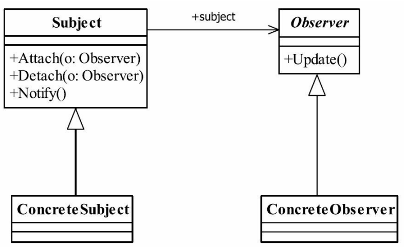

## 一、观察者模式

### 1.1 观察者模式的定义

观察者模式（Observer Pattern）也叫做发布订阅模式（Publish/subscribe），其定义如下：

<font color="blue">**Define a one-to-many dependency between objects so that when one object changes state,all its dependents are notified and updated automatically**</font>.（定义对象间一种一对多的依赖关系，使得每当一个对象改变状态，则所有依赖于它的对象都会得到通知并被自动更新。）


### 1.2 观察者模式的参与者

- **Subject（主题/被观察者）**：负责维护观察者列表，并在自身状态变化时通知所有观察者。它提供添加、删除观察者的方法，以及状态变更通知方法。
- **ConcreteSubject（具体主题）**：具体的主题类，实现了主题的具体逻辑。它维护着自身的状态，并负责在状态变化时通知所有观察者。
- **Observer（观察者）**：定义了一个更新接口，使得它可以在主题发生变化时被通知。具体的观察者实现类会根据通知做出相应处理。
- **ConcreteObserver（具体观察者）**：具体的观察者类，实现了观察者接口，并根据接收到的主题状态做出反应。




### 1.3 观察者模式的优点

- **解耦**：主题和观察者之间松耦合，主题不需要知道观察者的具体实现
- **灵活**：观察者可以在运行时动态添加或移除，容易扩展系统功能。


### 1.4 观察者模式的缺点

观察者模式需要考虑一下开发效率和运行效率问题，**最好使用异步通信**。

如果使用同步通信，当一个观察者的处理速度较慢时，可能会拖慢通知过程。


### 1.5 观察者模式的使用场景

- 当一个对象的改变需要自动通知其他对象时，适合使用观察者模式。常用于实现发布-订阅系统、事件监听器、GUI框架中的事件处理、MVC架构中的视图更新等场景。

  

## 二、观察者模式实现

### 2.1 工作流程

观察者模式工作流程：

- **注册观察者**：观察者通过注册接口订阅某个主题。

- **状态变化**：当主题发生变化时，它会遍历注册的所有观察者并通知它们。

- **通知观察者**：每个观察者收到通知后，依据主题传递的信息，更新自己的状态或执行相应的操作。


### 2.2 实现代码

```java
import java.util.ArrayList;
import java.util.List;

// 主题接口
interface Subject {
    void registerObserver(Observer o);
    void removeObserver(Observer o);
    void notifyObservers();
}

// 观察者接口
interface Observer {
    void update(float temperature, float humidity, float pressure);
}

// 具体主题类
class WeatherData implements Subject {
    private List<Observer> observers;
    private float temperature;
    private float humidity;
    private float pressure;

    public WeatherData() {
        observers = new ArrayList<>();
    }

    @Override
    public void registerObserver(Observer o) {
        observers.add(o);
    }

    @Override
    public void removeObserver(Observer o) {
        observers.remove(o);
    }

    @Override
    public void notifyObservers() {
        for (Observer observer : observers) {
            observer.update(temperature, humidity, pressure);
        }
    }

    public void setMeasurements(float temperature, float humidity, float pressure) {
        this.temperature = temperature;
        this.humidity = humidity;
        this.pressure = pressure;
        notifyObservers();
    }
}

// 具体观察者类
class CurrentConditionsDisplay implements Observer {
    private float temperature;
    private float humidity;

    @Override
    public void update(float temperature, float humidity, float pressure) {
        this.temperature = temperature;
        this.humidity = humidity;
        display();
    }

    public void display() {
        System.out.println("Current conditions: " + temperature + "F degrees and " + humidity + "% humidity.");
    }
}

// 主类测试
public class WeatherStation {
    public static void main(String[] args) {
        WeatherData weatherData = new WeatherData();

        CurrentConditionsDisplay currentDisplay = new CurrentConditionsDisplay();
        
        // 1. 注册观察者
        weatherData.registerObserver(currentDisplay);
		
        // 2. 状态变化，并通知观察者
        weatherData.setMeasurements(80, 65, 30.4f);
        weatherData.setMeasurements(82, 70, 29.2f);
    }
}

```


[设计模式（二）————观察者模式_观察者模式 uml类图-CSDN博客](https://blog.csdn.net/YXXXYX/article/details/120785799)