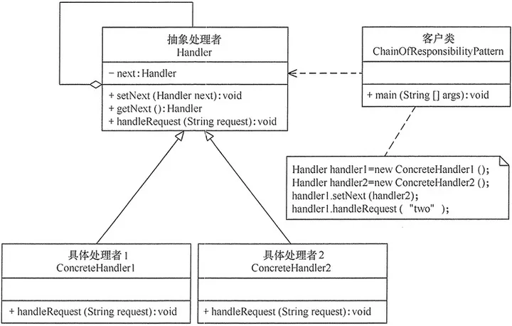
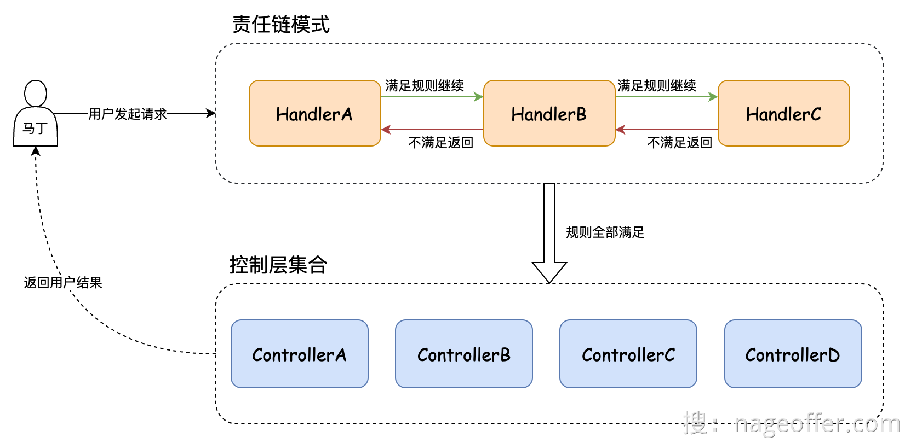

## 责任链模式定义

Avoid coupling the sender of a request to its receiver by giving more than one object a chance to handle the request.Chain the receiving objects and pass the request along the chain until an object handles it.（使多个对象都有机会处理请求，从而避免了请求的发送者和接受者之间的耦合关系。将这些对象连成一条链，并沿着这条链传递该请求，直到有对象处理它为止）

在实际应用中，责任链模式常用于请求的预处理、请求的过滤、请求的分发等场景。例如，可以使用责任链模式来实现前置校验、权限校验、日志记录、异常处理、请求重试等功能。

同时，也可以将责任链模式与其他设计模式结合起来，例如装饰器模式、工厂模式、观察者模式等，从而实现更复杂的功能。

因此责任链模式可以实现请求的动态分配。

[死磕设计模式之如何抽象责任链模式 (yuque.com)](https://www.yuque.com/magestack/12306/oly3msky0plpogzt)

# 实际案例

## 前置校验

[死磕设计模式之如何抽象责任链模式 (yuque.com)](https://www.yuque.com/magestack/12306/oly3msky0plpogzt#138aaa69)

[责任链模式重构复杂业务场景 (yuque.com)](https://www.yuque.com/magestack/12306/xxdps9bcasca7cyv)

[手摸手之实现用户购票责任链验证 (yuque.com)](https://www.yuque.com/magestack/12306/ggg2txzbfgfqp6tm)   推荐阅读

在责任链模式中，多个处理器依次处理同一个请求。一个请求先经过 A 处理器处理，然后再把请求传递给 B 处理器，B 处理器处理完后再传递给 C 处理器，以此类推，形成一个链条，链条上的每个处理器各自承担各自的处理职责。

