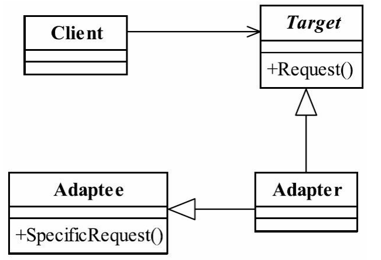

## 一、适配器模式

### 1.1 适配器模式的定义

适配器模式（**Adapter Pattern**）的定义如下：

<font color="blue">**Convert the interface of a class into another interface clients expect.Adapter lets classes work together that couldn't otherwise because of incompatible interfaces**</font>.（将一个类的接口变换成客户端所期待的另一种接口，从而使原本因接口不匹配而无法在一起工作的两个类能够在一起工 作。）

根据适配器模式的功能，适配器模式也叫包装器模式( Wrapper )。


### 1.2 适配器模式的参与者

- **目标接口（Target Interface）**：客户端所期望的接口。

- **源接口（Adaptee Interface）**：需要适配的现有接口。

- **适配器（Adapter）**：<font color="red">**将源接口转换成目标接口**</font>。适配器实现目标接口，同时在内部委托源接口的功能。

一个典型的类适配器的类图如下所示。




简单来说，适配器模式就是把一个接口或类转换成其他的接口或类。


### 1.3 适配器模式的类型

**对象适配器（Object Adapter）**：使用**组合**的方式将源接口的对象与目标接口结合起来。**适配器内部持有源接口的对象**，通过委托的方式调用源接口的方法。

**类适配器（Class Adapter）**：使用**继承**的方式实现适配，将目标接口的功能通过继承源接口的类来实现。这种方式需要适配器继承源接口的类。


### 1.3 适配器模式的使用场景

适配器模式是一个**补救**模式，用来解决接口不相容的问题。


## 二、适配器模式实现

假设你有一个旧版的电源插头（`OldPower`），而你需要将其与新版的电源插座（`NewPower`）连接。你可以创建一个适配器（`PowerAdapter`）来将旧版电源插头转换为新版电源插座可以接受的接口。

```java
// 目标接口
interface NewPower {
    void supplyPower();
}

// 源接口
class OldPower {
    void providePower() {
        System.out.println("Providing power from old power source.");
    }
}

// 适配器
class PowerAdapter implements NewPower {
    private OldPower oldPower;

    public PowerAdapter(OldPower oldPower) {
        this.oldPower = oldPower;
    }

    @Override
    public void supplyPower() {
        oldPower.providePower();
    }
}

// 客户端代码
public class Main {
    public static void main(String[] args) {
        OldPower oldPower = new OldPower();
        NewPower newPower = new PowerAdapter(oldPower);
        newPower.supplyPower(); // 通过适配器调用旧版电源的功能
    }
}

```

