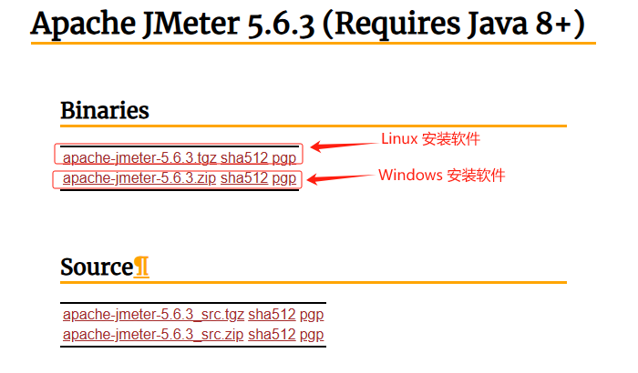
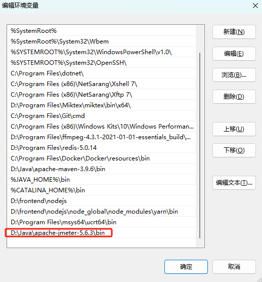

## Jmeter 下载和安装

### 下载 Jmeter

打开官网 [Apache JMeter - Download Apache JMeter](https://jmeter.apache.org/download_jmeter.cgi)， 下载最新版本的 Jmeter



在可选择的版本中，不同版本的区别在于:

- **binary **是已经编译过的、可直接运行的程序文件。这种版本包含已经编译和构建好的二进制文件，通常包括可执行文件、库文件和其他运行所需的二进制文件。

- **source**是还没编译过的源代码，需要自行编译。这种存档包含软件的源代码，通常包括所有的源代码文件、构建脚本和配置文件。源代码包可以用于查看、调试和理解项目的实现细节。

如果你只是想使用软件而不涉及修改或开发，建议直接选择 `Binary ` 格式的软件


### 配置环境变量

配置环境变量是为了在命令行中方便地运行特定工具或应用程序，而不需要每次都提供完整的路径。

在Windows系统里，配置环境变量的步骤为：

1. 解压 Jmeter 压缩包到自定义目录里面。比如，我的安装目录为 `D:\Java\apache-jmeter-5.6.3`

2. 在 "系统变量" 部分，找到 `Path` 变量，点击编辑。在编辑窗口中，点击 "新建"，然后添加  Jmeter 的 `bin` 目录路径，例如 `D:\Java\apache-jmeter-5.6.3\bin`。



配置完成后，打开 cmd, 运行 `jmeter -v`命令查看 Jmeter 版本信息 ， 验证环境变量是否配置正确。

```bash
$ jmeter -v
WARN StatusConsoleListener The use of package scanning to locate plugins is deprecated and will be removed in a future release
WARN StatusConsoleListener The use of package scanning to locate plugins is deprecated and will be removed in a future release
WARN StatusConsoleListener The use of package scanning to locate plugins is deprecated and will be removed in a future release
WARN StatusConsoleListener The use of package scanning to locate plugins is deprecated and will be removed in a future release
    _    ____   _    ____ _   _ _____       _ __  __ _____ _____ _____ ____
   / \  |  _ \ / \  / ___| | | | ____|     | |  \/  | ____|_   _| ____|  _ \
  / _ \ | |_) / _ \| |   | |_| |  _|    _  | | |\/| |  _|   | | |  _| | |_) |
 / ___ \|  __/ ___ \ |___|  _  | |___  | |_| | |  | | |___  | | | |___|  _ <
/_/   \_\_| /_/   \_\____|_| |_|_____|  \___/|_|  |_|_____| |_| |_____|_| \_\ 5.6.3

Copyright (c) 1999-2024 The Apache Software Foundation
```


### 启动 jmeter

打开 cmd,  运行 `jmeter `命令来启动 jmeter。

```bash
$ jmeter
WARN StatusConsoleListener The use of package scanning to locate plugins is deprecated and will be removed in a future release
WARN StatusConsoleListener The use of package scanning to locate plugins is deprecated and will be removed in a future release
WARN StatusConsoleListener The use of package scanning to locate plugins is deprecated and will be removed in a future release
WARN StatusConsoleListener The use of package scanning to locate plugins is deprecated and will be removed in a future release
================================================================================
Don't use GUI mode for load testing !, only for Test creation and Test debugging.
For load testing, use CLI Mode (was NON GUI):
   jmeter -n -t [jmx file] -l [results file] -e -o [Path to web report folder]
& increase Java Heap to meet your test requirements:
   Modify current env variable HEAP="-Xms1g -Xmx1g -XX:MaxMetaspaceSize=256m" in the jmeter batch file
Check : https://jmeter.apache.org/usermanual/best-practices.html
================================================================================
```


## 环境配置

`D:\Java\apache-jmeter-5.6.3\bin\jmeter.properties`  文件包含了 Jmeter 的配置属性。

http://jmeter.apache.org/usermanual/properties_reference.html 描述了常用的属性

### 配置中文环境

将 language=en 修改为 language=zh_CN

```
#Preferred GUI language. Comment out to use the JVM default locale's language.
#language=en
#language=zh_CN
```

