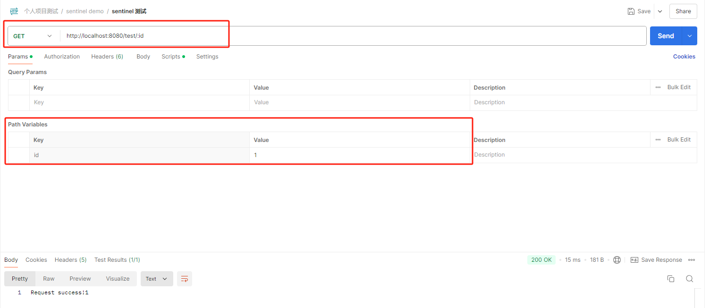

### 请求参数类型

请求参数是传递给服务器的数据，用于传递额外信息，在 API 请求中发挥着关键作用。它们传递不同类型的信息，确保服务器正确处理请求。常见的请求参数类型包括：

- **查询参数（Query Parameters）** ：以键值对形式附加在 URL 末尾，用于过滤、排序或限制请求结果。
- **路径参数（Path Parameters）** ：嵌入在 URL 中，用作资源的唯一标识或区分资源间的细微差异。
- **请求体参数（Body Parameters）** ：包含在请求体中，传递复杂或大量数据，如表格数据或 **[JSON](https://apifox.com/apiskills/what-is-json/)** 对象。

### 路径参数

URL路径中包含路径参数的部分，通常位于一个冒号(路径参数占位符)之后，例如 `http://localhost:8080/test/:id` 

### 参考资料

[高效使用 Postman：如何正确传递 Query、Path 和 Body 参数-阿里云开发者社区 (aliyun.com)](https://developer.aliyun.com/article/1474148)

