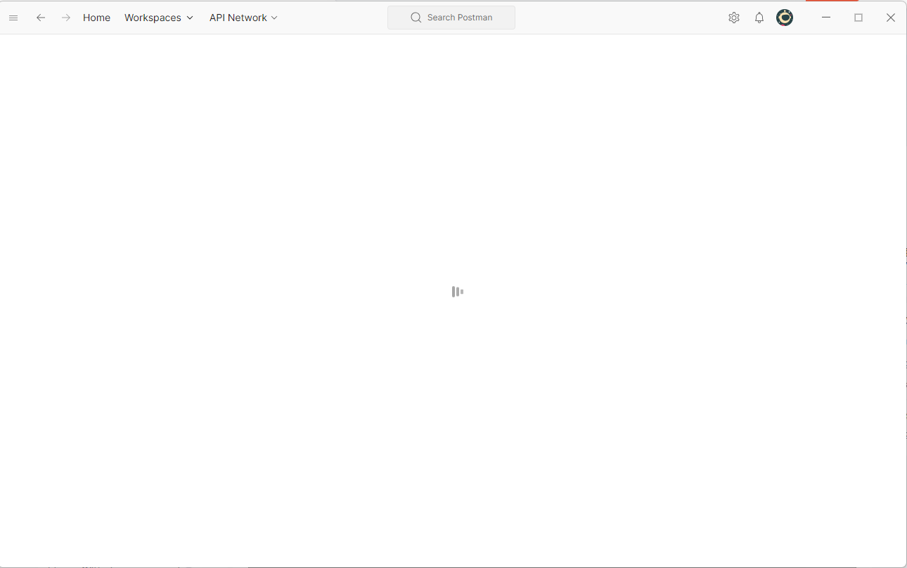

### 使用过程中存在的问题

Postman 打开一直加载白屏

解决方案：

- 兼容性：[Postman打开一直加载白屏_postman打开空白-CSDN博客](https://blog.csdn.net/qq_42605956/article/details/126069244)

- 删除缓存：[解决postman打开一直转圈圈的问题-腾讯云开发者社区-腾讯云 (tencent.com)](https://cloud.tencent.com/developer/article/2354417)
  - C:\Users\zouhu\AppData\Roaming\Postman
  - C:\Users\zouhu\AppData\Local\Postman