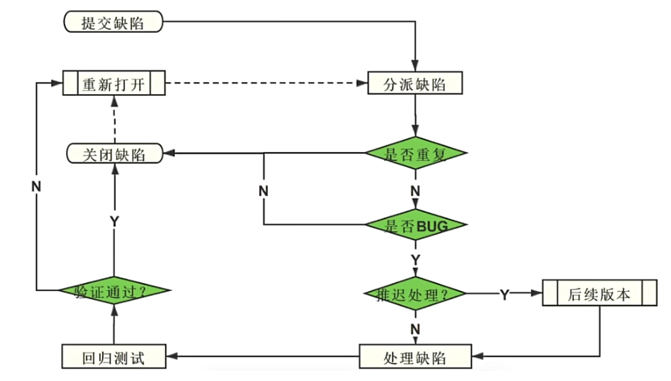
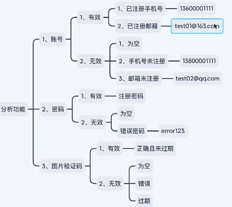
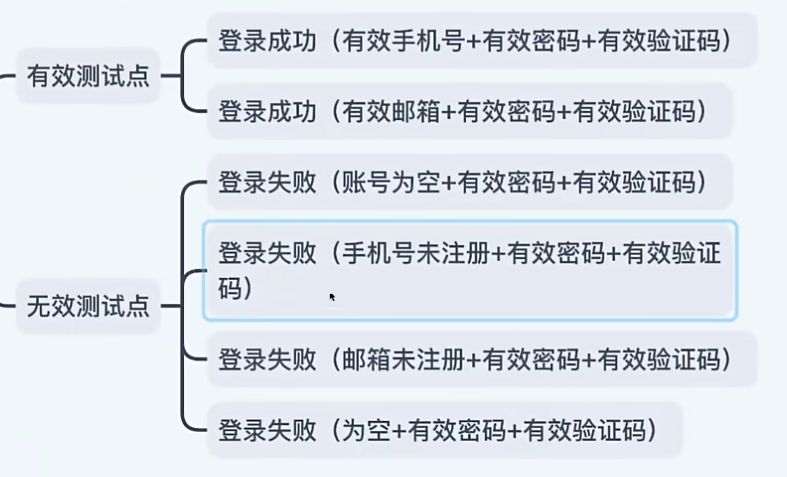
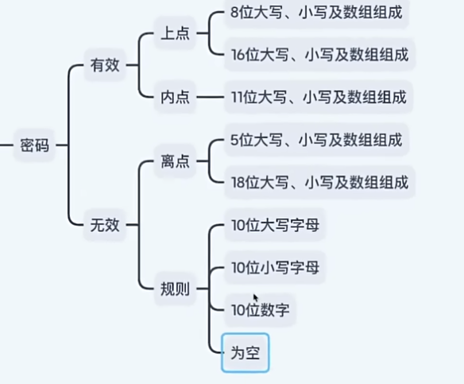
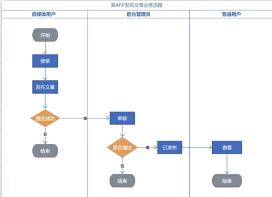

[TOC]

## 一、软件测试概述

### 1.1 什么是软件测试

**软件测试**是指通过特定的方法和技术，对软件产品进行验证和验证活动，以确保软件符合设计需求，并能够高质量地完成预期功能的一种过程。

其目的是**发现缺陷**，**验证需求实现**，并**提高软件质量**。

### 1.2 软件测试分类

(1) 按生产阶段(测试级别)划分

- **单元测试**：针对代码的最小单元（如函数、模块）进行测试。

- **集成测试**：验证多个模块之间的交互是否正确。

- **系统测试**：从用户的角度验证整个系统的功能、性能等。

- **验收测试**：验证系统是否满足业务需求，通常由最终用户进行。

（2）按代码可见度划分

- **黑盒测试**：不关注内部实现，仅基于功能需求进行验证，如输入、输出的正确性。常用方法包括等价类划分、边界值分析、因果图法等。
- **灰盒测试**：结合黑盒和白盒的特点，部分了解内部逻辑，测试范围更有针对性。应用于集成测试和安全性测试较多，便于发现隐含缺陷。
- **白盒测试**：关注程序内部逻辑，确保所有代码路径、分支和条件都被覆盖测试。常用方法包括语句覆盖、分支覆盖、路径覆盖。

（3）按测试类型划分

- **功能测试**：验证功能是否符合需求。
- **性能测试**：评估系统的响应时间、并发能力。
- **安全性测试**：检查系统是否能抵御恶意攻击。
- **兼容性测试**：验证软件在不同环境中的兼容性。
- **可用性测试**：评估用户体验。

(4) 其他测试

- **冒烟测试**：对核心功能的验证，保障提测内容具备可测性。
- **回归测试**：对已修复bug/更新后对已测内容再次测试，保证 bug 修复、确保新功能对旧功能没有影响。

### 1.3 软件测试的生命周期

软件测试一般贯穿于整个软件开发生命周期中，主要阶段包括：

1. 需求分析：分析测试需求，明确测试范围和目标。
2. 测试计划：制定测试策略、测试方案，分配资源和时间。
3. 测试设计：编写测试用例，包括输入数据、测试步骤和期望结果。
4. 测试执行： 执行测试用例，记录实际结果。
5. 缺陷管理：提交缺陷报告，跟踪和验证缺陷的修复情况。
6. 测试总结：分析测试结果，评估测试覆盖率，总结经验。

### 1.4 软件测试的原则

- **以用户为中心**：测试应从用户角度出发。

- **早期介入**：测试活动应尽早介入开发过程。

- **完全测试不可能**：不能穷尽所有测试，需关注风险点。

- **缺陷聚集**：大部分缺陷通常集中在少数模块中。

- **墨菲定律**：假定任何可能出错的地方都会出错。

- **测试的无穷回归**：不断修改和测试可能会耗尽时间和资源。

- **测试是信息服务**：测试提供质量信息，但不保证零缺陷

## 二、软件质量模型

### 2.1 什么是软件质量模型

**软件质量模型**是指用于衡量和评估软件产品质量的一种框架或标准。它定义了软件质量的特性及其子特性，帮助开发人员、测试人员和用户从多个维度理解和评价软件质量。质量模型为软件开发和测试提供了指导，是衡量软件是否满足用户需求和预期的重要依据。

### 2.2 ISO/IEC 25010 软件质量模型

ISO/IEC 25010 是 ISO/IEC 9126 的改进版本，也是目前较新的质量模型。它将质量特性细化为八个主要维度，并进一步细化子特性：

| **特性**       | **描述**                                     | **子特性**                                     |
| -------------- | -------------------------------------------- | ---------------------------------------------- |
| **功能适合性** | 软件功能是否满足需求和用户期望。             | 功能完整性、功能正确性、功能适当性等。         |
| **性能效率**   | 系统在使用资源时的效率和响应能力。           | 时间效率、资源利用效率、容量、高并发等。       |
| **兼容性**     | 软件是否能与其他系统、设备协同工作。         | 共存性、互操作性等。                           |
| **可用性**     | 用户是否能轻松学习和使用软件。               | 易理解性、易学性、可操作性、用户界面美观性等。 |
| **可靠性**     | 软件在特定时间段内是否稳定运行。             | 成熟性、可用性、容错性、可恢复性等。           |
| **安全性**     | 软件在数据保护和防止未经授权访问方面的能力。 | 机密性、完整性、不可否认性、授权性等。         |
| **可维护性**   | 软件是否易于修改和扩展。                     | 可修改性、可分析性、可测试性、可再用性等。     |
| **可移植性**   | 软件是否能适应不同的硬件或软件环境。         | 适应性、可安装性、互换性、环境依赖性等。       |

以微信为例，验证系统质量的具体方面如下：

1. 功能性:与需求数量一致，功能正确
2. 性能:响应快、占用资源少
3. 兼容性:不同设备平台正常使用
4. 易用性:用户体验好
5. 安全性:敏感信息无泄密存储有保障
6. 可靠性:持久运行无异常
7. 可移植性:升级迁移数据不丢失
8. 可维护性:出现异常恢复简单、可扩展功能、升级更新便捷

## 三、测试用例设计(功能测试)

### 3.1 什么是测试用例

测试用例是描述测试点执行的文档（测试输入、执行条件、预期结果等）

### 3.2 测试用例的组成元素

> 具体细节可以查看 [13-测试用例_哔哩哔哩_bilibili](https://www.bilibili.com/video/BV1Y4421Q7ej?spm_id_from=333.788.videopod.episodes&vd_source=52cd9a9deff2e511c87ff028e3bb01d2&p=13)

测试用例是描述测试点执行的文档。测试用例的组成元素包括：

1. 用例编号： `项目_模块_数字`，用于唯一标识每个测试用例。

2. 用例标题：简洁、明确地描述测试用例的目的或功能点
3. 所属模块：模块名
4. 优先级：用例的重要程度
5. 前置条件：执行操作步骤的前置条件
6. 测试步骤：测试点执行的关键步骤
7. 测试数据：输入数据
8. 预期结果：预期执行结果及隐写结果
9. 备注：记录测试中的任何补充说明或需要注意的事项。例如，特殊环境、已知问题、与其他测试用例的依赖关系等。

具体案例如下：

| **测试用例编号** | **App_Login_001**                                            |
| ---------------- | ------------------------------------------------------------ |
| **用例标题**     | 用户登录功能测试                                             |
| **所属模块**     | 登录模块                                                     |
| **优先级**       | 高                                                           |
| **前置条件**     | 用户已注册，且账号密码正确                                   |
| **测试步骤**     | 1. 打开应用程序登录界面      2. 输入有效用户名`testuser`  3. 输入正确密码`password123`  4. 点击登录按钮 |
| **测试数据**     | 用户名：`testuser`  密码：`password123`                   |
| **预期结果**     | 登录成功后，用户应跳转到主页面，并显示“欢迎，testuser”消息   |
| **实际结果**     | （执行后填写实际结果）                                       |
| **备注**         | 网络正常，应用已连接到后台服务器                             |

### 3.3 测试用例设计方法

- 功能测试：等价类和边界划分法往往通常一起使用，不过以等价类划分为主。
- 业务测试：流程图法。

## 四、缺陷管理

### 4.1 什么是缺陷

在软件测试中，**缺陷**（Defect），有时也称为**bug**，是指软件程序中不符合预期功能或需求的部分，通常表现为程序错误或问题，导致软件未按预定的行为工作。

缺陷衡量标准为：

| **缺陷类型**          | **描述**                                                     | **影响**                                     |
| --------------------- | ------------------------------------------------------------ | -------------------------------------------- |
| **少功能**            | 软件未实现需求文档中明确要求的功能                           | 功能缺失，无法满足用户需求，影响软件完整性   |
| **多功能**            | 软件实现了需求文档中未指明或超出范围的功能                   | 增加系统复杂性，可能影响性能和维护性         |
| **功能错误**          | 软件实现了需求文档中的功能，但存在错误或未按预期运行         | 影响系统功能，可能导致业务中断或用户体验差   |
| **隐性功能缺失/错误** | 软件未实现需求文档中未明确列出，但实际应包含的功能或功能错误 | 隐性功能缺失或错误，影响整体体验与功能性     |
| **不易使用**          | 软件操作复杂、界面不友好、运行缓慢等导致用户体验差           | 导致用户困惑，降低用户满意度，影响软件接受度 |

### 4.2 缺陷描述及提交

目的： 将缺陷提交给开发，开发根据描述可复现缺陷。

工具：禅道，jira

缺陷描述的主要组成元素包括：

1. **缺陷编号**：
2. **缺陷类型**：代码错误、设计缺陷
3. **缺陷标题**：描述 bug 问题
4. **严重性/优先级**：缺陷对系统的影响程度。
5. **复现步骤**：致缺陷发生的具体操作步骤，帮助开发人员能够复现并定位问题。
6.  **附件/截图**：与缺陷相关的附加信息，如截图、日志文件、视频等，帮助开发人员更快地定位问题。

### 4.3 缺陷跟踪流程

## 五、功能测试

### 5.1 等价类划分

**等价类划分**（Equivalence Partitioning）是一种黑盒测试设计方法，用于减少测试用例数量，同时覆盖尽可能多的输入条件。它通过将输入数据划分为若干个等价类，每个等价类中的数据对程序的功能表现具有**相同的效果**，因此只需选择其中一个数据进行测试即可。

具体步骤如下：

1. **等价类**

   将输入条件划分为一组等价类，每个类中数据对程序行为的作用是相同的。等价类包括：

   - **有效等价类**：符合需求的输入范围。
   - **无效等价类**：不符合需求的输入范围。

2. **测试目标**

   - **有效测试点**：覆盖所有的有效等价类，确保正常功能实现。

   - **无效测试点**：验证无效等价类，确保系统能正确处理异常输入。

**提取测试数据原则：**

- 多个选项有效数据建议组合应用，构成有效测试点
- 单个选项无效数据组合其他选项有效数据应用，构成取消测试点

使用场景：

- **输入范围明确的功能**：如表单输入校验、字段验证。
- **规则驱动的系统**：如取值范围限制的业务逻辑（年龄、价格等）。

### 5.2 边界值分析

**边界值分析**（Boundary Value Analysis，BVA）是一种黑盒测试设计方法，用于测试输入或输出的边界值是否被正确处理。它通过集中测试边界上的数据点，发现可能存在的缺陷，因为边界值往往是系统发生错误的高风险区域。

在边界范围里面，通常由以下划分：

- 上点：位于边界上的点
- 内点：**位于几何形状内部**的点
- 离点：**位于几何形状的外部**的点

通常，上点和内点为有效边界值，离点位无效边界值。

测试步骤如下：

1. **确定输入或输出范围**： 根据需求说明书，明确输入条件的取值范围，例如 `[min, max]`。
2. **选择边界值**：根据范围，选取以下测试点
   - **有效边界值**：包括最小值、最大值及其附近值，如 `min` 和 `max`。
   - **无效边界值**：小于最小值和大于最大值的值，如 `min - 1` 和 `max + 1`。

3. **构建测试用例**： 为每个边界值设计测试用例，观察系统在这些输入条件下的行为。

### 5.3 登录的测试用例设计案例

> 案例具体解析查看 [单功能（测试点提取）_哔哩哔哩_bilibili](https://www.bilibili.com/video/BV1Y4421Q7ej?spm_id_from=333.788.videopod.episodes&vd_source=52cd9a9deff2e511c87ff028e3bb01d2&p=6)

测试需求为：

- 账号:必填，已经注册手机号或邮箱
- 密码:必填，注册账号的密码
- 验证码:正确且未过期

本位主要使用等价类划分，划分的等价类：

**提取测试数据原则：**

- 多个选项有效数据建议组合应用，构成有效测试点
- 单个选项无效数据组合其他选项有效数据应用，构成取消测试点

根据提取测试数据原则，利用排列组合，可以得到相应测试点。

### 5.4 注册的测试用例设计案例

> 具体案例查看 [09-注册功能测试点完善_哔哩哔哩_bilibili](https://www.bilibili.com/video/BV1Y4421Q7ej?spm_id_from=333.788.videopod.episodes&vd_source=52cd9a9deff2e511c87ff028e3bb01d2&p=9)

需求:

1. 账号:未注册手机号且不能为空
2. 密码:8~16个字符，需要包含大小写字母和数字
3. 条款:需勾选才可以注册

使用等价类划分和边界值分析来研究密码的具体分类：

注意，这里的规则指的是不符合密码设定规则。

## 六、业务测试

### 6.1 业务测试

- 业务：软件为满足用户特定的业务需求而设计并实现的一系列功能。

- 作用：测试软件系统单功能之间关联性数据处理逻辑是否正确。

- 方法：业务测试方法主要使用流程图法。

流程图设计测试点步骤：

1. 确认流程图。
2. 流程图从开始到结束每条路径都为一条测试用例

### 6.2 发布文章业务测试案例

文章业务流程图如下所示：

具体测试点的用例标题如下所示：

- 发布文章失败(提交失败)
- 发布文章失败(审核失败)
- 发布文章成功

| **用例编号**        | **用例标题**             | **项目/模块** | **优先级** | **前置条件**                                      | **测试步骤**                                                 | **测试数据**                         | **预期结果**                                     |
| ------------------- | ------------------------ | ------------- | ---------- | ------------------------------------------------- | ------------------------------------------------------------ | ------------------------------------ | ------------------------------------------------ |
| publish_article_001 | 发布文章失败（提交失败） | 发布文章      | P1         | 1. 已打开发布文章页面 2. 已准备好发布文章素材  | 1. 填写发布文章页面 2. 点击提交按钮                       | 文章标题：含敏感字 其他：合法内容 | 发布失败，提示：标题内容不合法 已自动保存草稿 |
| publish_article_002 | 发布文章失败（审核失败） | 发布文章      | P1         | 1. 已提交文章 001 且为待审核 2. 打开待审核页面 | 1. 选中文章 2. 点击审核，选择“不通过”                     | 文章：001 审核：选择“不通过”      | 发布失败，提示：文章状态为审核不通过             |
| publish_article_003 | 发布文章成功             | 发布文章      | P1         | 1. 已打开发布文章页面 2. 准备好合法文章内容    | 1. 填写发布文章页面 2. 点击提交按钮 3. 系统跳转至文章详情页面 | 文章：合法内容 标题：合规标题     | 发布成功，用户文章列表可查看文章 001             |

## 参考资料

[03-测试基础（测试分类）_哔哩哔哩_bilibili](https://www.bilibili.com/video/BV1Y4421Q7ej?spm_id_from=333.788.videopod.episodes&vd_source=52cd9a9deff2e511c87ff028e3bb01d2&p=3)