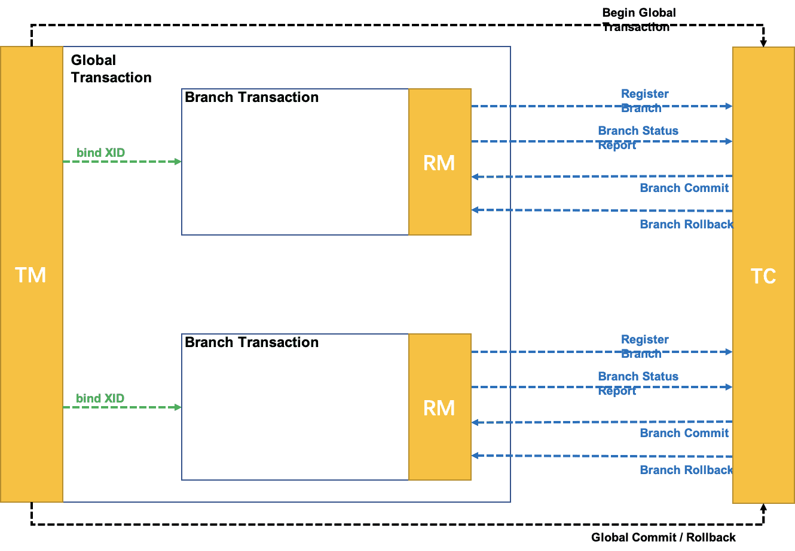

### Seata 领域模型

Seata 模型主要是使用 2pc 或基于 base 理论的最终一致性来达成事务。

一个分布式的全局事务，整体是 **两阶段提交** 的模型。全局事务是由若干分支事务组成的，分支事务要满足 **两阶段提交** 的模型要求，即需要每个分支事务都具备自己的：

- 一阶段 prepare 行为
- 二阶段 commit 或 rollback 行为

### 主要角色

- 事务管理者(Transcation Manager，TM)： Seata 中用于创建和决议事务结果的实体,  一般集成于业务调用链路的上游。

- 资源管理者(Resource Manager， RM)： Seata 中用于管理资源的实体, 一般情况下等同于微服务中的提供方(provider),管理其所在服务中的资源,如数据库资源等。

- 事务协调者(Transcation Coordinator，TC)：Seata 中用于 2pc 方式的事务模式统一协调事务的实体( SAGA 除外),其可由事务管理者驱动或自身驱动进行事务的二阶段行为。

其中，2PC 包含的角色通常只包括参与者和协调者。在 Seata 的参与角色中，相对多了一个事务管理者。可以这么认为， 将协调者拆分事务管理者和协调者：

- 创建和决议全局事务结果 ----> 事务管理者
- 对分支事务进行二阶段行为 -----> 事务协调者

### 事务生命周期

Seata 中事务生命周期主要分为Begin(TM), Registry(RM), Commit/Rollback(TM&TC)这三部分。

（1）**Begin(TM)**

事务管理者(TM) 通过 rpc 至事务协调者(TC) 创建全局事务(Global Transaction)，将 TC 生成的 XID 传递至其 TM 所调用的任意资源管理者(RM)

> **XID**（**Transaction ID**）是分布式事务中的唯一标识符，用来标识和追踪整个全局事务及其所有分支事务。它在分布式事务管理系统中至关重要，确保各个参与者能关联到同一个全局事务。
>
> XID 只表示全局事务

（2）**Registry(RM)**

RM 通过其接收到的 XID, 将其所管理的资源且被该调用锁使用到的资源注册为一个事务分支(Branch Transaction)

（3） **Commit/Rollback(TM&TC)**

当该请求的调用链全部结束时， TM 将事务的决议结果 (Commit/Rollback) 通知 TC, TC将协调所有RM进行事务的二阶段动作。

Seata 中用于2pc方式的事务模式统一协调事务的实体(SAGA除外),其可由事务管理者驱动或自身驱动进行事务的二阶段行为。

- Commit：

  Seata 中当事务管理器决议为提交时,TC才会进行对事务的二阶段提交行为下发,如TCC模式中的confirm, AT 模式的 undolog delete, XA 模式的XA Commit。

- Rollback：

  Seata 中当事务管理器决议为回滚时,TC会进行对事务的二阶段回滚行为下发,如TCC模式中的cancel, AT 模式的 undo, XA 模式的 XA Rollback。

- TimeoutRollback：

  Seata 中当事务管理器创建事务时指定的 Timeout 时间到达后还未决议时,TC 会主动将已超时的事务进行超时回滚,其超时行为等同上述 Rollback 行为.

