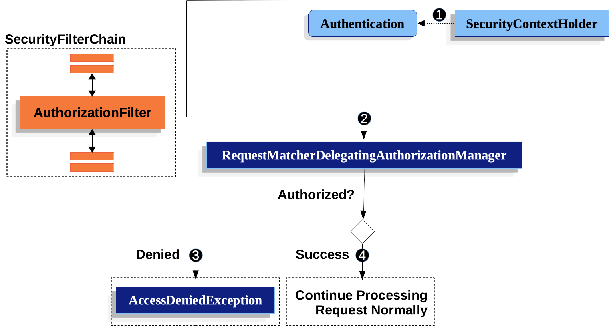

[TOC]

## 一、Spring Security 概述

### 什么是 Spring Security

Spring Security是一个提供身份验证、授权和防止常见攻击的高度可定制化框架。

其主要特点有：

- [authentication](https://docs.spring.io/spring-security/reference/features/authentication/index.html)：
- [authorization](https://docs.spring.io/spring-security/reference/features/authorization/index.html)：
- [protection against common attacks](https://docs.spring.io/spring-security/reference/features/exploits/index.html)：
- [Integrations](https://docs.spring.io/spring-security/reference/features/integrations/index.html): Spring Security提供与众多框架和API的集成。

### 防止常见攻击

Spring Security 提供针对常见漏洞的保护。

- [跨站点请求伪造（CSRF）](https://docs.spring.io/spring-security/reference/features/exploits/csrf.html)
- [HTTP response headers](https://owasp.org/www-project-secure-headers/#div-headers)：设置 HTTP 响应头来增加安全性。
- [HTTP Requests](https://docs.spring.io/spring-security/reference/features/exploits/http.html)

### 集成

[Integrations :: Spring Security](https://docs.spring.io/spring-security/reference/features/integrations/index.html)

## 二、身份验证 

[身份验证](https://docs.spring.io/spring-security/reference/features/authentication/index.html)是验证试图访问特定资源的人的身份的方式。

身份验证的常用方法为：

- 要求用户输入用户名和密码。密码应该使用安全的方法来[存储](https://docs.spring.io/spring-security/reference/features/authentication/password-storage.html)。

## 三、授权 authorization

[授权](https://docs.spring.io/spring-security/reference/features/authorization/index.html) 是决定某人是否能允许访问特定资源(request 和 method)。

在 Spring Security 通过允许基于请求的授权和基于方法的授权来提供深度防御。

### 3.1 基于请求的授权

[工作原理](https://docs.spring.io/spring-security/reference/servlet/authorization/authorize-http-requests.html)如下图所示。

