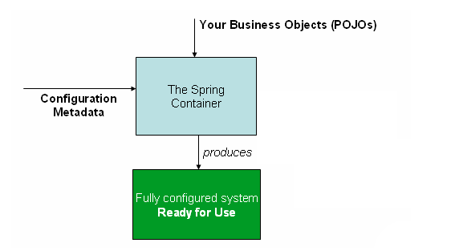

## 一、元数据配置概述

### 1.1 IoC 容器使用配置元数据

在Spring中，构成应用程序主干并由Spring IoC容器管理的对象称为bean。bean是由Spring IoC容器实例化、组装和管理的对象。否则，bean只是应用程序中众多 POJO 对象中的一个。Bean以及它们之间的依赖关系反映在容器使用的配置元数据（注解、xml配置、Java配置、Groovy配置）中。Spring 容器解析这些配置元数据进行 Bean 初始化、配置和管理依赖。

> 元数据即描述数据的数据。元数据本身不具备任何可执行的能力，只能通过外界代码来对这些元数据行解析后进行一些有意义操作。




### 1.2 元数据配置的发展历史

(1) 第一阶段：XML 配置。

 在 Spring 1.x 时代，使用 Spring 开发满眼都是 xml 配置的 Bean

(2) 第二阶段：[注解配置](https://docs.spring.io/spring-framework/reference/core/beans/annotation-config.html)

 在Spring 2.x 时代，随着JDK 15 带来的注解支持，Spring 提供了声明 Bean 的注解，大大减少了配置量。

(3) 第三阶段： [Java配置](https://docs.spring.io/spring-framework/reference/core/beans/java.html)

从Spring 3.x 到现在，Spring 提供了 Java 配置的能力，在 Java 代码中使用注解来配置 Spring 容器。使用Java 配置可以让你更理解你配置的 Bean。**Spring 4.x 和 Spring Boot 都推荐使用 Java配置**

<font color="red">注解配置和 Java 配置可以混合使用</font>。 使用原则是： 全局配置使用 Java 配置(如数据库相关配置、MVC 相关配置)，业务 Bean 的配置使用注解配置(如 @Service、@Component、@Repository、@Controller)。


### 1.3 Spring 注解和 JSR 330标准注解

Spring提供对 JSR-330 标准注释（依赖注入）的支持。这些注释的扫描方式与 Spring 注释相同。要使用它们，您需要在类路径中包含相关的 jar。

Spring 注解和 JSR 330标准注解的区别查看： [Using JSR 330 Standard Annotations :: Spring Framework](https://docs.spring.io/spring-framework/reference/core/beans/standard-annotations.html#beans-standard-annotations-limitations)


## 二、Bean 的声明

[Bean Overview :: Spring Framework](https://docs.spring.io/spring-framework/reference/core/beans/definition.html#beans-factory-class-ctor)

### 2.1 XML 配置

在XML配置文件中使用`<bean>`元素声明bean，指定bean的ID（标识符）和类，如下所示：

```xml
<bean id="myBean" class="com.example.MyBean"/>
```


### 2.2 注解配置

使用注解方式，通过在 Java 类上添加`@Component`或其派生注解（如`@Service`、`@Repository`等）来声明 Bean，Spring会自动扫描并将其注册为 Bean。

```java
@Component
public class MyBean {
    // Class implementation
}
```

声明 Bean 的注解主要有

- @Component 组件，没有明确的角色
- @Scrvice 在业务逻辑层(service 层)使用。
- @Repository 在数据访问层(dao 层)使用。
- @Controller 在展现层(MVC-Spring MVC)使用。


### 2.3 Java 配置

**Java 配置是通过 @Configuration 和 @Bean 来实现的。**

- [@Configuration](https://docs.spring.io/spring-framework/reference/core/beans/java/configuration-annotation.html) ：类级注释，声明当前类是一个配置类，相当于一个 Spring 配置的 XML 文件
- [@Bean](https://docs.spring.io/spring-framework/reference/core/beans/java/bean-annotation.html) : 方法级注释，提供了一个Bean 的定义，<font color="red">**声明当前方法的返回值为一个 Bean**</font>, 相当于XML文件中 `<bean/>` 元素。。

使用 Java 配置类，通过 `@Configuration` 注解声明配置类，再通过 `@Bean` 注解声明 Bean，如下所示：

```java
@Configuration
public class AppConfig {
    @Bean
    public MyBean myBean() {
        return new MyBean();
    }
}
```


## 三、Bean 的依赖注入

 [Dependency Injection :: Spring Framework](https://docs.spring.io/spring-framework/reference/core/beans/dependencies/factory-collaborators.html#beans-setter-injection)

### 3.1 XML 的配置


### 3.2 注解配置

 @Autowired 是 Spring 提供的注入 Bean 的注解，默认注入方式为 `byType`(根据类型进行匹配) 。使用`@Autowired`注解，Spring会自动在容器中查找匹配类型的Bean进行注入。


其他注解查看[Annotation-based Container Configuration :: Spring Framework](https://docs.spring.io/spring-framework/reference/core/beans/annotation-config.html)


### 3.3 Java 配置


## 四、细节补充

### 4.1 注解配置和 Java 配置区别

1. **语法：**
   - **注解配置：** 使用注解来标记bean，通常通过在类上添加`@Component`及其派生注解（如`@Service`、`@Repository`等）来声明bean。
   - **Java配置：** 使用Java类来声明bean，通常通过在Java配置类中使用`@Configuration`注解，然后在方法上使用`@Bean`注解来声明bean。
2. **灵活性：**
   - **注解配置：** 注解配置更加便捷，特别适用于小型项目或者简单的bean声明，因为它不需要额外的配置文件，所有的配置都可以直接写在Java类中。
   - **Java配置：** Java配置提供了更加灵活的方式来配置bean，可以在Java类中进行逻辑判断、循环等操作，生成bean的定义。这种方式更适合于复杂的配置场景，也更容易进行单元测试。
3. **可读性：**
   - **注解配置：** 注解配置可以使代码更加简洁，但当配置较多时，可能会使代码难以阅读和理解，特别是当多个注解组合使用时。
   - **Java配置：** Java配置可以将所有的配置逻辑都集中在一个或多个Java类中，使得配置更加清晰可读，便于维护和理解。
4. **类型安全：**
   - **注解配置：** 注解配置在一定程度上缺乏类型安全，因为注解的属性值通常是字符串，存在拼写错误等问题。
   - **Java配置：** Java配置是**类型安全的**，因为配置是通过Java代码实现的，编译器可以进行类型检查。

综上所述，注解配置适用于简单的bean声明和小型项目，而Java配置则更适合于复杂的配置场景和大型项目，因为它提供了更高的灵活性和可读性，并且具备类型安全性。

在 《 JavaEE开发的颠覆者 Spring Boot实战》中，使用原则是： 全局配置使用 Java 配置(如数据库相关配置、MVC 相关配置)，业务 Bean 的配置使用注解配置(@Service、@Component、@Repository、@Controller)。


### 4.2 @Autowired 和 @Resource 的区别

[Spring常见面试题总结 | JavaGuide](https://javaguide.cn/system-design/framework/spring/spring-knowledge-and-questions-summary.html#autowired-和-resource-的区别是什么)


### 4.3 @Component 和 @Bean 的区别

[Spring常见面试题总结 | JavaGuide](https://javaguide.cn/system-design/framework/spring/spring-knowledge-and-questions-summary.html#component-和-bean-的区别是什么)


## 参考资料

[Container Overview :: Spring Framework](https://docs.spring.io/spring-framework/reference/core/beans/basics.html)

[Annotation-based Container Configuration :: Spring Framework](https://docs.spring.io/spring-framework/reference/core/beans/annotation-config.html)

[Java-based Container Configuration :: Spring Framework](https://docs.spring.io/spring-framework/reference/core/beans/java.html)