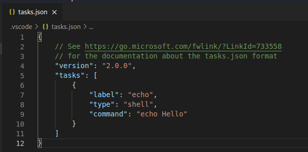

# 一、Task简单介绍

## 1.1 Task 定义

Visual Studio Code 的Task（任务）文件可以被用来运行脚本或启动一个进程。

许多现有的工具都可以通过Task直接在Visual Studio Code中运行，而**不需要额外在命令行中输入命令**。Task被配置在.vscode文件夹的tasks.json文件中。

> 注意：Task只能配置在有文件夹打开的项目中。


## 2.2 Task 主要属性

> 官网资料：https://code.visualstudio.com/docs/editor/tasks#_custom-tasks


| Task属性     | 语义                                                |
| ------------ | --------------------------------------------------- |
| label        | 在用户界面上展示的Task标签                          |
| type         | Task类型：分为shell和process                        |
| command      | c                                                   |
| windows      | Windows中的特定属性，在Windows中覆盖默认定义的属性  |
| group        | 定义Task属于哪一组                                  |
| presentation | 定义用户界面如何处理Task的输出                      |
| options      | 定义cwd（当前工作目录）、env（环境变量）和shell的值 |
| runOptions   | 定义Task何时运行及如何运行。                        |


# 二、配置简单的Task

## 2.1 创建task.json文件

1. 在顶部菜单栏中选择***Terminal->Configure Tasks***

2. 选择***Create tasks.json file from template***
3. 选择***Other***模板，创建文件


> Visual Studio Code 中内置了MSBuild、Maven和.NET Core 的Task模板.
>
> 可以根据需要自动选择模板

4. 可以看到在 `.vscode` 文件夹中生成相应的`task.json`文件




## 2.2 修改task.json文件

将task.json内容修改如下：

```
{
    // See https://go.microsoft.com/fwlink/?LinkId=733558
    // for the documentation about the tasks.json format
    "version": "2.0.0",
    "tasks": [
        {
            "label": "compile",             //创建任务名称
            "type": "shell",
            "command": "make clean all",    //创建任务名称
            "problemMatcher": [],
            "group": {                      //设置为默认构建任务，按Ctrl+Shift+B立即执行，不必选择
                "kind": "build",
                "isDefault": true
            }
        }

    ]
}
```


## 2.3 运行Task

在顶部菜单栏中选择**Terminal->RunTask**，会显示所有可以运行的Task

> 如果将该任务设置成 build task ， 则可以直接 用 **CTRL + Shift + B** 运行


# 参考资料

[Tasks in Visual Studio Code](https://code.visualstudio.com/docs/editor/tasks)

[Visual Studio Code 配置C/C++运行的Task](https://zhuanlan.zhihu.com/p/374826543#:~:text=Visual Studio Code 的Task（任务）文件可以被用来运行脚本或启动一个进程。,许多现有的工具都可以通过Task直接在Visual Studio Code中运行，而不需要额外在命令行中输入命令。 Task被配置在.vscode文件夹的tasks.json文件中。)

https://blog.csdn.net/sinat_34524528/article/details/85890657