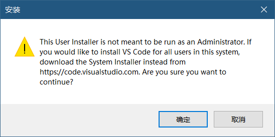
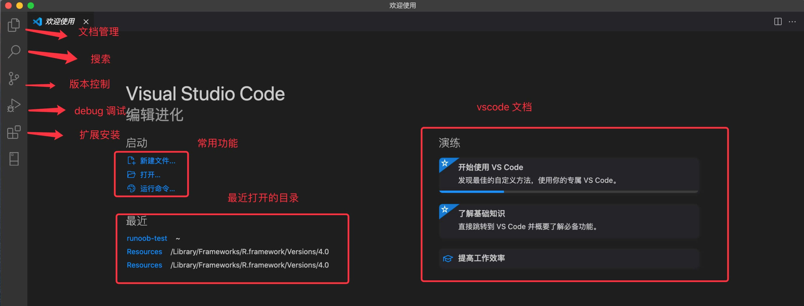
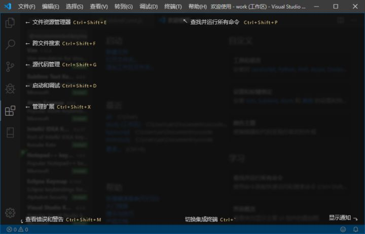
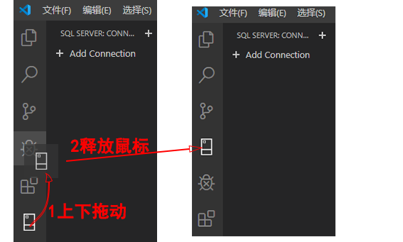
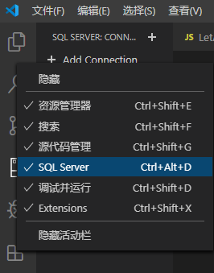
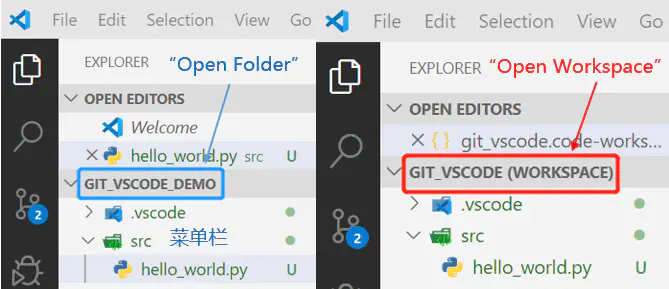
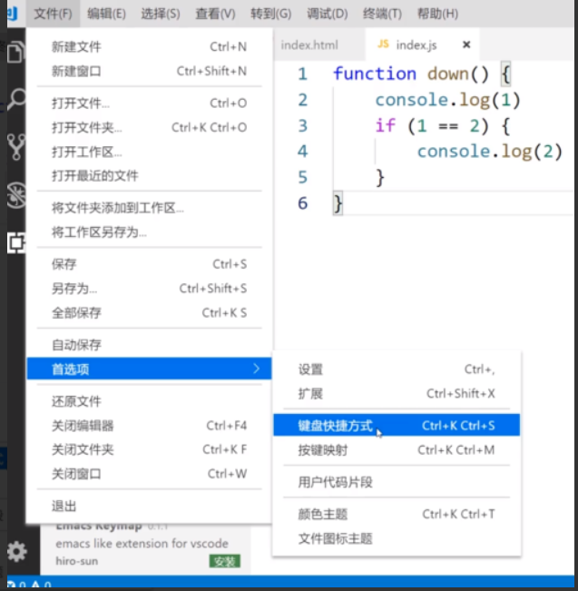
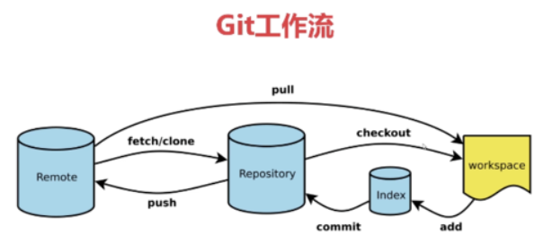

# 下载


# 安装


# 配置中文界面

## 从扩展程序视图切换

VScode 安装汉化包很简单，打开 VScode，点击安装扩展，在搜索框输入 Chinese，然后点 Install 就可以：


安装完之后在重启vscode就汉化完成


## **从命令面板切换**

操作步骤：

1. 按“ F1”键或“Ctrl+ Shift + P”打开命令面板
2. 输入“ language”选择“Configure Display Language”，
3. 然后选择想要切换的语言。


# 注意

VScode有两个版本的




# 插件

## 插件安装及说明

VScode 的扩展功能非常强大，我们可以找到几乎所有开发需要的工具，当然也可以自己开发。

VScode 扩展说明文档参考：https://code.visualstudio.com/docs/editor/extension-marketplace


在插件的侧边栏，可以显示vscode自带的插件


## 主题One  Dark Pro

- vscode最漂亮的主题，看代码非常优雅（以上个人观点），在插件仓库安装就会帮你自动换上.
- 如果没换上，使用快捷键 ⌘+K(Windows Ctrl+K) 紧接着 ⌘+T(Windows Ctrl+T) 进入主题的设置，自己手动换上吧。
- 主题颜色预览-[vscode themes](https://vscodethemes.com/)

- 还可以使用vscode自带的主题（顺便更换主题）。操作如下：


## 文件图标Material Icon Theme

- 使用过两个图标插件，还有一个是`vscode-icons`，都可以在插件仓库搜到，个人更加喜欢`Material Icon Theme`的风格。

- 图标主题可以在  文件->首选项->文件图标主题中进行替换。


## 图标集Icon Fonts

比如Font Awesome   、  Glyphicons


## 字体Fira Code

- 编程的话，肯定推荐用连字字体，最著名的就是`Fira Code`了，微软也出了一款`Cascadia Code`。
- `Fira Code`的[安装教程](https://github.com/tonsky/FiraCode/wiki/Installing)&[vscode配置教程](https://github.com/tonsky/FiraCode/wiki/VS-Code-Instructions)
  当然我相信也有不适应这种字体的，所以这个推荐力度没这么大，默认字体也不错了。


## 代码格式化Prettier

- 这是一个代码格式化插件，装上之后会代替vscode默认的格式化工具，格式化的快捷键**⌥+⇧+F(Windows Shift+Alt+F)**。

- 没有使用Prettier，因为我发现还是自带的HTML编辑器的一些规则比较好。


## 网页实时调试Live Server

- Live Server是一个能实时同步前端代码编辑和网页预览的插件，所见即所得。

- 选择HTML文件，右键菜单找到Open with Live Server就会在浏览器中打开当前HTML网页，一旦代码改变网页也会实时改变。建议配合分屏或者双屏食用。

- 事实上，只有保存了代码才会改变，但是vscode不是实时保存代码的，我们需要改变设置，[打开setting](https://blog.csdn.net/qq_33384402/article/details/104460970?utm_medium=distribute.pc_relevant.none-task-blog-2~default~baidujs_baidulandingword~default-4-104460970-blog-105123861.pc_relevant_antiscanv2&spm=1001.2101.3001.4242.3&utm_relevant_index=7#setting_for_vscode)，找到Files: Auto Save，**把off改成afterDelay**。


## **open in browser** 

vscode不像IDE一样能够直接在浏览器中打开html，而该插件支持快捷键与鼠标右键快速在浏览器中打开html文件，支持自定义打开指定的浏览器，包括：Firefox，Chrome，Opera，IE以及Safari


## 自动补全标签 Auto Complete Tag

自动补全标签

包含`Auto Close Tag`、`Auto Rename Tag`

`Auto Rename Tag`是指将开始标签修改后，结束标签也会相应地修改

`Auto Close Tag`是指输入开始标签后，输入</会自动显示闭合标签


## CSS Peek

将鼠标悬停在元素的类名或ID上，就可以看到应用于这个元素的CSS规则


## 颜色提示Color Info


## HTML CSS Support

html中css智能提示


## ESLint 

js语法纠错


## Markdown All in One 

markdown编辑，预览


## Project Manager

项目管理


## GitLens

方便查看git日志，git重度使用者必备


## Auto Import 

自动导入包


## Debugger for Chrome

映射vscode上的断点到chrome上，方便调试


# VScode使用技巧

## Command Line和Command Palette

- 我们知道一般说的命令行(Command Line, CLI)界面，就是所谓的黑框框，可以运行系统的一系列命令，在一些条件下非常高效。

  一般我们使用Terminal来打开。
  
- vscode除此之外还有一个命令面板(Command Palette)，这个是对vscode作出一系列命令的工具，包括vscode自带的和插件的命令。

  随着使用vscode的频率越来越高，最终大多数人都会爱上这个命令面板。

  使用快捷键 ⌘+⇧+P(Windows **Ctrl+Shift+P**) 可以调出Command Palette。


## 打开settings和settings.json

- settings非常重要，很多配置都需要在这里完成。
- 使用Command Palette来打开，在Command Palette中搜索settings，可以看到两个选项,，分别是Preferences: Open Settings (JSON)和Preferences: Open Settings (UI)，如果你熟悉JSON就选第一个，否则就选第二个。UI只是把settings.json图形化了，其他没有区别。
  


## HTML&CSS生成公式

Emmet被vscode内置了，这个工具对[前端开发](https://so.csdn.net/so/search?q=前端开发&spm=1001.2101.3001.7020)非常方便，请务必学会，官方的语法表：[Emmet Cheat Sheet](https://docs.emmet.io/cheat-sheet/)，分基础，HTML，CSS，XSL三篇，要求大部分都掌握。


## 快速生成HTML文件

在html文件里，输入`!`叹号(必须在英文状态下输入)，然后按键盘的`Tab`键，快速生成HTML的标准模板代码


注意：这种操作只有在html里面才能进行。如果新建的文本文件没有保存或者设置为html文件，则无法进行该操作。


# 编程语言设置

```html
{
	/*HTML编辑器设置*/
	"[html]": {
		"editor.defaultFormatter": "vscode.html-language-features",
		"editor.tabSize": 2, //一个tab设置成2个空格
		"editor.formatOnSave": true //保存的时候格式化
	},
	"html.format.wrapLineLength": 80, //一行的最大长度
	"html.format.indentInnerHtml": true, //format head和body标签
}

```

- html缩进层数非常多，所以我建议一个tab设置成2个空格，否则一行代码半行都是缩进也太搞笑了。


- 没有使用Prettier，因为我发现还是自带的HTML编辑器的一些规则比较好。


# 快捷键

快速生成多个标签，例如

h1+h5 

h1+ p*3

p*4>img + a


多行同时编辑   alt +


# VScode概述

VSCode（全称：Visual Studio Code）是一款由微软开发，且**免费的、开源的、高性能的、跨平台的、轻量级的**代码编辑器。

 该软件支持语法高亮、代码自动补全（又称 IntelliSense）、代码重构、查看定义功能，并且内置了命令行工具和 Git 版本控制系统。 用户可以更改主题和键盘快捷方式实现个性化设置，也可以通过内置的扩展程序商店安装扩展以拓展软件功能。 VS Code 使用 Monaco Editor 作为其底层的代码编辑器。 


**优点**：

- 免费，开源
- 有海量的扩展插件**（可以更好的帮助编写代码）**
- 轻量（**不会占用大量的内存和CPU，不会对电脑造成卡顿**）


# vscode界面教程


## 启动界面

VScode 启动后的界面，简单说明如图：




## 用户界面

VS Code默认具有以下界面。

1:活动栏，2:侧边栏，3:编辑栏，4:面板栏，5:状态栏

> 最左侧是活动栏，默认情况下有六个图标。 单击图标以切换侧边栏上的视图。
>
> 侧边栏右边是编辑栏，可以同时显示多个编辑器。
>
> 编辑栏下面是面板栏，可在各种面板(诸如终端命令行和Output)之间切换。
>
> 底部的状态栏显示有关打开的文件和项目的信息，例如语言，选项卡大小和Git分支名称等等。


在命令面板（ctal+shift+ p快捷键打开）中，选择“帮助:用户界面概述”（Help：User Interface Overview），可以看到每个菜单的描述和键盘快捷键。




### 活动栏

**活动栏：最左侧的一列，包括资源管理器、查找、源代码管理（也就是接下来要讲解的Git）、debug调式（一般用于后端的调理）、插件安装**

活动栏默认有六个图标。

添加的扩展功能可能会追加新图标在活动栏上。

上下拖动图标可**切换位置**,如下图所示。




右键单击活动栏，可在关联菜单上**显示或隐藏图标**,如下图所示。




### 编辑器

**编写代码的区域**


### 面板

面板通常显示在右下部分，默认有问题，输出，调试控制台，终端四种。根据安装的扩展，有可能会追加新的面板。

**左下角有个错误和警告的提示，点击出来的就是面板。该面板包括问题、输出、调试控制器、终端，常用的就是终端，比如建Vue项目时就会使用它，相当于cmd。**

> 问题面板：编译和运行时发生的错误和警告会显示在这里，需要相应的扩展功能支持，比如C++程序需要安装C++扩展才能显示错误和警告信息。
>
> 输出面板：出力程序编译和运行的日志信息。
>
> 调试控制台：调试时作为控制台使用。比如JavaScript的console.log信息会出力在这里。还
>
> 可以输入表达式来检测程序运行时的变量值。输入表达式时，通过【shift】+【enter】来换行。


### 状态栏

位于底部的状态栏显示了当前文件和工作区的各种信息。

**状态栏：最下面这一条，包括警告和错误，行列代表鼠标所在位置，空格代表缩进（因为不同的格式标准由不同的格式要求，有的是4空格缩进，有的是两空格缩进，还可以使用tab缩进），还包括字符集，行尾序列，语言模式（不需要手动设置，他可以自动识别）。**

> 1 语言信息：语言模式信息，双击可更改语言。
>
> 2 文本编码：字符编码信息，双击可更改编码。
>
> 3 缩进信息：缩进模式信息，双击可更改缩进。
>
> 4 错误警告：显示当前错误和警告的数量，双击可打开问题面板。


### 侧边栏

**侧边栏：活动栏里具体的项。**

“Ctrl+B”可关闭或打开侧边栏

在   设置->工作台->外观 里  ，通过修改Side Bar : Location  ,   切换左右显示位置。


## 资源管理器

资源管理器在侧边栏中显示工作区中目录和文件一览，单击文件可以在编辑器中显示其内容。

资源管理器与Windows系统的文件资源管理器功能类似，可以在其中打开，复制，移动，重命名文件或文件夹。


## 命令面板

Vsc提供的许多功能，是无法通过菜单来使用的，这时就需要使用命令面板。

命令面板调出方式：

- 快捷键【ctrl】+【shift】+【p】
- 菜单【查看】【命令面板】
- F1键


# 项目的新建与引入

【a】文件夹的操作软件中没有新建文件夹功能，这里通过在桌面创建文件夹，在软件内打开文件夹就会自动引入该文件了。

创建项目的目录：项目包括常见的CSS、JS，这里可以点击第二个图标新建文件夹，第一个是新建文件，第三个是刷新，第四个是折叠（所有打开的文件夹都会关闭）。

【b】文件的操作：点击第一个图片就可以新建文件，也可以点击文件夹来创建文件。

注意：在vscode新建文件时，一定要**加后缀**，如果不加，它就相当于一个文本。


# 用户设置与工作区设置

- 用户设置-全局应用您打开的任何vs代码实例的设置
- 工作区设置-存储在工作区内的上设置，仅在打开工作区时应用（即是局部的）


Editor：Word Wrap（控制折行的方式）

on（保证不会出现横向的滚动条）


# 文件夹(Folder)与工作区(Workspace)

 在VS Code的“**文件**”菜单中，**“打开文件夹（Open Folder）”**是指开打项目文件夹的根目录。一个项目文件夹(Project Folder)包含一个或多个文件夹与项目相关的文件夹，以及与该项目相关的VS Code配置(放在.vscode文件夹中)。


在“**文件**”菜单中，还有一个选项：**“打开工作空间（Open Workspace）”，**

 在VS Code中，工作空间(workspace)具体指后缀为*.code-workspace的文件，它是一个[JSON with Comments](https://links.jianshu.com/go?to=https%3A%2F%2Fcode.visualstudio.com%2Fdocs%2Flanguages%2Fjson%23_json-with-comments)格式的文件，里面包含了所有与该工作空间相关联的文件夹，以及相关的VS Code配置信息。


双击*.code-workspace文件，启动VSCode打开工作空间与启动VSCode后，用“打开文件夹”方式打开项目文件夹的区别是，前者的文件夹名后面有一个工作空间(workspace)的后缀。




[**什么时候用工作区？**] 有且仅有需要同时在**多个项目上工作**的时候，才需要创建工作区，这时候，工作区里面有多个项目文件夹的根目录(root)，即：[Multi-root Workspaces](https://links.jianshu.com/go?to=https%3A%2F%2Fcode.visualstudio.com%2Fdocs%2Feditor%2Fmulti-root-workspaces%23_opening-workspace-files)

[**什么时候用文件夹？**]当仅在**一个项目**上工作时使用文件夹。针对该项目设置完VS Code后，VS Code会自动在项目文件夹的根目录中创建一个.vscode文件夹存储VS Code配置(settings.json文件)


# 快捷键设置

## 常用快捷键

- Ctrl + C    复制，选定内容即复制选中内容，不选定则复制整行
- Ctrl + V    粘贴
- Ctrl + X    剪切
- Ctrl + F    查找，光标在搜索框则按回车键搜索下一个，在编辑器则按F3搜索下一个
- Ctrl + H    替换
- Ctrl + S    保存
- Ctrl + /    行注释
- Shift + Alt + A    块注释
- Ctrl + Enter    下方插入一行
- Ctrl + Shift + Enter    上方插入一行
- Ctrl + Shift + F    文件夹查找
- Alt + Shift + F    格式化代码 （）


## 快捷键映射

将其他编辑器的快捷键应用到vscode上

例如： sublime text  ， atom


## 自定义快捷键

在没有合适的快捷键映射时，可以根据个人习惯设置自定义快捷键




# Git

git就是一个代码管理工具，是一个开源的分布式版本控制系统。可以有效、高速地处理从很小到非常大的项目版本管理。

git的工作流程：workspace是我们电脑的工作区域，repository是本地仓库，remote是远程仓库。




## git基本操作


在当前位置打开git命令行：git bash here

1. 配置用户名:$ git config --global user.name '用户名
2. 配置邮箱:$ git config --global user.email '邮箱'
3. 使用git clone克隆远程仓库到桌面：$ git clone 'GitHub上的远程仓库地址'
4. 使用vscode打开克隆到本地的文件夹，新建一个index.js文件
5. 进入到本地仓库后进行添加文件：$ cd 本地仓库名
6. add添加文件：$ git add index.js
7. commit提交文件到本地仓库：$ git commit index.js(适用于单独提交一个文件)
8. $ git commit -m '填写提交信息，例如：add index.js'(适用于提交整体)
9. push推送本地仓库到远程仓库：$ git push
10. 从远程仓库pull拉取代码到本地：$ git pul
11. lcheckout检出：可以检出分支branch(master主干分支)      
    可以检出删除的文件:$ git checkout index.js 


# 参考网址

[VScode技术入门](https://www.imooc.com/qa/1106/t/0)

[前端开发的配置与插件](https://www.bilibili.com/video/BV1P64y187Fh/?vd_source=52cd9a9deff2e511c87ff028e3bb01d2)

[Chrome开发者工具](https://www.imooc.com/learn/1164?utm_source=courseright)

[怎么做一个开源项目](https://www.imooc.com/learn/1003)

[H5+JS+CSS3实现圣诞情缘](https://www.imooc.com/learn/545)

[元旦贺卡](https://www.imooc.com/note/1298?sort=hot&page=1)

[适合练手的10个前端实战项目(附源码）](https://zhuanlan.zhihu.com/p/131333112)

[前端视频](https://www.icourse163.org/learn/BFU-1003382003?tid=1467148606#/learn/content?type=detail&id=1247919104&sm=1)

