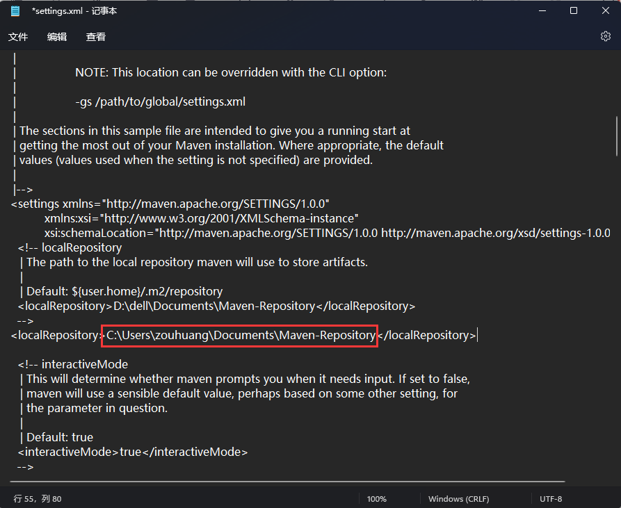

修改仓库存储位置

设置MAVEN镜像，使其在阿里云的私有MAVEN仓库下载；操作方式为：打开 Maven 的配置文件(windows机器一般在maven安装目录的conf/settings.xml)，在`<mirrors></mirrors>`标签中添加 mirror 子节点:

插件从远程存储库下载并存储在本地仓库中。文件路径为D:\dell\Documents\Maven-Repository\org\apache\maven\plugins。

