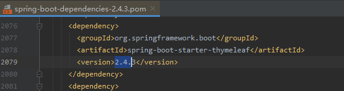

# Thymeleaf概述

​       Thymeleaf是一个供后端人员使用的，为快速开发页面而生的Java模板引擎，能够动态地替换掉静态内容，使页面动态显示，。Thymeleaf的主要目标是为您的开发工作流程带来优雅的自然模板 - 可以正确显示在浏览器中的HTML，也可以作为静态原型工作，从而在开发团队中进行更强大的协作。 

​      开发传统Java WEB工程时，我们可以使用JSP页面模板语言，但是在SpringBoot中已经不推荐使用了。

SpringBoot支持如下页面模板语言

```
Thymeleaf
FreeMarker
Velocity
Groovy
JSP
```

其中Thymeleaf是SpringBoot官方所推荐使用的，Thymeleaf是动静分离的，页面中的动态标签是需要传递有数据的时候才会渲染，不然就是原本默认的静态的样子。（Thymeleaf就是jsp的高端升级版。）

## 一、为什么使用模板引擎

- **Thymeleaf 在有网络和无网络的环境下皆可运行**，即它可以让美工在浏览器查看页面的静态效果，也可以让程序员在服务器查看带数据的动态页面效果。这是由于它支持 html 原型，然后在 html 标签里增加额外的属性来达到模板+数据的展示方式。浏览器解释 html 时会忽略未定义的标签属性，所以 thymeleaf 的模板可以静态地运行；当有数据返回到页面时，Thymeleaf 标签会动态地替换掉静态内容，使页面动态显示。
- Thymeleaf **开箱即用**的特性。它提供标准和spring标准两种方言，可以直接套用模板实现JSTL、 OGNL表达式效果，避免每天套模板、该jstl、改标签的困扰。同时开发人员也可以扩展和创建自定义的方言。
- Thymeleaf 提供spring标准方言和一个与 SpringMVC 完美集成的可选模块，可以快速的实现表单绑定、属性编辑器、国际化等功能。

## 二、使用Thymealeaf

（1）**引入依赖**

在pom.xml文件中加入以下依赖即可

```xml
<dependency>
<groupId>org.springframework.boot</groupId>
<artifactId>spring-boot-starter-thymeleaf</artifactId>
</dependency>
```

无需指定版本号，spring-boot-dependencies.pom中已指定



（2）**在模板文件中加入解析**

在加入依赖后，还需要在HTML引用命名空间

```html
<html xmlns:th="http://www.thymeleaf.org">
```

以下代码是一个简单的thymeleaf模板文件，其作用是显示数据库（实体）中的文章标题和内容。

```html
<!DOCTYPE html>
<html xmlns:th="http://www.thymeleaf.org">
<head>
    <meta charset="UTF-8">
    <title th:text="${article.title}">标题</title>
</head>
<body>
    <div th:text="${article.title}">标题</div>
    <div th:text="${article.body}">内容</div>
</body>
</html>
```

（3）**配置视图解析器**

在application.properties文件中，可以配置Thymealeaf模板解析器的属性

```xml
#为便于测试，在开发时需要关闭缓存
spring.thymeleaf.cache=false
```


# 标准表达式语法


# 基础语法

### 常用th标签

**(1)th:text**

该标签功能是文本替换。

示例：

```html
<!--显示控制器传来的title值。如果title不存在，要显示默认值-->

<title th:text="${title}?:'默认值'"> </title>
```

**(2)th:action**

指定表单提交地址。

如下例，当点击取消按钮后，页面跳转到@{/notice/updateVerify(current=${current},size=10)，同时将表单提交信息交给相应的控制器来处理。

```html
<form th:action="@{/notice/updateVerify(current=${current},size=10)}" method="post" class="forms-sample">
    表单具体内容
    <button type="submit" class="btn btn-success mr-2">确认</button>
</form>
```


```html
<button class="btn btn-light" th:action="@{/customerService/message(current=${current},size=10)}">取消</button>
```

**(3)th:value**

属性赋值


**(4)th:if**

th:if通过布尔值决定这个元素是否渲染

```
<p th:if="${user.isVip == null}">会员</p>
```


## Switch结构

下面的代码意思是：如果用户性别是“man”，显示“男”；如果用户性别是“women”，显示“女”；如果都不是，显示“性别不详”，即使用“*”表示默认情况。

```
<div th:switch="${user.getSex()}">
<p th:case="man">男</p>
<p th:case="women">女</p>
<p th:case="*">性别不详</p>
</div>
```


## URL写法

Thymeleaf 的 @ {...} 表达式用于处理 web 应用中的 url 地址，可以是相对地址，也可以是绝对地址。@ 以 "/" 开头相对应用根目录，否则是相对当前路径。

   @{/} 斜杠开头表示相对整个应用根目录，"/" 表示 "/应用上下文路径"。

```
<body>
<!--相对路径，相对应用根目录结果为：http://localhost/customerService/login-->
<a th:href="@{/customerService/login}">@{/customerService/login}</a>

<!--绝对路径，绝对路径结果为：https://www.baidu.com-->
<a th:href="@{https://www.baidu.com}">@{https://www.baidu.com}</a>

<!--文件-->
<a th:href="@{css/bootstrap.min.css}">默认访问static下的css文件夹</a>

</body>
```


参考网站

[url详解](https://blog.csdn.net/wangmx1993328/article/details/81077957)