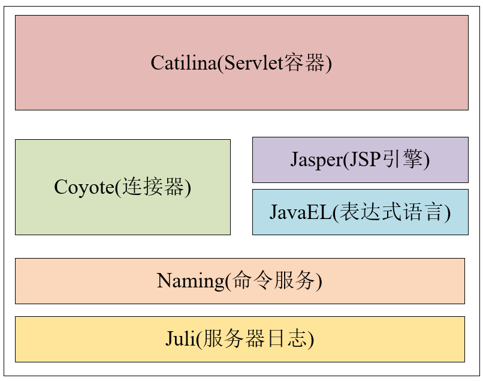
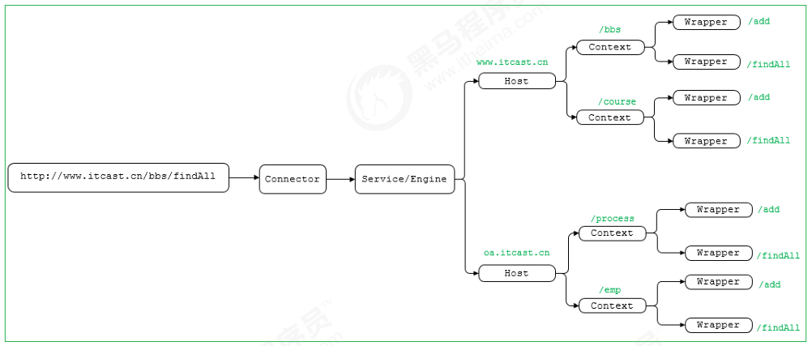

# 一、Tomcat 整体架构

## 1.1 Tomcat 架构图

Tomcat要实现**两个核心功能**：

-  处理Socket连接，负责网络字节流与 Request 和 Response 对象的转化。  
- 加载和管理Servlet，以及具体处理 Request 请求。

因此Tomcat设计了两个核心组件连接器（Connector）和容器（Container）来分别做这 两件事情。<font color="red">**连接器负责对外交流，容器负责内部处理**</font>。


## 1.2 Tomcat 模块结构图

Tomcat本质上是一个Servlet容器。因此，Catalina才是Tomcat的核心，其他模块都是为Catalina提供支持的。

比如说，Coyote模块负责处理连接通信，Jasper模块提供JSP引擎，Naming提供JNDI服务，Juli提供日志服务。




在源代码 `apache-tomcat-10.1.18-src\java\org\apache` 目录里面，我们也可以通过子目录目录看到对应的模块

```shell
D:\Enviroment\Java\apache-tomcat-10.1.18-src\java\org\apache>dir
 驱动器 D 中的卷是 DATA
 卷的序列号是 545F-F867

 D:\Enviroment\Java\apache-tomcat-10.1.18-src\java\org\apache 的目录

2024/01/05  14:39    <DIR>          .
2024/01/05  14:39    <DIR>          ..
2024/01/05  14:39    <DIR>          catalina
2024/01/05  14:39    <DIR>          coyote
2024/01/05  14:39    <DIR>          el
2024/01/05  14:39    <DIR>          jasper
2024/01/05  14:39    <DIR>          juli
2024/01/05  14:39    <DIR>          naming
2024/01/05  14:39    <DIR>          tomcat
               0 个文件              0 字节
               9 个目录 999,003,066,368 可用字节
```


## 1.3 相关术语

以下术语基本上都是 Catalina(Servlet 容器) 里面的组件，不同组件之间的关系可以查看 Catalina 介绍。

### 1.3.1 服务器 Server

在 Tomcat 的世界中，  [Server](https://tomcat.apache.org/tomcat-10.1-doc/config/server.html)  代表整个容器。

Tomcat 提供了一个 [Server interface](https://tomcat.apache.org/tomcat-10.1-doc/api/org/apache/catalina/Server.html) 的默认实现，用户很少对其进行定制。

Server 元素代表整个 Catalina Servlet 容器。因此，它必须是 conf/server. xml 配置文件中的单个最外层元素。它的属性代表整个 Servlet容器的特征。


### 1.3.2 服务 Service

服务 [Service](https://tomcat.apache.org/tomcat-10.1-doc/config/service.html) 是一个中间组件，存在于服务器内部，将一个或多个连接器绑定到一个引擎。换句话说，Service 由一个 Container 和 多个 Connector 组成，形成一个独立完整的单元，对外提供服务。

服务元素很少由用户定制，因为默认实现是简单而足够的： [Service interface](https://tomcat.apache.org/tomcat-10.1-doc/api/org/apache/catalina/Service.html)。


### 1.3.5 连接器 Connector

连接器处理与客户端的通信。它负责接收客户请求，然后转给相关的容器处理，最后向客户返回响应结果。

Tomcat提供了多个连接器，包括：

-  [HTTP connector](https://tomcat.apache.org/tomcat-10.1-doc/config/http.html) ，用于大多数HTTP流量，特别是在将Tomcat作为独立服务器运行时，
-  [AJP connector](https://tomcat.apache.org/tomcat-10.1-doc/config/ajp.html) ，实现了与Web服务器（如Apache HTTPD服务器）连接时使用的AJP协议。创建自定义连接器是一项重要的工作。

另外， Tomcat 的连接器框架的名字是 Coyote。


### 1.3.3 容器 Container

Tomcat 将 Engine，Host，Context，Wrapper 统一抽象成 **Container**。 

Connector接受到请求后，会将请求交给Container，Container处理完了之后将结果返回给Connector。


### 1.3.3 引擎 Engine

引擎  [Engine](https://tomcat.apache.org/tomcat-10.1-doc/config/engine.html) 表示特定服务的请求处理管道。由于一个服务可能有多个连接器，引擎接收并处理所有这些连接器的请求，将响应返回到适当的连接器，以传输到客户端。

[Engine interface](https://tomcat.apache.org/tomcat-10.1-doc/api/org/apache/catalina/Engine.html) 可以实现为提供自定义引擎，尽管这不常见。


### 1.3.4 主机 Host

主机  [Host](https://tomcat.apache.org/tomcat-10.1-doc/config/host.html) 是将网络名称（例如www.yourcompany.com）与Tomcat服务器关联的组件。

一个 Engine 可以包含多个 Host，而且 Host 元素还支持网络别名，例如yourcompany.com和abc.yourcompany.com。

用户很少创建自定义 Host，因为 [StandardHost implementation](https://tomcat.apache.org/tomcat-10.1-doc/api/org/apache/catalina/core/StandardHost.html) 提供了显著的附加功能。


### 1.2.6 上下文 Context

上下文  [Context](https://tomcat.apache.org/tomcat-10.1-doc/config/context.html) 表示一个Web应用程序。一个 Host 可以包含多个 Context，每个都有一个唯一的路径。

 [Context interface](https://tomcat.apache.org/tomcat-10.1-doc/api/org/apache/catalina/Context.html) 可以实现为创建自定义上下文，但这很少见，因为 [StandardContext](https://tomcat.apache.org/tomcat-10.1-doc/api/org/apache/catalina/core/StandardContext.html) 提供了显著的附加功能。


# 二、连接器 - Coyote


# 三、 Server 容器 - Catalina

## 3.1 Catalina 组件结构

Catalina 负责管理 Server，而 Server 表示着整个服务器。Server 下面有多个服务 Service，每个服务都包含着多个连接器组件 Connector（Coyote 实现）和一个容器组件 Container。


在Tomcat 启动的时候， 会初始化一个 Catalina 的实例。


# 四、Container

## 4.1 Container 结构

Tomcat 将 Engine，Host，Context，Wrapper 统一抽象成 **Container**。 

这 4 种容器不是平行关系，而是父子关系。


## 4.2 组合模式在 Container 管理中的应用

这些容器之间是父子关系，形成了树形结构。因此，Tomcat 采用组合模式来管理这些容器。

具体实现方法是，所有容器组件都实现了Container接口，因此组合模式可以**使得用户对单容器对象和组合容器对象的使用具有一致性**。

> 这里单容器对象指的 是最底层的Wrapper，组合容器对象指的是上面的Context、Host或者Engine。


# 五、Tomcat Server 启动流程

> Tomcat Server 启动流程详细描述和序列图，查看 [Apache Tomcat 10 Architecture (10.1.18) - Startup](https://tomcat.apache.org/tomcat-10.1-doc/architecture/startup.html)

## 5.1 Bootstrap 介绍

首先，我们得先了解一下 Bootstrap 。

在Tomcat中，<font color="blue">**Bootstrap主要负责 Tomcat 服务器的启动和初始化**</font>。Bootstrap 是 Tomcat 的启动类，它负责加载 Tomcat 的核心类库，并启动 Tomcat 的各个组件，最终启动 Tomcat 服务器。

具体来说，Bootstrap的主要职责包括：

1. **加载Tomcat类库：** Bootstrap负责加载Tomcat服务器所需的所有核心类库，包括各个组件的实现类、配置文件等。
2. **初始化Catalina组件：** Bootstrap初始化Catalina组件，其中包括Server、Service、Connector、Engine、Host、Context等各个组件的实例化和配置。
3. **启动Tomcat组件：** 一旦所有的Catalina组件都被正确初始化和配置，Bootstrap会启动Tomcat的各个组件，使它们开始监听来自客户端的请求。
4. **创建并启动Tomcat服务器：** 最后，Bootstrap会创建一个Tomcat服务器实例，并调用其`start()`方法启动服务器，从而开始接受和处理客户端的请求。


# 六、Tomcat 处理请求流程

> Tomcat 请求处理流程详细描述和序列图，查看 [Apache Tomcat 10 Architecture (10.1.18) - Startup](https://tomcat.apache.org/tomcat-10.1-doc/architecture/startup.html)

## 6.1 URL 定位原理

设计了这么多层次的容器，Tomcat是怎么确定每一个请求 URL 应该由哪个Wrapper容器里的 Servlet来处理的呢？Tomcat 利用 Mapper 组件来完成这个任务的。

Mapper 组件的工作原理为：

1. **Mapper组件处理URL映射：**  Mapper 组件根据一系列配置规则（通常是在 `server.xml` 配置文件中配置的），尝试将 URL 路径映射到合适的Servlet或JSP。这些规则可以是基于URL路径、文件扩展名、虚拟主机等。Mapper 组件里保存了 Web 应用的配置信息，其实就是容器组件与访问路径的映射关系， 比如 Host 容器里配置的域名、Context 容器里的Web应用路径，以及 Wrapper 容器里 Servlet 映射的路径。
2. **调用Servlet处理请求：**一旦找到了与请求 URL 匹配的 Servlet 或 JSP 文件，Mapper 组件将请求转发给相应的 Servlet 容器进行处理。Servlet 容器负责执行 Servlet 的生命周期方法，并调用相应的 Servlet 或 JSP 来处理请求。

举个例子， 当用户请求链接 `http://www.itcast.cn/bbs/findAll` 后, 是如何找到最终处理业务逻辑的servlet 




# 参考资料

[Apache Tomcat 10 Architecture (10.1.18) - Table of Contents](https://tomcat.apache.org/tomcat-10.1-doc/architecture/index.html)

[Tomcat专题 - 黑马程序员 bilibili](https://www.bilibili.com/video/BV1dJ411N7Um?p=1&vd_source=52cd9a9deff2e511c87ff028e3bb01d2)

[Tomcat整体架构浅析 - 掘金 (juejin.cn)](https://juejin.cn/post/7031055221358870564)