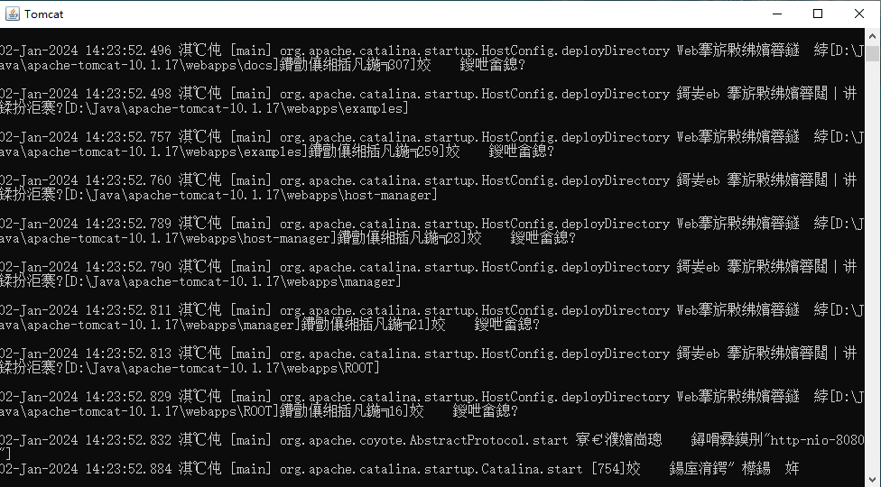

# 一、Tomcat 安装

## 1.1 选择合适的 Tomcat 版本

Apache Tomcat 是 Jakarta EE（正式JavaEE）技术子集的开源软件实现。不同版本的 Apache Tomcat 可用于不同版本的规范。在 [Tomcat官网](https://tomcat.apache.org/whichversion.html)，规范和相应 Apache Tomcat 版本之间的映射是：

| **Servlet Spec** | **JSP Spec** | **EL Spec** | **WebSocket Spec** | **Authentication (JASPIC) Spec** | **Apache Tomcat Version** | **Latest Released Version** | **Supported Java Versions**             |
| :--------------- | :----------- | :---------- | :----------------- | :------------------------------- | :------------------------ | :-------------------------- | :-------------------------------------- |
| 6.1              | 4.0          | 6.0         | TBD                | TBD                              | 11.0.x                    | 11.0.0-M15 (alpha)          | 21 and later                            |
| 6.0              | 3.1          | 5.0         | 2.1                | 3.0                              | 10.1.x                    | 10.1.17                     | 11 and later                            |
| 5.0              | 3.0          | 4.0         | 2.0                | 2.0                              | 10.0.x (superseded)       | 10.0.27 (superseded)        | 8 and later                             |
| 4.0              | 2.3          | 3.0         | 1.1                | 1.1                              | 9.0.x                     | 9.0.84                      | 8 and later                             |
| 3.1              | 2.3          | 3.0         | 1.1                | 1.1                              | 8.5.x                     | 8.5.97                      | 7 and later                             |
| 3.1              | 2.3          | 3.0         | 1.1                | N/A                              | 8.0.x (superseded)        | 8.0.53 (superseded)         | 7 and later                             |
| 3.0              | 2.2          | 2.2         | 1.1                | N/A                              | 7.0.x (archived)          | 7.0.109 (archived)          | 6 and later (7 and later for WebSocket) |
| 2.5              | 2.1          | 2.1         | N/A                | N/A                              | 6.0.x (archived)          | 6.0.53 (archived)           | 5 and later                             |
| 2.4              | 2.0          | N/A         | N/A                | N/A                              | 5.5.x (archived)          | 5.5.36 (archived)           | 1.4 and later                           |
| 2.3              | 1.2          | N/A         | N/A                | N/A                              | 4.1.x (archived)          | 4.1.40 (archived)           | 1.3 and later                           |
| 2.2              | 1.1          | N/A         | N/A                | N/A                              | 3.3.x (archived)          | 3.3.2 (archived)            | 1.1 and later                           |


## 1.2 下载 Tomcat

选择Tomcat 10.1 版本， 在官网 [Apache Tomcat ® - Apache Tomcat 10 Software Downloads](https://tomcat.apache.org/download-10.cgi) 下载对应软件


其中，不同发行版的区别查看  [README](https://dlcdn.apache.org/tomcat/tomcat-10/v10.1.17/README.html) 


## 1.3 配置环境变量

> 官方教程： [tomcat.apache.org/tomcat-10.1-doc/RUNNING.txt](https://tomcat.apache.org/tomcat-10.1-doc/RUNNING.txt)

在Windows系统里，配置环境变量的步骤为：

- 解压 Tomcat 压缩包到自定义目录里面。比如，我的安装目录为 `D:\Java\apache-tomcat-10.1.17`
- 在 "系统变量" 部分， 新建变量 `CATALINA_HOME`  ， 变量值为 Tomcat 的“二进制”发行版的根目录(例如 `D:\Java\apache-tomcat-10.1.17` )。
- 在 "系统变量" 部分，找到 `Path` 变量，点击编辑。在编辑窗口中，点击 "新建"，然后添加 Tomcat 的 `bin` 目录路径，例如 `%CATALINA_HOME%\bin`。在该目录下，存放着 Tomcat 的启动脚本  `startup.bat` 和关闭脚本 `shutdown.bat`

 


# 二、 运行 Tomcat

## 2.1 启动 Tomcat

打开 cmd ，输入 `startup.bat` 并回车

```
C:\Users\zouhu>startup.bat
Using CATALINA_BASE:   "D:\Java\apache-tomcat-10.1.17"
Using CATALINA_HOME:   "D:\Java\apache-tomcat-10.1.17"
Using CATALINA_TMPDIR: "D:\Java\apache-tomcat-10.1.17\temp"
Using JRE_HOME:        "D:\Java\jdk-17.0.8"
Using CLASSPATH:       "D:\Java\apache-tomcat-10.1.17\bin\bootstrap.jar;D:\Java\apache-tomcat-10.1.17\bin\tomcat-juli.jar"
Using CATALINA_OPTS:   ""
```

之后，Tomcat 启动窗口出现




启动后，Tomcat中包含的默认Web应用程序将是通过 http://localhost:8080/ 访问：

> Refer to the [Windows Service How-To](https://tomcat.apache.org/tomcat-10.1-doc/windows-service-howto.html) for information on how to manage Tomcat as a Windows service.
>
> 

## 2.2 关闭 Tomcat

打开 cmd ，输入 `shutdown.bat` 并回车

```
C:\Users\zouhu>shutdown.bat
Using CATALINA_BASE:   "D:\Java\apache-tomcat-10.1.17"
Using CATALINA_HOME:   "D:\Java\apache-tomcat-10.1.17"
Using CATALINA_TMPDIR: "D:\Java\apache-tomcat-10.1.17\temp"
Using JRE_HOME:        "D:\Java\jdk-17.0.8"
Using CLASSPATH:       "D:\Java\apache-tomcat-10.1.17\bin\bootstrap.jar;D:\Java\apache-tomcat-10.1.17\bin\tomcat-juli.jar"
Using CATALINA_OPTS:   ""
```

之后，Tomcat 启动窗口也会随之关闭


# 参考资料

[Apache Tomcat 10 (10.1.17) - Tomcat Setup](https://tomcat.apache.org/tomcat-10.1-doc/setup.html)

[tomcat.apache.org/tomcat-10.1-doc/RUNNING.txt](https://tomcat.apache.org/tomcat-10.1-doc/RUNNING.txt)