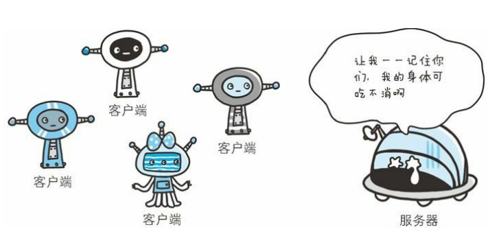

[TOC]

# 一、HTTP Cookie

## 1.1 为什么引入cookie

HTTP 是**无状态协议**，它不对之前发生过的请求和响应的状态进行管理。假设要求登录认证的 Web 页面本身无法进行状态的管理（不记录已 登录的状态），那么每次跳转新页面不是要再次登录，就是**要在每次请求报文中附加参数来管理登录状态**。但是，如果让服务器管理全部客户端状态则会成为比较大的负担。



不可否认，无状态协议当然也有它的优点。由于不必保存状态，自然 可减少服务器的 CPU 及内存资源的消耗。从另一侧面来说，也正是 因为 HTTP 协议本身是非常简单的，所以才会被应用在各种场景里。保留无状态协议这个特征的同时又要解决类似的矛盾问题，于是网景通信公司引入了 Cookie 技术。**Cookie 技术通过在请求和响应报文中写入 Cookie 信息来控制客户端的状态。**


## 1.2 cookie的定义和结构

HTTP Cookie（也叫 Web Cookie 或浏览器 Cookie）是**服务器发送到用户浏览器并保存在本地的一小块数据**。浏览器会存储 cookie 并在下次向同一服务器再发起请求时携带并发送到服务器上。通常，它用于告知服务端两个请求是否来自同一浏览器——如保持用户的登录状态。**Cookie 使基于[无状态](https://developer.mozilla.org/zh-CN/docs/Web/HTTP/Overview#http_是无状态，有会话的)的 HTTP 协议记录稳定的状态信息成为了可能。**

Cookie 以**健/值对**的形式存储，一个简单的 Cookie 可能像这样：

```
Set-Cookie: <cookie-name>=<cookie-value>
```

以chrome浏览器为例，利用开发者工具查看浏览器中的cookie


## 1.3 cookie的作用

Cookie 主要用于以下三个方面：

- 会话状态管理

  如用户登录状态、购物车、游戏分数或其他需要记录的信息

- 个性化设置

  如用户自定义设置、主题和其他设置

- 浏览器行为跟踪

  如跟踪分析用户行为等

Cookie 曾一度用于客户端数据的存储，因当时并没有其他合适的存储办法而作为唯一的存储手段，但现在推荐使用现代存储 API。由于服务器指定 Cookie 后，浏览器的每次请求都会携带 Cookie 数据，会带来额外的性能开销（尤其是在移动环境下）。**新的浏览器 API 已经允许开发者直接将数据存储到本地**，如使用 [Web storage API](https://developer.mozilla.org/zh-CN/docs/Web/API/Web_Storage_API)（`localStorage` 和 `sessionStorage`）或 [IndexedDB](https://developer.mozilla.org/zh-CN/docs/Web/API/IndexedDB_API) 。


## 1.4 为cookie服务的首部字段

为cookie服务的首部字段主要有 <font color="red">**Set-Cookie**</font> 、<font color="red">**Cookie**</font> 

| 首部字段名 | 说明                           | 首部类型     |
| ---------- | ------------------------------ | ------------ |
| Set-Cookie | 开始状态管理所使用的Cookie信息 | 响应首部字段 |
| Cookie     | 服务器接收到的Cookie信息       | 请求首部字段 |

 有关`Set-Cookie`具体属性的信息可查阅[Set-Cookie - HTTP | MDN (mozilla.org)](https://developer.mozilla.org/zh-CN/docs/Web/HTTP/Headers/Set-Cookie)

 有关`Cookie`具体属性的信息可查阅[Set-Cookie - HTTP | MDN (mozilla.org)](https://developer.mozilla.org/zh-CN/docs/Web/HTTP/Headers/Set-Cookie)


# 二、Cookie工作机制

Cookie 的工作机制是**用户识别及状态管理**。Web 网站为了管理用户的 状态会通过 Web 浏览器，把一些数据临时写入用户的计算机内。接着当用户访问该Web网站时，可通过通信方式取回之前发放的 Cookie。 调用 Cookie 时，由于可校验 Cookie 的有效期，以及发送方的域、路 径、协议等信息，所以正规发布的 Cookie 内的数据不会因来自其他 Web 站点和攻击者的攻击而泄露。

## 2.1 创建和发送cookie

Cookie 会根据从服务器端发送的响应报文内的一个叫做 **Set-Cookie** 的 首部字段信息，**通知客户端保存 Cookie**。当下次客户端再往该服务器 发送请求时，客户端会自动在请求报文中加入 Cookie 值后发送出去。服务器端发现客户端发送过来的 Cookie 后，会去检查究竟是从哪一 个客户端发来的连接请求，然后对比服务器上的记录，最后得到之前 的状态信息。

举个例子，当客户端发送没有 Cookie 信息状态下的请求后，服务器发送响应报文并告知客户端存储两个cookie，即choco 和 strawberry。响应报文(服务器端生成 Cookie 信息)的具体内容为：

```
HTTP/1.0 200 OK
Content-type: text/html
Set-Cookie: yummy_cookie=choco
Set-Cookie: tasty_cookie=strawberry

[页面内容]
```


现在，对该服务器发起的每一次新请求，浏览器都会将之前保存的 Cookie 信息通过 [`Cookie`](https://developer.mozilla.org/zh-CN/docs/Web/HTTP/Headers/Cookie) 请求首部字段再发送给服务器。请求报文(自动发送保存着的 Cookie 信息)的具体内容为：

```
GET /sample_page.html HTTP/1.1
Host: www.example.org
Cookie: yummy_cookie=choco; tasty_cookie=strawberry
```


## 2.2 cookie的生命周期

Cookie 的生命周期可以通过两种方式定义：

- ***会话期* Cookie** 会在当前的会话结束之后删除。浏览器定义了“当前会话”结束的时间，一些浏览器重启时会使用***会话恢复***。这可能导致会话 cookie 无限延长。
- ***持久性* Cookie** 在过期时间（`Expires`）指定的日期或有效期（`Max-Age`）指定的一段时间后被删除。


# 参考资料

[HTTP Cookie - HTTP | MDN (mozilla.org)](https://developer.mozilla.org/zh-CN/docs/Web/HTTP/Cookies)

图解HTTP.上野宣 （书籍）