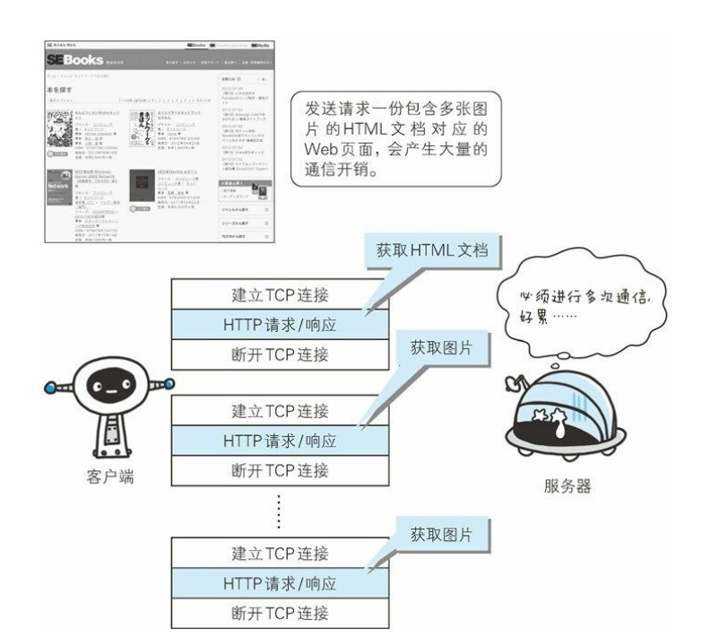
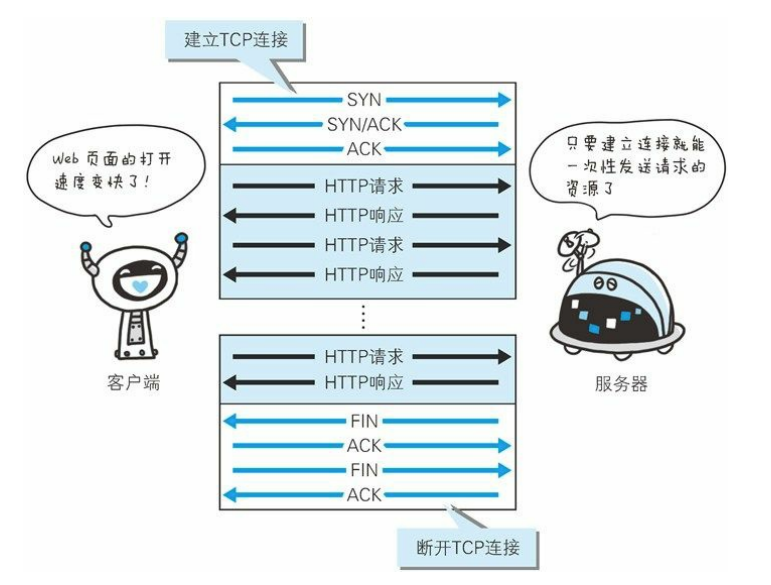

# 一、HTTP协议

HTTP（HyperText Transfer Protocol，超文本传输协议）是一种用于在Web浏览器和服务器之间传输数据的协议，定义了浏览器（即万维网客户进程）怎样向万维网服务器请求万维网文档，以及服务器怎样把文档传送给浏览器。


## HTTP协议历史版本


# 二、HTTP协议特点

## 2.1 HTTP是不保存状态的协议


## 2.2 持续连接节省通信量

### 2.2.1 持续连接

**HTTP 协议的初始版本中，每进行一次 HTTP 通信就要断开一次 TCP 连接**。以当年的通信情况来说，因为都是些容量很小的文本传输，所以即使 这样也没有多大问题。可随着 HTTP 的普及，文档中包含大量图片的 情况多了起来。当万维网服务器要同时服务于大量客户的请求时，这种<font color="blue">**非持续连接**</font>会使万维网服务器的负担很重。



为解决上述 TCP 连接的问题，HTTP/1.1 和一部分的 HTTP/1.0 想出了 <font color="blue">**持续连接**</font>（HTTP Persistent Connections，也称为 HTTP keep-alive 或 HTTP connection reuse）的方法。持续连接的特点是，只要任意一端 没有明确提出断开连接，则保持 TCP 连接状态。持续连接的好处在于**减少了 TCP 连接的重复建立和断开所造成的额外开销**，减轻了服务器端的负载。另外，减少开销的那部分时间，使 HTTP 请求和响应能够更早地结束，这样 Web 页面的显示速度也就相 应提高了。

> 在 HTTP/1.1 中，所有的连接默认都是持久连接，但在 HTTP/1.0 内并 未标准化。




HTTP/1.1协议的持续连接有两种工作方式：

- **非流水线方式**(without pipelining)。非流水线方式的特点是客户在收到前一个响应后才能发出下一个请求。因此，在 TCP连接已建立后，客户每访问一次对象都要用去一个往返时间RTT。这比非持续连接要用去两倍RTT的开销，节省了建立TCP连接所需的一个 RTT时间。但非流水线方式还是有缺点的，因为服务器在发送完一个对象后，其TCP连接就处于空闲状态，浪费了服务器资源。
- **流水线方式**(with pipelining)。流水线方式的特点，是客户在收到 HTTP 的响应报文之前就能够接着发送新的请求报文。于是一个接一个的请求报文到达服务器后，服务器就可连续发回响应报文。因此，使用流水线方式时，客户访问所有的对象只需花费一个RTT时间。流水线工作方式使TCP连接中的空闲时间减少，提高了下载文档效率。

> 如果对于节省RTT时间这部分不太懂的话，可以看一下 计算机网络（第7版）- 谢希仁 该书的 6.4.3节


### 2.2.2 管线化

持久连接使得多数请求以管线化（pipelining）方式发送成为可能。从 前发送请求后需等待并收到响应，才能发送下一个请求。管线化技术 出现后，**不用等待响应亦可直接发送下一个请求**。

> 管线化（pipelining）方式 其实也就是  流水线方式

这样就能够**做到同时并行发送多个请求**，而不需要一个接一个地等待响应了。


# Cookie和会话管理

Cookie用于在客户端和服务器之间传递会话信息，实现会话管理。


# 缓存

HTTP缓存可以减少网络请求，常用的缓存控制头部字段有Cache-Control、Expires、ETag等。


# 安全性

HTTPS使用SSL/TLS进行加密通信，提高HTTP的安全性。


# Web服务

基于HTTP的Web服务使用RESTful API设计原则，并使用HTTP进行数据传输。


# 示例和代码

以下是一些示例和代码片段，以帮助理解HTTP的应用和用法：

```http
GET /api/users HTTP/1.1
Host: example.com
User-Agent: Mozilla/5.0
```

```
HTTP/1.1 200 OK
Content-Type: application/json
{
  "name": "John Doe",
  "age": 30
}
```

