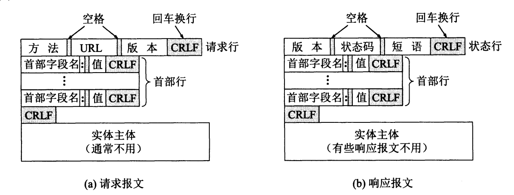

[TOC]

# 一、HTTP报文结构

HTTP有两类报文:

- 请求报文——  从客户向服务器发送请求报文

- 响应报文——  从服务器到客户的回答



HTTP请求报文和响应报文都是由三个部分组成的。可以看出，这两种报文格式的区别就是开始行不同。

- **开始行**，用于区分是请求报文还是响应报文。在请求报文中的开始行叫做<font color="blue">**请求行(Request-Line)**</font>，而在响应报文中的开始行叫做<font color="blue">**状态行(Status-Line)**</font>。在开始行的三个字段之间都以空格分隔开，最后的“CR”和“LF”分别代表“回车”和“换行”。
- **首部行**，用来**说明浏览器、服务器或报文主体的一些信息**。首部可以有好几行，但也可以不使用。在每一个首部行中都有首部字段名和它的值，每一行在结束的地方都要有“回车”和“换行”。整个首部行结束时，还有一空行将首部行和后面的实体主体分开。
- **实体主体**(entity body)，在请求报文中一般都不用这个字段，而在响应报文中也可能没有这个字段。

> 由于HTTP是面向文本的(text-oriented)，因此在报文中的每一个字段都是一些ASCII 码串，因而各个字段的**长度都是不确定的**。


# 二、HTTP请求报文的方法

请求报文的第一行“请求行”只有三个内容，即**方法**，请求资源的URL，以及 HTTP协议的版本。

<font color="blue">**方法**</font>是面向对象技术中使用的专门名词。所谓“方法”就是对所请求的对象进行的操作，这些方法实际上也就是一些命令。因此，**请求报文的类型是由它所采用的方法决定的**。

请求报文中常用的几种方法如下：

| 方法    | 作用                                                    |
| ------- | ------------------------------------------------------- |
| GET     | 获取资源                                                |
| POST    | 传输实体主体                                            |
| PUT     | 上传文件                                                |
| DELETE  | 删除文件                                                |
| HEAD    | 和GET方法类似，但只返回报文首部，不返回报文实体主体部分 |
| PATCH   | 对资源进行部分修改                                      |
| OPTIONS | 查询指定的URL支持的方法                                 |
| CONNECT | 要求用隧道协议连接代理，用来进行环回测试的请求报文      |
| TRACE   | 服务器会将通信路径返回给客户端， 用于代理服务器         |

为了方便记忆，可以将PUT、DELETE、POST、GET理解为客户端对服务端的增删改查。

- PUT：上传文件，向服务器添加数据，可以看作增
- DELETE：删除文件
- POST：传输数据，向服务器提交数据，对服务器数据进行更新。
- GET：获取资源，查询服务器资源

## 2.1 GET和POST请求的区别


# 三、HTTP响应报文的状态码

## 3.1 响应状态码

HTTP响应报文的状态行包括三项内容，即 HTTP的版本，**状态码**，以及解释状态码的简单短语。

下面三种状态行在响应报文中是经常见到的。

```
HTTP/1.1 202 Accepted           {接受}
HTTP/1.1 400 Bad Request        {错误的请求}
Http/1.1 404 Not Found          {找不到}
```


<font color="blue">**状态码(Status-Code)**</font>负责表示客户端 HTTP 请求的返回结果、标记服务器端 的处理是否正常、通知出现的错误等工作。状态码(Status-Code)都是三位数字的，分为5大类。这5大类的状态码都是以不同的数字开头的。

|      | 类别                             | 原因短语                   |
| ---- | -------------------------------- | -------------------------- |
| 1xx  | Informational（信息性状态码）    | 接收的请求正在处理         |
| 2xx  | Success（成功状态码）            | 请求正常处理完毕           |
| 3xx  | Redirection（重定向状态码）      | 需要进行附加操作以完成请求 |
| 4xx  | Client Error（客户端错误状态码） | 服务器无法处理请求         |
| 5xx  | Server Error（服务器错误状态码） | 服务器处理请求出错         |

仅记录在 **RFC2616 上的 HTTP 状态码**就达 40 种，若再加上 **WebDAV**（Web-based Distributed Authoring and Versioning，基于万维网 的分布式创作和版本控制）（RFC4918、5842） 和附加 HTTP 状态码 （RFC6585）等扩展，数量就达 **60** 余种。但是，**实际上经常使用的大概只有 14 种**。

查询状态码的建议网址主要有：

- [Hypertext Transfer Protocol (HTTP) Status Code Registry (iana.org)](https://www.iana.org/assignments/http-status-codes/http-status-codes.xhtml)

- [HTTP 响应状态码 - HTTP | MDN (mozilla.org)](https://developer.mozilla.org/zh-CN/docs/Web/HTTP/Status)


- ~~1xx表示通知信息，如请求收到了或正在进行处理。~~
- ~~2xx表示成功，如接受或知道了。~~
- ~~3xx表示重定向，如要完成请求还必须采取进一步的行动。~~
- ~~4xx表示客户的差错，如请求中有错误的语法或不能完成。~~
- ~~5xx表示服务器的差错，如服务器失效无法完成请求。~~

## 3.2 常见状态码

以 `2xx` 为开头的都表示 请求成功响应。

| 状态码 | 简单短语        | 含义                                                         |
| ------ | --------------- | ------------------------------------------------------------ |
| 200    | OK              | 成功响应                                                     |
| 204    | No Content      | 请求处理成功，但是没有资源可以返回                           |
| 206    | Partial Content | 客户端进行范围请求，由Content-Range 指定范围的实体内容。服务器对资源某一部分进行响应 |


以 `3xx` 为开头的都表示 浏览器需要进行附加操作以完成请求

| 状态码 | 简单短语           | 含义                                                         |
| ------ | ------------------ | ------------------------------------------------------------ |
| 301    | Moved Permanently  | 永久性重定向，该状态码表示请求的资源已经重新分配 URI，以后应该使用资源现有的 URI |
| 302    | Found              | 临时性重定向。该状态码表示请求的资源已被分配了新的 URI，希望用户（本次）能使用新的 URI 访问。 |
| 303    | See Other          | 该状态码表示由于请求对应的资源存在着另一个 URI，客户端应使用 GET 方法定向获取请求的资源。 |
| 304    | Not Modified       | 该状态码表示客户端发送附带条件的请求时，服务器端允许请求访问资源，但未满足条件的情况。 |
| 307    | Temporary Redirect | 临时重定向。该状态码与 302 Found 有着相同的含义,   会遵照浏览器标准，不会从POST变成GET |

> 当 301、302、303 响应状态码返回时，几乎所有的浏览器都会把 POST 改成 GET，并删除请求报文内的主体，之后请求会自动再次发送。
>
> 301、302 标准是禁止将 POST 方法改变成 GET 方法的，但实际使 用时大家都会这么做。


以 `4xx` 的响应结果表明客户端是发生错误的原因所在。

| 状态码 | 简单短语     | 含义                                                         |
| ------ | ------------ | ------------------------------------------------------------ |
| 400    | Bad Request  | 该状态码表示请求报文中存在语法错误。当错误发生时，需修改请求的内容后再次发送请求。 |
| 401    | Unauthorized | 该状态码表示发送的请求需要有通过 HTTP 认证（BASIC 认证、DIGEST 认证）的认证信息。 |
| 403    | Forbidden    | 该状态码表明对请求资源的访问被服务器拒绝了。（原因很有可能是客户端没有访问权限） |
| 404    | Not Found    | 该状态码表明服务器上无法找到请求的资源。（也可以在服务器端拒绝请求且不想说明理由时使用） |


以 `5xx` 为开头的响应标头都表示服务器本身发生错误

| 状态码 | 简单短语              | 含义                                                         |
| ------ | --------------------- | ------------------------------------------------------------ |
| 500    | Internal Server Error | 该状态码表明服务器端在执行请求时发生了错误。                 |
| 503    | Service Unavailable   | 该状态码表明服务器暂时处于超负载或正在进行停机维护，现在无法处理请求。 |


# 四、HTTP报文的首部字段

## 4.1 HTTP首部字段

HTTP首部字段是构成HTTP报文的要素之一。在客户端与服务器之间以HTTP协议进行通信的过程中，无论是请求还是响应都会使用首部字段，它能起到**传递额外重要信息**的作用。使用首部字段是为了给浏览器和服务器提供报文主体大小、所使用的语言、认证信息等内容。

**HTTP 首部字段是由首部字段名和字段值构成的**，中间用冒号“`:`” 分 隔。

```
首部字段名: 字段值
```

另外，**字段值对应单个 HTTP 首部字段可以有多个值**，举个例子

```
Keep-Alive: timeout=15, max=100
```


## 4.2 HTTP首部字段类型

HTTP 首部字段根据实际用途被分为以下 4 种类型。

| HTTP首部字段                           | 含义                                                         |
| -------------------------------------- | ------------------------------------------------------------ |
| 通用首部字段（General Header Fields）  | 请求报文和响应报文两方都会使用的首部。                       |
| 请求首部字段（Request Header Fields）  | 从客户端向服务器端发送请求报文时使用的首部。补充了请求的附加 内容、客户端信息、响应内容相关优先级等信息。 |
| 响应首部字段（Response Header Fields） | 从服务器端向客户端返回响应报文时使用的首部。补充了响应的附加 内容，也会要求客户端附加额外的内容信息。 |
| 实体首部字段（Entity Header Fields）   | 针对请求报文和响应报文的实体部分使用的首部。补充了资源内容更 新时间等与实体有关的信息。 |

> 需要注意的是，HTTP 首部字段是**可以自行扩展**的。所以在 Web 服务器和浏览器的应 用上，会出现各种非标准的首部字段。


# 参考资料

[Hypertext Transfer Protocol (HTTP) Status Code Registry (iana.org)](https://www.iana.org/assignments/http-status-codes/http-status-codes.xhtml)

计算机网络（第7版）-谢希仁 （书籍）

图解HTTP.上野宣 （书籍）

[看完这篇HTTP，跟面试官扯皮就没问题了   CSDN博客](https://blog.csdn.net/qq_36894974/article/details/103930478?ops_request_misc={"request_id"%3A"168912444016782427479000"%2C"scm"%3A"20140713.130102334.."}&request_id=168912444016782427479000&biz_id=0&utm_medium=distribute.pc_search_result.none-task-blog-2~all~top_positive~default-1-103930478-null-null.142^v88^control_2,239^v2^insert_chatgpt&utm_term=HTTP协议&spm=1018.2226.3001.4187)

[HTTP 响应状态码 - HTTP | MDN (mozilla.org)](https://developer.mozilla.org/zh-CN/docs/Web/HTTP/Status)