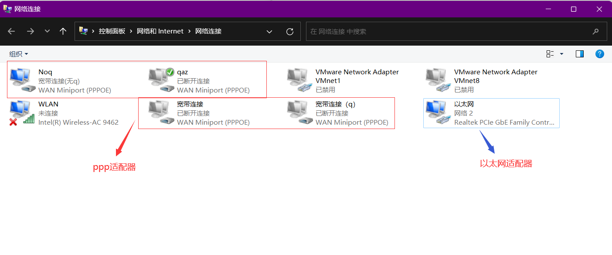

# 一、网络中的适配器

## 1.1 以太网适配器


## 1.2 PPP适配器


## 1.3 无线局域网适配器


# 二、实际案例

以我的笔记本为例，在cmd里面运行命令 `ipcongfig /all`或者 `ipconfig`，`ipconfig`查阅到的简略信息为

```
Windows IP 配置


以太网适配器 以太网:

   连接特定的 DNS 后缀 . . . . . . . :
   本地链接 IPv6 地址. . . . . . . . : fe80::9d78:78c7:47f5:93dd%7
   IPv4 地址 . . . . . . . . . . . . : 10.50.82.15
   子网掩码  . . . . . . . . . . . . : 255.255.192.0
   默认网关. . . . . . . . . . . . . : 10.50.64.1

PPP 适配器 Noq:

   连接特定的 DNS 后缀 . . . . . . . :
   IPv4 地址 . . . . . . . . . . . . : 10.50.224.19
   子网掩码  . . . . . . . . . . . . : 255.255.255.255
   默认网关. . . . . . . . . . . . . : 0.0.0.0

无线局域网适配器 本地连接* 1:

   媒体状态  . . . . . . . . . . . . : 媒体已断开连接
   连接特定的 DNS 后缀 . . . . . . . :

无线局域网适配器 本地连接* 11:

   媒体状态  . . . . . . . . . . . . : 媒体已断开连接
   连接特定的 DNS 后缀 . . . . . . . :

无线局域网适配器 WLAN:

   媒体状态  . . . . . . . . . . . . : 媒体已断开连接
   连接特定的 DNS 后缀 . . . . . . . :
```

其中，**Noq**是我创建的一个宽带拨号连接

> 宽带拨号连接可以自己创建多个。下图中的 `qaz`、`宽带连接`、`宽带连接(q)`就是我自己创建的其他宽带拨号连接

